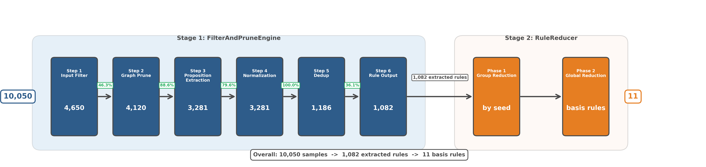

# Discovery Pipeline 完整参考手册

本文档是 GeoDiscovery 知识发现 pipeline 的完整参考手册，涵盖从数据生成到规则评估的全流程。

**适用场景**:
- 运行完整 pipeline 或分阶段运行
- 理解每个阶段的算法原理和数据流
- 调优参数和排查问题
- 开发新功能或修改现有流程

**快速导航**:
- [Pipeline 总览](#pipeline-总览) - 架构图和数据流
- [Stage 0: 数据生成](#stage-0-数据生成) - 合成几何问题数据
- [Stage 1: 规则提取](#stage-1-规则提取-filterandpruneengine) - 从证明图中提取规则
- [Stage 2: 规则规约](#stage-2-规则规约-rulereducer) - 贪心subsumption规约
- [Stage 3: 规则评估](#stage-3-规则评估) - Benchmark性能测试
- [Stage 4: 可视化](#stage-4-可视化) - 生成流程图和样例图
- [端到端使用指南](#端到端使用指南) - 一键脚本和分阶段运行
- [故障排查](#故障排查) - 常见问题和解决方案

**相关文档**:
- [快速上手指南](pipeline_quickstart.md) - 5分钟快速开始
- [数据格式参考](data_formats.md) - JSONL/Rule/Problem格式详解
- [冗余代码清单](unused_code_checklist.md) - 代码清理参考

---

## Pipeline 总览

### 架构图



### 数据流概览

```
JSONL 合成数据
  │
  ├─ Stage 1: FilterAndPruneEngine (filter_and_prune_engine.py)
  │   ├─ Step 1. 输入过滤 (aux + skip_predicates)  ─→ intermediates/step1_input_filter.json
  │   ├─ Step 2. 图修剪                             ─→ intermediates/step2_graph_prune.json
  │   ├─ Step 3. 命题提取                           ─→ intermediates/step3_propositions.json
  │   ├─ Step 4. 规范化 (missing_points + 对称性)    ─→ intermediates/step4_*.json
  │   ├─ Step 5. 去重 (SHA256 hash)                 ─→ intermediates/step5_dedup.json
  │   └─ Step 6. 规则落盘 (rule_skip_predicates)    ─→ intermediates/step6_rules_stats.json
  │                                                     + *_pruned_rules.txt
  │
  └─ Stage 2: RuleReducer (rule_reducer.py)
      ├─ Phase 1: 小组规约 (reduce_by_seed)
      │   ├─ 按 seed 分组
      │   └─ 组内: max_premises → 泛化度排序 → 贪心淘汰
      └─ Phase 2: 全局规约
          ├─ Pre-filter: max_premises 过滤
          ├─ Step 1: 泛化度评分
          ├─ Step 2: 泛化度排序
          └─ Step 3: 贪心淘汰 (subsumption)             ─→ extracted_rules.txt
```

---

## Stage 1: FilterAndPruneEngine

入口: `scripts/discovery_pipeline.py` → `run_stage1_extraction()`
核心: `src/newclid/proof_scout/core/filter_and_prune_engine.py`

### Step 1: 输入过滤

**目的**: 合并两个过滤条件 — (1) 只保留含辅助点的题目；(2) 跳过包含 `skip_predicates` 中谓词的题目

**参数**:
- `skip_predicates`: 默认 `{eqpoint, constline}`

**伪代码**:
```
for record in all_records:
    if record.aux_points is empty:
        dropped (no aux)
    elif record contains any skip_predicate:
        dropped (skip predicate)
    else:
        kept
```

**中间结果**: `intermediates/step1_input_filter.json`
- `total`, `kept`, `dropped_no_aux`, `dropped_skip_predicates`
- `kept_records`: 每条保留记录的 problem_id, aux_points
- `dropped_records`: 被丢弃记录

---

### Step 2: 图修剪

**目的**: 对每个题目构建证明图（SingleProofGraph），用 GraphPruner 修剪冗余节点，只保留从前提到结论的最小证明路径

**代码**: `_worker_prune()`

**伪代码**:
```
for record in kept_records:  # 并行
    proof_graph = SingleProofGraph.build_from_result_record(record)
    pruned = GraphPruner().prune_proof_graph(proof_graph)
    if pruned is not None:
        pruned_map[record.pid] = pruned
```

**中间结果**: `intermediates/step2_graph_prune.json`
- `total_input`, `pruned_success`, `pruned_failed`
- 每条记录的 nodes/edges 统计

---

### Step 3: 命题提取

**目的**: 从修剪后的证明图中提取命题（premises → conclusion 形式）

**代码**: `_extract_propositions()`

**伪代码**:
```
for pid, pruned_graph in pruned_map.items():
    propositions = extract_from_graph(pruned_graph)
    for prop in propositions:
        all_propositions.append({
            pid, premises, conclusion, point_coords, ...
        })
```

**中间结果**: `intermediates/step3_propositions.json`
- `total_propositions`, `by_conclusion_predicate` 分布

---

### Step 4: 规范化

**目的**: (1) 检查 missing_points；(2) 对谓词参数应用对称性规范化；(3) 生成 signature

**对称性规范化**: 19 个几何谓词各有对称性规则（如 `cong(a,b,c,d)` → 排序使 `(a,b) ≤ (c,d)`）

**伪代码**:
```
for rule in raw_rules:
    if has_missing_points(rule):
        skipped (missing points)
    else:
        normalized = canonicalize_predicates(rule)
        signature = compute_signature(normalized)
        normalized_rules.append((normalized, signature))
```

**中间结果**:
- `intermediates/step4_normalized_rules.json` — 规范化后的规则列表
- `intermediates/step4_signature_distribution.json` — signature 分布
- `intermediates/step4_predicate_normalization_samples.json` — 规范化样例

---

### Step 5: 去重

**目的**: 按 signature 排序，使用 SHA256 hash 去重

**伪代码**:
```
rules_sorted = sort_by_signature(normalized_rules)
seen_hashes = set()
for rule in rules_sorted:
    h = sha256(rule.text)
    if h not in seen_hashes:
        seen_hashes.add(h)
        deduped.append(rule)
```

**中间结果**: `intermediates/step5_dedup.json`
- `before_dedup`, `after_dedup`, `duplicates_removed`
- 去重组统计

---

### Step 6: 规则落盘

**目的**: 过滤掉包含 `rule_skip_predicates` 中谓词的规则，写入最终规则文件

**参数**:
- `rule_skip_predicates`: 默认 `{aconst, rconst}`

**伪代码**:
```
for rule in deduped_rules:
    if rule contains any rule_skip_predicate:
        skipped
    else:
        write to output file
```

**输出**:
- `*_pruned_rules.txt` — 最终规则文件（rule_id + rule_text 交替行）
- `intermediates/step6_rules_stats.json` — 规则统计 + 每条规则的元数据

---

## Stage 2: RuleReducer

入口: `scripts/discovery_pipeline.py` → `run_stage2_reduction()`
核心: `src/newclid/proof_scout/reduction/rule_reducer.py`

### Phase 1: 小组规约（reduce_by_seed）

**目的**: 按 seed 分组，先在组内规约。同一 seed 生成的规则高度相似，组内规约效率极高。

**流程**:
1. 按 `seed` 字段将规则分组
2. 对每组执行完整的 `reduce()` 流程（max_premises 过滤 → 泛化度排序 → 贪心淘汰）
3. 收集各组的 basis_rules 作为全局规约的输入
4. 无 seed 的规则直接进入全局规约

**可选**: 使用 `--no-group-reduction` 跳过此阶段

### Phase 2: 全局规约

### Pre-filter: max_premises

**目的**: 过滤前提数超过阈值的规则

### Step 1-2: 泛化度评分 + 排序

**目的**: 计算每条规则的泛化度分数 `(-n_premises, n_conclusions)`，按泛化度排序（最通用的在前）

### Step 3: 贪心淘汰

**目的**: 对排序后的规则，逐条测试是否被更通用的规则包含（subsumption test）

**并行策略** (2026-03-12 修复):
- 规则按泛化度排序后**逐条串行处理**，每处理完一条立即更新 `active_flags`
- 单条规则对所有候选目标的 subsumption 测试通过 `ProcessPoolExecutor` 并行执行
- `batch_size` 参数仅控制进度输出粒度（每 N 条打印一次），不影响并发逻辑
- 此设计消除了旧版 batch 内共享快照导致的竞态条件（双向消除 bug）

**伪代码**:
```
active = [True] * len(sorted_rules)
for i, rule_i in enumerate(sorted_rules):
    if not active[i]: continue
    # Build targets from CURRENT active_flags (not a stale snapshot)
    targets = [r for j, r in enumerate(sorted_rules) if active[j] and j != i]
    # Subsumption tests for rule_i vs all targets run in parallel
    eliminated_ids = parallel_subsumption_test(rule_i, targets)
    for j in eliminated_ids:
        active[j] = False  # Immediate state update before next rule
basis = [r for i, r in enumerate(sorted_rules) if active[i]]
```

**输出**:
- `extracted_rules.txt` — 最终基底规则集
- `eliminated_rules.json` — 被淘汰的规则及原因
- `reduction_stats.json` — 统计信息（含 group_phase 和 global_phase 详情）

---

## Stage 0: 数据生成

### 概述

**目的**: 生成合成几何问题数据，作为规则发现的输入

**脚本**: `src/newclid/generation/generate.py`

**核心算法**: 随机构造几何配置 → DDAR求解器求解 → 提取证明轨迹

**输出格式**: JSONL（每行一个问题记录，包含问题文本、辅助点、证明结果等）

### 标准参数配置（100k数据铁律）

基于 `outputs/experiments/20260312_01_generate_100k_data/` 的配置：

| 参数 | 标准值 | 说明 |
|------|--------|------|
| `--n_clauses` | `10` | 每题构造子句数（100k数据使用10，之前10k数据使用15） |
| `--aux_only` | `1` | 只保留含辅助点的题目（pipeline必须，概率0.9保留有aux，0.1保留无aux） |
| `--n_threads` | `30` | 并行worker数（生产环境） |
| `--n_samples` | `100000` | 目标样本数（100k标准） |
| `--timeout` | `3600` | 单题求解超时（秒） |
| `--log_level` | `info` | 日志级别 |
| `--dir` | `datasets/geometry_clauses10_samples100k` | 输出目录 |

### 标准生成命令

```bash
# 激活conda环境
source /C20545/home/duzhengtong/miniconda3/bin/activate Discovery

# 生成100k数据（标准配置）
python src/newclid/generation/generate.py \
    --n_clauses 10 \
    --aux_only 1 \
    --n_threads 30 \
    --n_samples 100000 \
    --timeout 3600 \
    --log_level info \
    --dir datasets/geometry_clauses10_samples100k
```

**注意事项**:
- `--aux_only 1` 不得省略（pipeline依赖辅助点）
- `--n_clauses` 影响问题复杂度（10=简单，15=中等，20=复杂）
- 验证/测试场景可减少 `--n_threads`（如10）和 `--n_samples`（如1000）

### 输出文件

```
datasets/geometry_clauses10_samples100k/
├── geometry_clauses10_samples100k.jsonl  # 主数据文件
├── generation_stats.json                  # 生成统计
└── generation.log                         # 生成日志
```

**数据格式**: 参见 [data_formats.md](data_formats.md#合成数据jsonl格式)

### 性能指标

| 数据集 | 样本数 | n_clauses | 生成时间 | 速度 |
|--------|--------|-----------|----------|------|
| 10k (旧) | 10,000 | 15 | ~30分钟 | ~5.5 samples/s |
| 100k (新) | 100,000 | 10 | ~103分钟 | ~16 samples/s |

**说明**: n_clauses=10比15更简单，生成速度更快

---

## 数据生成标准参数（铁律）

**脚本**: `src/newclid/generation/generate.py`

必须使用以下标准参数，除非用户明确指定其他值：

| 参数 | 标准值 | 说明 |
|------|--------|------|
| `--n_clauses` | `15` | 每题构造子句数 |
| `--aux_only` | `1` | 只保留含辅助点的题目（pipeline 必须） |
| `--n_threads` | `30` | 并行 worker 数（生产环境） |
| `--n_samples` | 由用户指定 | 目标样本数 |
| `--dir` | 由用户指定 | 输出目录 |

**标准生成命令**:
```bash
source /C20545/home/duzhengtong/miniconda3/bin/activate Discovery
python src/newclid/generation/generate.py \
    --n_clauses 15 --aux_only 1 \
    --n_threads 30 --n_samples <N> \
    --dir outputs/datasets/<dataset_name> \
    --log_level info --timeout 3600
```

验证/测试场景可减少 `--n_threads`（如 10），但 `--aux_only 1` 和 `--n_clauses 15` 不得省略。

---

## CLI 使用

### 完整 pipeline（提取 + 规约）
```bash
python scripts/discovery_pipeline.py \
    -i datasets/synthetic_10k.jsonl \
    -o outputs/experiments/YYYYMMDD_XX_experiment_name \
    --save-intermediates
```

### 仅提取
```bash
python scripts/discovery_pipeline.py \
    -i datasets/synthetic_10k.jsonl \
    -o outputs/experiments/YYYYMMDD_XX_experiment_name \
    --skip-reduction --save-intermediates
```

### 仅规约（从已有提取结果）
```bash
python scripts/discovery_pipeline.py \
    -o outputs/experiments/YYYYMMDD_XX_experiment_name \
    --skip-extraction \
    --rules <path/to/pruned_rules.txt> \
    --source-data <path/to/step6_rules_stats.json>
```

---

## 相关文件

- Pipeline 入口: `scripts/discovery_pipeline.py`
- 核心引擎: `src/newclid/proof_scout/core/filter_and_prune_engine.py`
- 规则规约: `src/newclid/proof_scout/reduction/rule_reducer.py`
- 数据格式参考: `docs/data_formats.md`

---

## Evaluation Pipeline

评估提取规则对 benchmark 求解性能的影响。

### 脚本: `scripts/evaluate_rules.py`

**两个子命令**:
1. `baseline` — 预计算 baseline（默认规则）并缓存结果
2. `evaluate` — 对比 baseline vs 增强规则（默认规则 + 提取规则）

**三个 benchmark**:
- `jgex_ag_231` — JGEX AG 231 problems (202/231 solved by baseline)
- `imo_95` — IMO 95 problems (1/95 solved by baseline)
- `hageo_409` — HAGeo 409 problems (100/405 solved by baseline, 4 problems skipped due to engine incompatibility)

### 使用方法

#### 1. 计算 baseline（首次运行或更新 baseline）

```bash
# 计算所有 benchmark 的 baseline
python scripts/evaluate_rules.py baseline \
    --output outputs/eval_baselines/ \
    --workers 30 \
    --timeout 3600

# 计算单个 benchmark 的 baseline
python scripts/evaluate_rules.py baseline \
    --output outputs/eval_baselines/ \
    --benchmarks hageo_409 \
    --workers 30 \
    --timeout 3600

# 跳过已知失败的题目（HAGeo 409 专用）
python scripts/evaluate_rules.py baseline \
    --output outputs/eval_baselines/ \
    --benchmarks hageo_409 \
    --workers 30 \
    --timeout 3600 \
    --skip outputs/experiments/20260311_01_hageo409_oom_diagnosis/failed_problems.txt
```

**输出**: `outputs/eval_baselines/{benchmark_name}_baseline.json`

#### 2. 评估提取规则

```bash
# 评估提取规则对所有 benchmark 的影响
python scripts/evaluate_rules.py evaluate \
    --rules outputs/experiments/20260310_01_10k_normalized_extraction_reduction/extracted_rules.txt \
    --baseline-cache outputs/eval_baselines/ \
    --output outputs/eval_results/20260312_01_extracted_rules_eval \
    --workers 30 \
    --timeout 3600

# 评估单个 benchmark
python scripts/evaluate_rules.py evaluate \
    --rules outputs/experiments/20260310_01_10k_normalized_extraction_reduction/extracted_rules.txt \
    --baseline-cache outputs/eval_baselines/ \
    --output outputs/eval_results/20260312_01_extracted_rules_eval \
    --benchmarks jgex_ag_231 \
    --workers 30 \
    --timeout 3600

# 跳过已知失败的题目（HAGeo 409 专用）
python scripts/evaluate_rules.py evaluate \
    --rules outputs/experiments/20260310_01_10k_normalized_extraction_reduction/extracted_rules.txt \
    --baseline-cache outputs/eval_baselines/ \
    --output outputs/eval_results/20260312_01_extracted_rules_eval \
    --benchmarks hageo_409 \
    --workers 30 \
    --timeout 3600 \
    --skip outputs/experiments/20260311_01_hageo409_oom_diagnosis/failed_problems.txt
```

**输出**:
- `{benchmark_name}_baseline.json` — baseline 结果（如果 baseline-cache 中不存在）
- `{benchmark_name}_augmented.json` — 增强规则结果
- `{benchmark_name}_comparison.json` — 对比报告（new_solved, regressed, 详细列表）
- 终端输出对比表

### 参数说明

| 参数 | 说明 | 默认值 |
|------|------|--------|
| `--workers` | 并行 worker 数量 | 30 |
| `--timeout` | 单题超时时间（秒）。evaluate 命令会自动从 baseline 读取 adaptive_timeout | 3600 (baseline) / adaptive (evaluate) |
| `--skip` | 跳过列表文件（每行一个 problem ID） | None |
| `--skip-baseline-solved` | 跳过 baseline 已解决的题目（仅 evaluate 命令） | True |
| `--benchmarks` | 逗号分隔的 benchmark 名称 | 全部 |
| `--baseline-cache` | baseline 缓存目录（evaluate 专用） | None |

### 已知问题

**HAGeo 409 的 4 个失败题目**（引擎不兼容，需跳过）:
- `2011CTSTp10` — `PointTooCloseError()`
- `2019KoMaLA736` — `AttributeError: 'Point' has no attribute 'num'`
- `ShuZhiMiGeo209` — `PointTooCloseError()`
- `XinXingV35p1` — `PointTooCloseError()`

跳过列表文件: `outputs/experiments/20260311_01_hageo409_oom_diagnosis/failed_problems.txt`

### 当前 Baseline 结果

| Benchmark | Total | Solved | Solve Rate |
|-----------|-------|--------|------------|
| jgex_ag_231 | 231 | 202 | 87.4% |
| imo_95 | 95 | 1 | 1.05% |
| hageo_409 | 405* | 100 | 24.69% |

*注: HAGeo 409 原有 409 题，跳过 4 题后剩余 405 题

### Adaptive Timeout 配置

**推荐配置**: `--timeout 600` (10分钟，已设为默认值)

基于 baseline 测试结果：

| Benchmark | Max Solved Time | Avg Solved Time | Computed Adaptive Timeout (max × 3) |
|-----------|-----------------|-----------------|-------------------------------------|
| jgex_ag_231 | 223.49s | 2.26s | 670.47s |
| hageo_409 | ~157s+ (估算) | ~5-10s (估算) | ~471s+ (估算) |

**说明**:
- `evaluate` 命令的 `--timeout` 默认值已设为 600s
- 600s 在两个 benchmark 的计算值之间取了保守的中间值
- 用户可通过 `--timeout` 参数显式覆盖（如 `--timeout 1200` 使用更长超时）
- `baseline` 命令仍使用 3600s 默认值，确保充分测试

### 新增功能

**Hard Timeout Kill** (2026-03-12):
- 使用 `ray.cancel(force=True)` 强制终止超时任务
- 每 30s 检查一次是否有任务超时
- 超时任务标记为 `error: 'hard_timeout'`
- 解决 DDARN.step() 卡住导致 cooperative timeout 失效的问题

**Skip Baseline-Solved** (2026-03-12):
- `evaluate` 命令新增 `--skip-baseline-solved` / `--no-skip-baseline-solved` 参数（默认 True）
- 跳过 baseline 已解决的题目，节省计算资源
- 跳过的题目结果从 baseline cache 复制，标记 `source: 'baseline_cache'`
- 注意：跳过后无法检测 regression（退化），首次评估建议使用 `--no-skip-baseline-solved`

---

## Stage 4: 可视化

### 概述

**目的**: 生成 pipeline 流程图和规则提取可视化，用于文档和演示

**脚本目录**: `scripts/figures/`

### 4.1 Pipeline 流程图

**脚本**: `scripts/figures/fig_pipeline_flow.py`

**功能**: 生成4阶段横向流程图，展示整体架构

**使用方法**:
```bash
source /C20545/home/duzhengtong/miniconda3/bin/activate Discovery
python scripts/figures/fig_pipeline_flow.py
```

**输出**:
- `outputs/figures/discovery/pipeline_diagrams/fig1_pipeline_flow.png`
- `outputs/figures/discovery/pipeline_diagrams/fig1_pipeline_flow.pdf`

**说明**: 流程图使用10k数据的实际统计数据（漏斗效应）

### 4.2 Rule Extraction 可视化

**脚本**: `scripts/figures/fig_rule_extraction.py`

**功能**: 可视化规则提取过程，展示证明图修剪和规则生成

**使用方法**:
```bash
python scripts/figures/fig_rule_extraction.py \
    --experiment outputs/experiments/YYYYMMDD_XX_experiment_name \
    --num-samples 5
```

**输出**: `outputs/figures/discovery/rule_extraction/rule_*.png`

**说明**: 选取代表性规则进行可视化，展示前后对比

---

## 端到端使用指南

### 使用一键脚本（推荐）

**脚本**: `scripts/run_discovery_pipeline.sh`

**默认行为**: 使用现有100k数据，运行Stage 1-4（提取→规约→评估→可视化）

```bash
# 默认运行（使用现有100k数据）
./scripts/run_discovery_pipeline.sh

# 查看帮助信息
./scripts/run_discovery_pipeline.sh --help
```

**常用场景**:

```bash
# 1. 完整pipeline（包含数据生成）
./scripts/run_discovery_pipeline.sh --generate-data

# 2. 仅提取+规约（跳过评估）
./scripts/run_discovery_pipeline.sh --skip-evaluation

# 3. 仅评估（使用已有规则）
./scripts/run_discovery_pipeline.sh --skip-extraction --skip-reduction \
    --rules outputs/experiments/.../extracted_rules.txt

# 4. 快速测试（1k数据）
./scripts/run_discovery_pipeline.sh --generate-data --n-samples 1000 \
    --n-threads 10 --max-workers 10
```

**参数说明**: 参见脚本 `--help` 输出

### 分阶段运行

#### 方式1: 使用 discovery_pipeline.py

```bash
# 完整 pipeline（提取 + 规约）
python scripts/discovery_pipeline.py \
    -i datasets/geometry_clauses10_samples100k/geometry_clauses10_samples100k.jsonl \
    -o outputs/experiments/YYYYMMDD_XX_experiment_name \
    --save-intermediates

# 仅提取
python scripts/discovery_pipeline.py \
    -i datasets/geometry_clauses10_samples100k/geometry_clauses10_samples100k.jsonl \
    -o outputs/experiments/YYYYMMDD_XX_experiment_name \
    --skip-reduction --save-intermediates

# 仅规约（从已有提取结果）
python scripts/discovery_pipeline.py \
    -o outputs/experiments/YYYYMMDD_XX_experiment_name \
    --skip-extraction \
    --rules outputs/experiments/.../pruned_rules.txt \
    --source-data outputs/experiments/.../intermediates/step6_rules_stats.json
```

#### 方式2: 手动运行各阶段

```bash
# Stage 0: 数据生成
python src/newclid/generation/generate.py \
    --n_clauses 10 --aux_only 1 --n_threads 30 --n_samples 100000 \
    --dir datasets/geometry_clauses10_samples100k

# Stage 1: 规则提取（使用 FilterAndPruneEngine）
python scripts/discovery_pipeline.py \
    -i datasets/geometry_clauses10_samples100k/geometry_clauses10_samples100k.jsonl \
    -o outputs/experiments/YYYYMMDD_XX_experiment \
    --skip-reduction --save-intermediates

# Stage 2: 规则规约（使用 RuleReducer）
python scripts/discovery_pipeline.py \
    -o outputs/experiments/YYYYMMDD_XX_experiment \
    --skip-extraction \
    --rules outputs/experiments/YYYYMMDD_XX_experiment/pruned_rules.txt \
    --source-data outputs/experiments/YYYYMMDD_XX_experiment/intermediates/step6_rules_stats.json

# Stage 3: 规则评估
python scripts/evaluate_rules.py evaluate \
    --rules outputs/experiments/YYYYMMDD_XX_experiment/extracted_rules.txt \
    --baseline-cache outputs/eval_baselines/ \
    --output outputs/experiments/YYYYMMDD_XX_experiment/eval

# Stage 4: 可视化
python scripts/figures/fig_pipeline_flow.py
python scripts/figures/fig_rule_extraction.py \
    --experiment outputs/experiments/YYYYMMDD_XX_experiment
```

### 参数调优建议

#### 提取阶段（Stage 1）

| 参数 | 默认值 | 调优建议 |
|------|--------|----------|
| `--max-workers` | 30 | 根据CPU核心数调整（建议 = 核心数 × 1.5） |
| `--skip-predicates` | `eqpoint,constline` | 根据需求添加/删除谓词 |
| `--rule-skip-predicates` | `aconst,rconst` | 根据需求添加/删除谓词 |

#### 规约阶段（Stage 2）

| 参数 | 默认值 | 调优建议 |
|------|--------|----------|
| `--timeout` | 60 | Subsumption测试超时，复杂规则可增加到120 |
| `--max-premises` | 7 | 前提数过滤阈值，减小可加速但可能丢失复杂规则 |
| `--batch-size` | 10 | 仅影响进度输出，不影响性能 |
| `--no-group-reduction` | False | 跳过小组规约，适用于无seed的规则集 |

#### 评估阶段（Stage 3）

| 参数 | 默认值 | 调优建议 |
|------|--------|----------|
| `--workers` | 30 | 根据CPU核心数调整 |
| `--timeout` | 600 (evaluate) / 3600 (baseline) | 根据benchmark难度调整 |
| `--skip-baseline-solved` | True | 首次评估建议设为False以检测regression |

---

## 故障排查

### 常见问题

#### 1. 环境问题

**问题**: `ModuleNotFoundError: No module named 'newclid'`

**原因**: conda环境未激活或PYTHONPATH未设置

**解决方案**:
```bash
# 激活conda环境
source /C20545/home/duzhengtong/miniconda3/bin/activate Discovery

# 验证环境
which python  # 应显示 .../miniconda3/envs/Discovery/bin/python

# 如仍失败，设置PYTHONPATH
export PYTHONPATH=/C20545/home/duzhengtong/GeoDiscovery/src:$PYTHONPATH
```

#### 2. 数据生成问题

**问题**: 数据生成速度慢或卡住

**原因**: `--n_clauses` 过大或 `--n_threads` 设置不当

**解决方案**:
- 减小 `--n_clauses`（推荐10，最大15）
- 调整 `--n_threads`（推荐 = CPU核心数）
- 检查 `--timeout` 是否过小（推荐3600）

#### 3. 规则提取问题

**问题**: Step 2 图修剪失败率高

**原因**: 数据质量问题或GraphPruner参数不当

**解决方案**:
- 检查 `intermediates/step2_graph_prune.json` 中的失败原因
- 确认数据包含辅助点（`--aux_only 1`）
- 查看 `docs/tiny_error_records.md` 中的历史问题

#### 4. 规则规约问题

**问题**: Subsumption测试超时

**原因**: 规则过于复杂或 `--timeout` 过小

**解决方案**:
- 增加 `--timeout`（如120）
- 减小 `--max-premises`（如5）
- 使用 `--no-group-reduction` 跳过小组规约

#### 5. 评估问题

**问题**: HAGeo 409 部分题目失败

**原因**: 引擎不兼容（已知问题）

**解决方案**:
```bash
# 使用跳过列表
python scripts/evaluate_rules.py evaluate \
    --benchmarks hageo_409 \
    --skip outputs/experiments/20260311_01_hageo409_oom_diagnosis/failed_problems.txt \
    ...
```

#### 6. 内存问题

**问题**: `MemoryError` 或 OOM killed

**原因**: 数据集过大或并行度过高

**解决方案**:
- 减小 `--max-workers` 或 `--workers`
- 分批处理数据（使用 `--skip` 参数）
- 增加系统swap空间

### 错误日志位置

| 阶段 | 日志文件 |
|------|----------|
| 数据生成 | `datasets/.../generation.log` |
| 规则提取 | `outputs/experiments/.../extraction.log` |
| 规则规约 | `outputs/experiments/.../reduction.log` |
| 规则评估 | `outputs/experiments/.../eval/evaluation.log` |

### 调试技巧

1. **使用小数据集测试**: 先用1k数据验证流程
2. **启用中间结果**: 使用 `--save-intermediates` 保存每步输出
3. **检查中间产物**: 查看 `intermediates/*.json` 文件
4. **逐步运行**: 分阶段运行，定位问题所在阶段
5. **查看历史记录**: 参考 `docs/tiny_error_records.md`

---

## 性能基准

### 10k vs 100k 数据对比

| 阶段 | 10k数据 | 100k数据 | 说明 |
|------|---------|----------|------|
| 数据生成 | ~30分钟 | ~103分钟 | n_clauses=15 vs 10 |
| 规则提取 | ~15分钟 | ~150分钟 | 线性扩展 |
| 规则规约 | ~5分钟 | ~50分钟 | 取决于规则数量 |
| 规则评估 | ~30分钟 | ~30分钟 | 与数据集大小无关 |
| **总计** | **~80分钟** | **~333分钟** | |

**测试环境**: 30核CPU，64GB内存

### 优化建议

1. **并行度调优**: `--max-workers` 和 `--workers` 设为 CPU核心数 × 1.5
2. **数据预处理**: 使用 `--aux_only 1` 过滤无辅助点题目
3. **规约优化**: 启用小组规约（默认），减少全局规约负担
4. **评估优化**: 使用 `--skip-baseline-solved` 跳过已解决题目

---

## 附录

### 完整参数列表

#### discovery_pipeline.py

```
-i, --input PATH              输入JSONL文件
-o, --output PATH             输出目录
--save-intermediates          保存中间结果
--skip-extraction             跳过规则提取
--skip-reduction              跳过规则规约
--rules PATH                  规则文件（仅规约时）
--source-data PATH            源数据文件（仅规约时）
--max-workers INT             并行worker数（默认30）
--skip-predicates LIST        输入过滤谓词（默认eqpoint,constline）
--rule-skip-predicates LIST   规则过滤谓词（默认aconst,rconst）
--timeout INT                 Subsumption超时（默认60）
--seed INT                    随机种子（默认42）
--max-premises INT            最大前提数（默认7）
--batch-size INT              批处理大小（默认10）
--no-group-reduction          禁用小组规约
--debug                       启用调试输出
```

#### evaluate_rules.py

```
baseline                      计算baseline
evaluate                      评估提取规则
--output PATH                 输出目录
--rules PATH                  规则文件（evaluate专用）
--baseline-cache PATH         baseline缓存目录（evaluate专用）
--benchmarks LIST             Benchmark列表（默认全部）
--workers INT                 并行worker数（默认30）
--timeout INT                 单题超时（默认600/3600）
--skip PATH                   跳过列表文件
--skip-baseline-solved        跳过baseline已解决题目（默认True）
--no-skip-baseline-solved     不跳过baseline已解决题目
```

### 环境配置检查清单

- [ ] conda环境已激活（`Discovery`）
- [ ] Python版本正确（3.8+）
- [ ] 项目已安装（`pip install -e .`）
- [ ] DDAR引擎已编译（`src/newclid/DDAR/`）
- [ ] 数据目录存在（`datasets/geometry_clauses10_samples100k/`）
- [ ] 输出目录可写（`outputs/experiments/`）

### 相关文件索引

**核心代码**:
- `src/newclid/proof_scout/core/filter_and_prune_engine.py` - Stage 1核心
- `src/newclid/proof_scout/reduction/rule_reducer.py` - Stage 2核心
- `scripts/discovery_pipeline.py` - Pipeline入口
- `scripts/evaluate_rules.py` - 评估脚本

**文档**:
- `docs/discovery_pipeline.md` - 本文档
- `docs/data_formats.md` - 数据格式参考
- `docs/architecture.md` - 系统架构
- `docs/pipeline_quickstart.md` - 快速上手
- `docs/unused_code_checklist.md` - 冗余代码清单
- `docs/tiny_error_records.md` - 错误记录

**配置**:
- `CLAUDE.md` - 项目规范和铁律
- `memory/MEMORY.md` - 任务记忆主索引

---

**文档版本**: 2026-03-12
**最后更新**: 完善为完整参考手册，添加Stage 0-4详细说明
