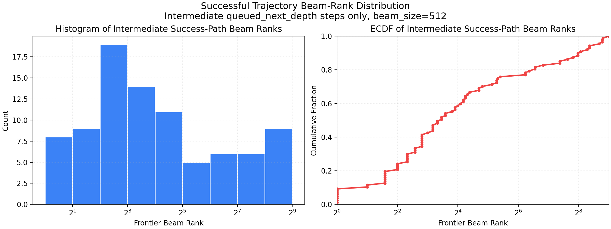
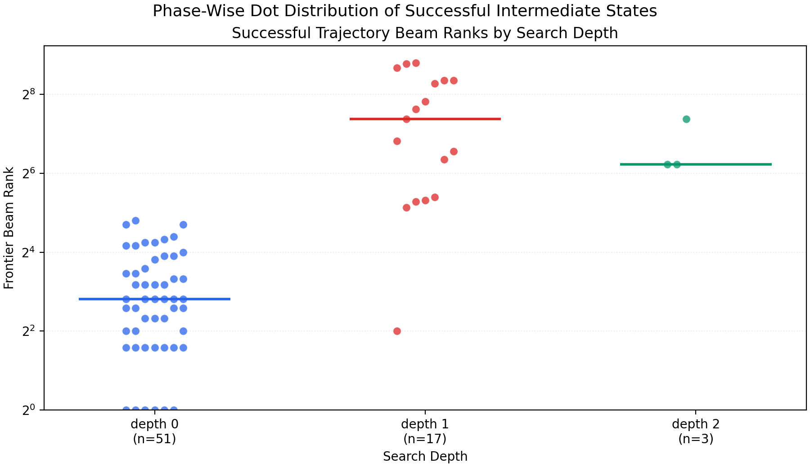
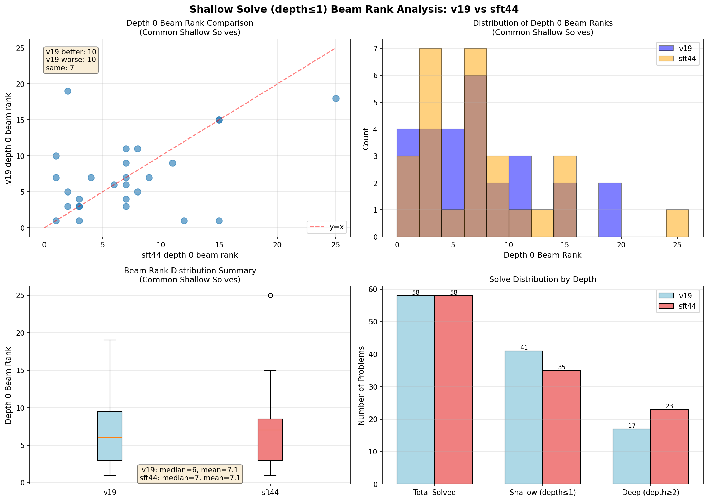
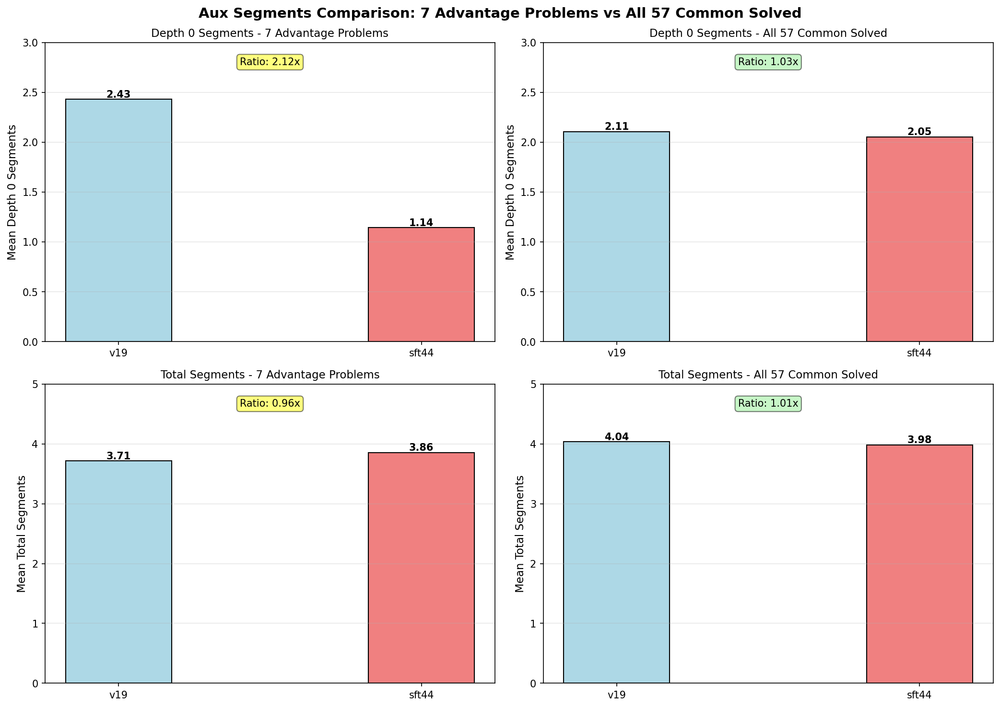

# IMO-95 Success Trajectory Beam-Rank Analysis

## 分析对象

本报告分析以下评测运行中，**成功题目的正确轨迹**在搜索过程中的 beam 排位分布：

- 运行目录：
  `results/v19_lr5e6_checkpoint500_qwen3_vl_text_multiaux/eval_single_problem_multi_gpu_qwen3_vl_text_imo_95_v0-20260508-105855_checkpoint-500_sv1_auxfull_d32_b512_s4_gbs2_gbt100_seed123_20260521T133115Z`
- 汇总 CSV：
  `results/v19_lr5e6_checkpoint500_qwen3_vl_text_multiaux/eval_single_problem_multi_gpu_qwen3_vl_text_imo_95_v0-20260508-105855_checkpoint-500_sv1_auxfull_d32_b512_s4_gbs2_gbt100_seed123_20260521T133115Z.csv`

对应的明细产物：

- 逐步轨迹 CSV：
  `results/v19_lr5e6_checkpoint500_qwen3_vl_text_multiaux/eval_single_problem_multi_gpu_qwen3_vl_text_imo_95_v0-20260508-105855_checkpoint-500_sv1_auxfull_d32_b512_s4_gbs2_gbt100_seed123_20260521T133115Z/analysis/success_trajectory_beam_rank_steps_eval_single_problem_multi_gpu_qwen3_vl_text_imo_95_v0-20260508-105855_checkpoint-500_sv1_auxfull_d32_b512_s4_gbs2_gbt100_seed123_20260521T133115Z.csv`
- 汇总 JSON：
  `results/v19_lr5e6_checkpoint500_qwen3_vl_text_multiaux/eval_single_problem_multi_gpu_qwen3_vl_text_imo_95_v0-20260508-105855_checkpoint-500_sv1_auxfull_d32_b512_s4_gbs2_gbt100_seed123_20260521T133115Z/analysis/success_trajectory_beam_rank_summary_eval_single_problem_multi_gpu_qwen3_vl_text_imo_95_v0-20260508-105855_checkpoint-500_sv1_auxfull_d32_b512_s4_gbs2_gbt100_seed123_20260521T133115Z.json`
- 分布图：
  `./_static/imo95_success_trajectory_beam_rank_distribution.png`
- 分阶段点状图：
  `./_static/imo95_success_trajectory_beam_rank_phase_scatter.png`

## Beam 排位的定义

这里需要区分两个不同概念：

1. `candidate_rank`

- 含义：某个父节点展开时，该候选在本次生成候选列表中的序号。
- 来源：`candidate_transition` 事件中的 `candidate_rank` 字段。

2. `frontier_beam_rank`

- 含义：某个候选经过 DDAR 验证后，如果进入下一层 frontier，它在该层 beam 中的真实排序位置。
- 这不是 trace 里现成字段，而是根据代码逻辑重建出来的。

beam 的真实排序规则来自：

- [src/newclid/agent/runtime/search_runtime.py](/C20545/home/wangzi/GenesisGeo-grpo/src/newclid/agent/runtime/search_runtime.py:309)
- [src/newclid/agent/base.py](/C20545/home/wangzi/GenesisGeo-grpo/src/newclid/agent/base.py:326)

具体做法：

- 只对 `decision="queued_next_depth"` 的节点计入下一层 frontier。
- 在同一 depth 内，按 `beam_score_after` 降序排序。
- 分数并列时，用 `path_key` 的稳定顺序打破平局。
- 只保留 `beam_size=512` 的节点。

因此，本报告中的“成功轨迹在 beam 中的排位”，默认指的是 **中间成功前缀进入下一层 frontier 时的 `frontier_beam_rank`**。

最后一步通常是“从当前节点展开后直接 solved”，它不会进入下一层 frontier，所以只有 `candidate_rank`，没有 `frontier_beam_rank`。

## 方法

分析脚本：

- [scripts/analyze_success_trajectory_beam_rank.py](/C20545/home/wangzi/GenesisGeo-grpo/scripts/analyze_success_trajectory_beam_rank.py)

脚本流程：

1. 从评测 CSV 中读取成功题目列表。
2. 对每道成功题，读取对应 `problems/*.jsonl` 原始事件流。
3. 从 `problem_end.final_node_id` 回溯最终成功节点。
4. 用 `node_id -> parent_node_id` 重建正确轨迹。
5. 在每个 depth 上，对所有 `queued_next_depth` 节点按真实 beam 规则重新排序。
6. 将正确轨迹上的中间节点映射到 `frontier_beam_rank`。
7. 输出逐步 CSV、汇总 JSON 和分布图。

## 总体结论

从汇总 JSON 可得：

- 成功题总数：`58`
- 其中 base DDAR 直接解出：`1`
- 经过搜索后成功：`57`
- 成功轨迹逐步记录总数：`128`
- 可计算 `frontier_beam_rank` 的中间步骤数：`71`

唯一的 base-solved 题目是：

- `imo_sl_2009_g2`

它的 `final_node_id=0`，没有进入 beam 搜索，因此没有 beam 排位可分析。

### 中间成功前缀的 frontier beam rank 分布

- 最小值：`1`
- 25 分位：`5`
- 中位数：`10`
- 75 分位：`35`
- 最大值：`447`

这说明：

- 大量成功轨迹在搜索早期确实处于 beam 前列。
- 但也存在明显长尾，一部分最终成功轨迹在中间层一度掉到 beam 很靠后的位置。
- 极端情况下，正确轨迹曾排到第 `447` 名，已经非常接近 `beam_size=512` 的尾部。

### 最后一步的 candidate rank 分布

最后一步没有下一层 beam 排位，因此使用 `candidate_rank` 描述“解出时在父节点候选中的序号”：

- 最小值：`0`
- 25 分位：`5`
- 中位数：`16`
- 75 分位：`22`
- 最大值：`31`

这说明最终解并不总是来自父节点的前几个候选，后段候选同样经常贡献最终成功。

## 分布图



图中只统计 **中间步骤** 的 `frontier_beam_rank`，不包含最后一步的 `candidate_rank`。

左图是直方图，右图是累计分布（ECDF）。

从图中可以看到：

- 排名 `1-16` 的区间最密集。
- 分布右尾较长，不是一个只集中在 beam 顶部的窄分布。
- 超过 `256` 的尾部样本数量不多，但确实存在，并且这些样本最终仍然能继续走到成功。

## 分阶段点状分布



这张图按 `depth` 分组，把每个成功轨迹中间步骤的 `frontier_beam_rank` 画成散点，纵轴使用对数刻度。

可以直接读出几个现象：

- `depth=0` 的成功前缀大多集中在 beam 前部，但仍有少量点落到更后的位置。
- `depth=1` 的离散程度明显增大，已经出现很多 `100+` 甚至 `400+` 的成功前缀。
- `depth=2` 的样本数比上一版更少，但仍然保留了明显长尾。

结合上面的总体分布，这说明：

- 搜索越往后，成功前缀在 beam 中的位置越不稳定。
- 后续深度上的成功往往依赖于 beam 仍然保留住这些中后部候选。

## 与 sft44 的对比

除了上面的单 run 分析，这次还基于最新 `imo95` 评测结果，补画了 `v19` 与 `sft44` 的 phase scatter 对比图：

- `sft44` run：
  `results/pre_grpo_vlm_sft44_checkpoint20084_qwen3_vl_text_multiaux/eval_single_problem_multi_gpu_qwen3_vl_text_imo_95_vlm_sft44_checkpoint-20084_sv1_auxfull_d32_b512_s4_gbs2_gbt100_seed123_20260522T073225Z`
- `v19` run：
  `results/v19_lr5e6_checkpoint500_qwen3_vl_text_multiaux/eval_single_problem_multi_gpu_qwen3_vl_text_imo_95_v0-20260508-105855_checkpoint-500_sv1_auxfull_d32_b512_s4_gbs2_gbt100_seed123_20260521T133115Z`

对应图像：

- `./_static/imo95_sft44_success_trajectory_phase_scatter.png`
- `./_static/imo95_v19_vs_sft44_success_trajectory_phase_scatter.png`

### 总体结论

- 两个 run 的最终通过数相同，都是 `58/95`。
- 但 `sft44` 的成功轨迹中间点更多：`78`，`v19` 是 `71`。
- `sft44` 的中间 beam rank 分布整体更靠前。
  `sft44`: `min 1 / p25 3 / median 7 / p75 21 / max 406`
  `v19`: `min 1 / p25 5 / median 10 / p75 35 / max 447`
- `v19` 在相同成功前缀上的 beam 排名整体偏差。
  在 `66` 个可配对 `(problem, depth)` 点里：
  `v19 better = 17`，`unchanged = 11`，`v19 worse = 38`

这说明：

- `v19` 最终解题数没有落后于 `sft44`，但在成功路径的中间阶段，正确前缀通常排得更靠后。
- 也就是说，`v19` 更多依赖 beam 宽度把中后段候选保留下来，而不是像 `sft44` 那样更稳定地把正确前缀放在前部。

### 深度分布差异

- `sft44` 的中间成功点深度分布：
  `depth 0 = 51`, `depth 1 = 23`, `depth 2 = 4`
- `v19` 的中间成功点深度分布：
  `depth 0 = 51`, `depth 1 = 17`, `depth 2 = 3`

配对后的深度分布：

- common: `depth 0 = 50`, `depth 1 = 15`, `depth 2 = 1`
- sft44-only: `depth 0 = 1`, `depth 1 = 8`, `depth 2 = 3`
- v19-only: `depth 0 = 1`, `depth 1 = 2`, `depth 2 = 2`

这说明两者在浅层成功前缀上高度重合，但一旦进入更深层，`sft44` 保留下来的成功前缀更多。

### 代表性差异

- `imo_sl_2007_g3`
  `sft44` 在 depth 1 的 `frontier_beam_rank=303`，`v19` 是 `94`。
  这是少数 `v19` 明显更优的深层案例。
- `imo_sl_2002_g7`
  到 depth 2 时，`sft44=326`，`v19=75`。
  说明 `v19` 也不是全局更差，它在部分难题后期反而能把正确前缀拉到更靠前的位置。
- `imo_sl_2008_g1a_variant`
  depth 0 时，`sft44=1`，`v19=28`。
  这是典型的 `v19` 早层排序劣化案例。

整体看，`v19` 相比 `sft44` 更像是：

- 最终成功数持平；
- 中间 beam 排位退化；
- 个别难题深层轨迹更强；
- 总体稳定性不如 `sft44`。

## 成功深度分布

按最终成功发生的搜索深度统计：

- `depth = 0`：`6` 题
- `depth = 1`：`34` 题
- `depth = 2`：`14` 题
- `depth = 3`：`3` 题
- `base solved`：`1` 题

按成功轨迹长度统计：

- 长度 `0`：`1` 题
- 长度 `1`：`6` 题
- 长度 `2`：`34` 题
- 长度 `3`：`14` 题
- 长度 `4`：`3` 题

说明本次 run 的大部分成功发生在较浅层，主要集中在 `depth=1`。

## 代表性案例

### 1. 一路保持靠前：`imo_sl_1999_g6`

成功轨迹：

- depth 0: `candidate_rank=0`, `frontier_beam_rank=1`
- depth 1: `candidate_rank=1`, `frontier_beam_rank=4`
- depth 2: `candidate_rank=10`, `frontier_beam_rank=75`
- depth 3: `candidate_rank=30`, 直接 solved

解读：

- 前两层都非常靠前。
- 到第三层前已掉到 `frontier rank=75`，但仍然足以保留在 beam 中并最终成功。
- 最终解本身来自父节点的第 `30` 个候选，不是顶序候选。

### 2. 接近 beam 尾部仍然成功：`imo_sl_2015_g5_variant`

成功轨迹：

- depth 0: `candidate_rank=20`, `frontier_beam_rank=19`
- depth 1: `candidate_rank=13`, `frontier_beam_rank=447`
- depth 2: `candidate_rank=19`, 直接 solved

解读：

- 这是本次 run 中最极端的长尾案例。
- 正确轨迹在 depth 1 时只排到 `447`，已经落到 beam 的很后段。
- 如果 beam 明显缩小，这条成功轨迹大概率会被提前截断。

### 3. 早层不算顶序，但还能稳定命中：`imo_sl_2006_g6`

成功轨迹：

- depth 0: `candidate_rank=2`, `frontier_beam_rank=3`
- depth 1: `candidate_rank=26`, 直接 solved

解读：

- 正确的第一步并不是 top-1，而是 beam 中第 `3` 名。
- 第二步的最终解来自第 `26` 个候选，说明父节点内部的候选后段也有明显价值。

## 最差中间 beam 排名的 Top 10

根据汇总 JSON：

1. `imo_sl_2015_g5_variant`: `447`
2. `imo_sl_2016_g5_variant`: `438`
3. `imo_sl_2020_g7a`: `409`
4. `imo_sl_2016_g6_variant`: `329`
5. `imo_sl_2020_g8_variant`: `328`
6. `imo_sl_2012_g5`: `311`
7. `imo_sl_2019_g3`: `226`
8. `imo_sl_2008_g1b`: `198`
9. `imo_sl_2007_g3`: `166`
10. `imo_sl_2020_g8`: `166`

这些案例表明：

- 成功路径未必始终停留在 beam 顶部。
- 当前 `beam_size=512` 对于保住一部分长尾成功轨迹是有实际作用的。

## 结论与启示

1. 成功轨迹整体偏前，但并不只集中在极前部。

- 中位数 `10` 说明多数成功前缀确实在 beam 前列。
- 但最大值 `447` 说明成功轨迹仍然存在显著长尾。

2. 较大的 beam 对保留长尾正确轨迹是有价值的。

- 至少在这次 run 中，确实存在接近 beam 下边界的成功前缀。
- 如果缩小 beam，这些题目可能会从“可成功”变成“被提前剪枝”。

3. 最终解经常不是父节点的头部候选。

- 最后一步 `candidate_rank` 中位数 `16`，上四分位 `22`。
- 说明只看 top-k 很小的候选会损失不少成功机会。

4. 需要区分“候选序号”和“beam 排名”。

- `candidate_rank` 反映单次生成内部顺序。
- `frontier_beam_rank` 才反映跨父节点竞争后，在全局下一层 frontier 中的位置。

## 浅层解题分析（Shallow Solve Analysis）

### 定义

**浅层解题**：在 depth ≤ 1 时成功的题目，包括：
- depth = -1：base DDAR 直接解出（无需搜索）
- depth = 0：只需一步 aux 即可解出
- depth = 1：需要两步 aux 才能解出

### 整体统计

| 指标 | v19 | sft44 |
|------|-----|-------|
| 总解题数 | 58/95 | 58/95 |
| 浅层解题数（depth≤1） | 41/58 (70.7%) | 35/58 (60.3%) |
| 深层解题数（depth≥2） | 17/58 (29.3%) | 23/58 (39.7%) |

**关键发现**：
- v19 在浅层解题比例上**高出 10.4 个百分点**（70.7% vs 60.3%）
- 这意味着 v19 更倾向于在搜索早期就找到解，而 sft44 需要更深的搜索
- 但这并未转化为总解题数优势（两者都是 58/95）

### 深度分布细节

| 深度 | v19 | sft44 | 差异 |
|------|-----|-------|------|
| base DDAR (depth=-1) | 1 | 1 | 0 |
| depth=0 | 6 | 6 | 0 |
| depth=1 | 34 | 28 | **+6** |
| depth=2 | 14 | 20 | -6 |
| depth=3 | 3 | 3 | 0 |

**解读**：
- v19 在 depth=1 多解出 6 题，但在 depth=2 少解出 6 题
- 这是一个**深度迁移**现象，而非净增益
- 说明 v19 的策略在浅层更有效，但在深层搜索能力反而下降

### 共同浅层解题的 Beam Rank 比较

在 34 道两者都在 depth≤1 成功的题目中，我们比较了它们在 depth 0 的 frontier beam rank：



#### 统计摘要

| 指标 | v19 | sft44 |
|------|-----|-------|
| 样本数 | 27 | 27 |
| 最小值 | 1 | 1 |
| 中位数 | 6 | 7 |
| 平均值 | 7.1 | 7.1 |
| 最大值 | 19 | 25 |

#### 逐题比较

在 27 道共同浅层解题中：
- **v19 更好**（rank 更低）：10 题（37.0%）
- **sft44 更好**（rank 更低）：10 题（37.0%）
- **相同**：7 题（25.9%）

**结论**：在浅层解题的 beam rank 上，v19 和 sft44 **基本持平**，没有系统性优势。

#### 显著差异案例

**v19 显著更好**（Δrank > 5）：

1. `imo_sl_2018_g2`：sft=15 → v19=1（Δ=14）
2. `imo_sl_2022_g3_variant`：sft=12 → v19=1（Δ=11）
3. `imo_sl_2007_g2_variant`：sft=25 → v19=18（Δ=7）

**v19 显著更差**（Δrank > 5）：

1. `imo_sl_2000_g6`：sft=2 → v19=19（Δ=17）
2. `imo_sl_2015_g3_variant`：sft=1 → v19=10（Δ=9）
3. `imo_sl_2016_g7a`：sft=1 → v19=7（Δ=6）

### 浅层分析结论

1. **深度迁移而非净增益**：v19 的 +6 题 depth=1 优势被 -6 题 depth=2 劣势完全抵消，总解题数持平。

2. **Beam rank 无系统性优势**：在共同浅层解题中，v19 和 sft44 的 depth 0 beam rank 分布几乎相同（中位数 6 vs 7，平均值均为 7.1）。

3. **个体差异大于整体趋势**：存在显著的逐题波动（Δrank 最大达 17），但正负案例数量相当，说明 GRPO 训练**没有系统性地改善浅层搜索的排序质量**。

4. **与全局分析一致**：这个结论与前文"v19 vs sft44 全局对比"中的发现一致——v19 在 66 个配对点中有 38 worse vs 17 better，说明策略 shift 是**分布性的而非能力性的**。

---

## 相关文件

- 评测运行：
  [run_meta.json](/C20545/home/wangzi/GenesisGeo-grpo/results/v19_lr5e6_checkpoint500_qwen3_vl_text_multiaux/eval_single_problem_multi_gpu_qwen3_vl_text_imo_95_v0-20260508-105855_checkpoint-500_sv1_auxfull_d32_b512_s4_gbs2_gbt100_seed123_20260521T133115Z/run_meta.json)
- 逐步明细：
  [success_trajectory_beam_rank_steps_eval_single_problem_multi_gpu_qwen3_vl_text_imo_95_v0-20260508-105855_checkpoint-500_sv1_auxfull_d32_b512_s4_gbs2_gbt100_seed123_20260521T133115Z.csv](/C20545/home/wangzi/GenesisGeo-grpo/results/v19_lr5e6_checkpoint500_qwen3_vl_text_multiaux/eval_single_problem_multi_gpu_qwen3_vl_text_imo_95_v0-20260508-105855_checkpoint-500_sv1_auxfull_d32_b512_s4_gbs2_gbt100_seed123_20260521T133115Z/analysis/success_trajectory_beam_rank_steps_eval_single_problem_multi_gpu_qwen3_vl_text_imo_95_v0-20260508-105855_checkpoint-500_sv1_auxfull_d32_b512_s4_gbs2_gbt100_seed123_20260521T133115Z.csv)
- 汇总统计：
  [success_trajectory_beam_rank_summary_eval_single_problem_multi_gpu_qwen3_vl_text_imo_95_v0-20260508-105855_checkpoint-500_sv1_auxfull_d32_b512_s4_gbs2_gbt100_seed123_20260521T133115Z.json](/C20545/home/wangzi/GenesisGeo-grpo/results/v19_lr5e6_checkpoint500_qwen3_vl_text_multiaux/eval_single_problem_multi_gpu_qwen3_vl_text_imo_95_v0-20260508-105855_checkpoint-500_sv1_auxfull_d32_b512_s4_gbs2_gbt100_seed123_20260521T133115Z/analysis/success_trajectory_beam_rank_summary_eval_single_problem_multi_gpu_qwen3_vl_text_imo_95_v0-20260508-105855_checkpoint-500_sv1_auxfull_d32_b512_s4_gbs2_gbt100_seed123_20260521T133115Z.json)
- 浅层解题分析图：
  [shallow_solve_beam_rank_comparison.png](./_static/shallow_solve_beam_rank_comparison.png)

---

## Aux Segments 对比分析

### 核心发现

- **7 道 v19 优势题目**（v19 在 depth=1 解出，sft44 需要 depth=2）：v19 在 depth 0 使用了 **2.12x** 的 aux segments，但总 segments 反而更少（0.96x）。
- **所有 57 道共同成功题目**：v19 和 sft44 的 aux segments 几乎完全相同（depth 0: 1.03x，总: 1.01x）。

**关键结论**：v19 的"复杂第一步"策略只在特定的 7 道题目上有效，在整体上没有系统性优势。

### 对比可视化



左列为 7 道 v19 优势题目，右列为所有 57 道共同成功题目。

### 7 道 v19 优势题目的详细对比

这些是 **v19 在 depth=1 就解出，但 sft44 需要 depth=2** 的题目。

| 题目 | 模型 | 步数 | d0 Seg | d0 Pts | d1 Seg | d1 Pts | 总 Seg | 总 Pts |
|------|------|------|--------|--------|--------|--------|--------|--------|
| **imo_1983_p2** | v19 | 2 | 1 | 1 | 1 | 1 | 2 | 2 |
| | sft44 | 3 | 1 | 1 | 1 | 1 | 3 | 3 |
| | Δ | -1 | 0 | 0 | 0 | 0 | -1 | -1 |
| **imo_sl_2008_g1a_variant** | v19 | 2 | 1 | 1 | 1 | 1 | 2 | 2 |
| | sft44 | 3 | 1 | 1 | 1 | 1 | 3 | 3 |
| | Δ | -1 | 0 | 0 | 0 | 0 | -1 | -1 |
| **imo_sl_2008_g1a_variant2** | v19 | 2 | **6** | **6** | 1 | 1 | 7 | 7 |
| | sft44 | 3 | 1 | 1 | 1 | 1 | 8 | 8 |
| | Δ | -1 | **+5** | **+5** | 0 | 0 | -1 | -1 |
| **imo_sl_2011_g5** | v19 | 2 | 1 | 1 | 2 | 2 | 3 | 3 |
| | sft44 | 3 | 2 | 2 | 1 | 1 | 4 | 4 |
| | Δ | -1 | -1 | -1 | +1 | +1 | -1 | -1 |
| **imo_sl_2017_g3_variant** | v19 | 2 | **2** | **2** | 2 | 2 | **4** | **4** |
| | sft44 | 3 | 1 | 1 | 1 | 1 | 3 | 3 |
| | Δ | -1 | **+1** | **+1** | +1 | +1 | **+1** | **+1** |
| **imo_sl_2019_g2** | v19 | 2 | **3** | **3** | 1 | 1 | **4** | **4** |
| | sft44 | 3 | 1 | 1 | 1 | 1 | 3 | 3 |
| | Δ | -1 | **+2** | **+2** | 0 | 0 | **+1** | **+1** |
| **imo_sl_2019_g2_variant** | v19 | 2 | **3** | **3** | 1 | 1 | **4** | **4** |
| | sft44 | 3 | 1 | 1 | 1 | 1 | 3 | 3 |
| | Δ | -1 | **+2** | **+2** | 0 | 0 | **+1** | **+1** |

#### 7 道优势题目统计摘要

| 指标 | v19 | sft44 | v19/sft44 |
|------|-----|-------|-----------|
| Depth 0 平均 segments | **2.43** | 1.14 | **2.12x** |
| Depth 0 最大值 | 6 | 2 | — |
| 总平均 segments | 3.71 | 3.86 | 0.96x |
| 平均步数 | 2 | 3 | — |

Depth 0 对比：v19 更多 4/7，相同 2/7，v19 更少 1/7。

#### 典型案例

**`imo_sl_2008_g1a_variant2`**（最极端差异）：

v19 depth 0（6 segments，6 points）：
```
k = on_aline k b d d b a, on_tline k c a b
l = on_aline l c d d c a, angle_bisector l d a c
m = on_line m a d, on_tline m l a d
n = on_line n a c, on_tline n l a c
o = on_line o c d, on_tline o l c d
p = midpoint p k n
```

sft44 depth 0（1 segment，1 point）：
```
k = on_circum k a b g, on_line k b d
```

**`imo_sl_2019_g2` / `imo_sl_2019_g2_variant`**（两道变体题策略完全一致）：

v19 depth 0（3 segments，3 points）：
```
m = on_tline m b b d, on_circle m b d
n = on_pline n m b d, on_pline n d b m
o = midpoint o b n
```

sft44 depth 0（1 segment，1 point）：
```
m = on_circle m h e, on_circle m i e
```

### 所有 57 道共同成功题目的统计

| 指标 | v19 | sft44 | v19/sft44 |
|------|-----|-------|-----------|
| Depth 0 平均 segments | 2.11 | 2.05 | **1.03x** |
| Depth 0 中位数 | 2.00 | 1.00 | — |
| 总平均 segments | 4.04 | 3.98 | **1.01x** |
| 总中位数 | 4.00 | 4.00 | — |
| 平均步数 | 2.18 | 2.30 | — |

Depth 0 对比：v19 更多 11/57（19.3%），相同 39/57（**68.4%**），v19 更少 7/57（12.3%）。

总 segments 对比：v19 更多 12/57（21.1%），相同 35/57（**61.4%**），v19 更少 10/57（17.5%）。

### Aux Segments 综合结论

| 指标 | 7 道优势题目 | 所有 57 道题目 |
|------|-------------|---------------|
| Depth 0 segments (v19/sft44) | **2.12x** | **1.03x** |
| 总 segments (v19/sft44) | 0.96x | 1.01x |

v19 在 7 道特定题目上学会了使用更复杂的第一步（2.12x segments），但在整体 57 道题目上这个优势几乎消失（1.03x）。这 7 道题只占成功题目的 12%，局部优化被整体持平抵消，总解题数仍然是 58/95。

- 图：[v19_vs_sft44_aux_segments_all_vs_advantage.png](./_static/v19_vs_sft44_aux_segments_all_vs_advantage.png)
- 图：[v19_vs_sft44_aux_segments_comparison.png](./_static/v19_vs_sft44_aux_segments_comparison.png)
