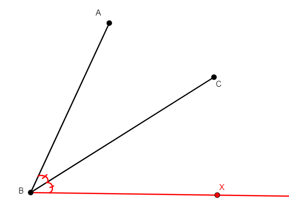

Definitions
===========

Definitions are the basic building blocks for the statement of problems. Each definition works as a function, demanding a certain collection of arguments, in order to create new points, and add corresponding predicates to the proof state (see details in :ref:`Adding new problems`).

The definitions available in the defs.txt file are the following (definitions in section :ref:`New Definitions` were added by us and are available in new_defs.txt):

.. image:: ../../_static/Images/defs/angle_bisector.png
    :width: 400
    :align: center

- **angle_bisector x a b c:** From non-collinear points a, b, c, creates x in the internal bisector of angle abc, with vertex at b. Adds the statement that angle abx and angle xbc are congruent. Construction returns a line that can be subjected to intersections.

- **angle_mirror x a b c:** From non-collinear points a, b, c, creates x on the opposite side of bc with respect to a in a way that angle abx doubles angle abc. Adds the statement that angle abc and angle cbx are congruent. Construction returns a ray that can be subjected to intersections.

- **circle x a b c:** From non-collinear points a, b, c, creates x the center of the circle through a, b, c. Adds the congruence statements that xa=xb and xb=xc.

- **circumcenter x a b c:** Same construction as **circle x a b c**.

- **eq_quadrangle a b c d:** From nothings, adds four points in a quadrilateral abcd with two opposing sides (AD and BC) of same length. Adds the congruence statement that ad=bc.

- **iso_trapezoid a b c d:** From nothing, adds four points on a trapezoid abcd with parallel opposing sides ab and cd and non-parallel opposing sides ad and bc of same length. Adds the congruence statement that ad=bc and the parallel statement that ab//cd.

- **eq_triangle x b c:** From two different points b, c, adds a third point x such that the triangle xbc is equilateral. Adds the two side congruence statements xb=bc and xc=bc, as well as the two angle congruence statements that the angles xbc and xcb are congruent, as well as angles xbc and cxb.

- **eqangle2 x a b c:** From three non-collinear points a, b, c, adds a third point x such that the quadrilateral abcx has two opposed angles that are congruent, bax and bcx. Adds the statement that angles bax and bcx are congruent. Should be able to be subjected to intersections.

- **eqdia_quadrangle a b c d:** From nothing, adds four points on a quadrilateral abcd with the two diagonals of same length. Adds the congruence statement that bd=ac.

- **eqdistance x a b c:** From two different points b, c, and with a base point a (that can be b or c themselves), adds x such that the distance from x to a is equal to the distance from b to c. Adds the congruence statement that ax=bc. Construction returns a circle that can be subjected to intersections.

- **foot x a b c:** From three non-collinear points a, b, c, adds x that is the perpendicular projection of a onto line bc. Adds the statements that x, b, and c are collinear, and that ax is perpendicular to bc.

- **free a:** From nothing, adds a point a with random coordinates.

- **incenter x a b c:** From three non-collinear points a, b, c, adds x the incenter of the triangle abc. Adds the corresponding three angle congruence statements corresponding to the fact that the incenter is the meeting of the three internal bisectors of the angles of the triangle.

- **incenter2 x y z i a b c:** From three non-collinear points a, b, c, adds i, the incenter of the triangle abc, as well as x, y, and z, the tangent points of the incircle with sides bc, ac, and ab, respectively. Adds the three angle congruence statements corresponding to the fact that the incenter is the meeting of the three internal bisectors of the angles of the triangle, as well as the three collinear statements that place x, y, and z in the corresponding sides of the triangle abc. It also adds the perpendicular statements that ix is perpendicular to bc, that iy is perpendicular to ac, and that iz is perpendicular to ab, given by the tangency of circle and triangle. Finally, it adds the congruence statements ix=iy and iy=iz, given by the fact that x, y, z are in the circle of center i.

- **excenter x a b c:** From three non-collinear points a, b, c, adds x the excenter of triangle abc in a way that the corresponding excircle is externally tangent to side bc. Symbolically, it works exactly as the incenter construction because the angle constructions in DD do not differentiate the two bisectors of an angle crossing.

- **excenter2 x y z i a b c:** From three non-collinear points a, b, c, adds i, the excenter of the triangle abc in a way that the corresponding excircle is externally tangent to side bc. It also adds x, y, and z, the tangent points of the incircle with the lines containing sides bc, ac, and ab, respectively. Symbolically, it works exactly as the incenter construction because the angle constructions in DD do not differentiate the two bisectors of an angle crossing.

- **centroid x y z i a b c:** 

- **ninepoints x y z i a b c:** 

- **intersection_cc x o w a:** From three non-colinear points, o, w, and a, adds x, the other intersection of the circle of center o through a and the circle of center w through a. Adds the two congruence statements oa=ox and wa=wx corresponding to x being in the circle of center o through and in the circle of center w through a, respectively.

- **intersection_lc x a o b:** From three points, a, o, and b, b different from both a and o, such that bo is not perpendicular to ba (to avoid the situation of a line tangent to a circle at b), adds point x, the second intersection of line ab with the circle of center o going through b. Adds the statements of the colinearity between a, b, and x, and the congruence statement ob=ox, that guarantees that x is in the circle of center o and going through b.

- **intersection_ll x a b c d:** From four points a, b, c, d, such that lines ab and cd are not parallel and such that they do are not all collinear, build point x on the intersection of lines ab and cd. Adds the statements that x, a, and b are collinear and that x, c, and d are collinear.

- **intersection_lp x a b c m n:** From five points a, b, c, m, and n, such that lines ab and mn are not parallel, and that c is neither on line ab nor on line mn, build x, the intersection of line ab with the line through c that is parallel to mn. Adds the statements that x, a, and b are collinear and that lines cx and mn are parallel.

- **intersection_lt x a b c d e:** From five points a, b, c, d, and e, such that lines ab and de are not perpendicular and c is not on line ab, build x, the intersection of line ab and the line through c perpendicular to de. Adds the statements that x, a, and b are collinear and that lines cx and de are perpendicular.

- **intersection_pp x a b c d e f:** From six points, a, b, c, d, e, f, such that a and d are different and that lines bc and ef are not parallel, builds point x in the intersection of the line through a parallel to bc and the line through d parallel to ef. Adds the statements that xa and bc are parallel and that xd and ef are parallel.

- **intersection_tt x a b c d e f:** From six points, a, b, c, d, e, f, such that a and d are different and lines bc and ef are not parallel, build point x in the intersection of the line through a perpendicular to bc and the line through d perpendicular to ef. Adds the statements that xa and bc are perpendicular and that xd and ef are perpendicular.

- **iso_triangle a b c:** From nothing, creates the three vertices a, b, c of an isosceles triangle with ab=ac. It adds BOTH the congruence statement for ab=ac and for the congruence of angle abc and angle acb. (Compare to iso_triangle0, iso_triangle_vertex, and iso_triangle_vertext_angle below).

- **lc_tangent x a o:**

- **midpoint x a b:** From a pair of points a, b, that are different, builds m, the midpoint of a and b. Adds the statements that m, a, and b are collinear and that am=bm.

- **mirror x a b:** From two points a, b that are different, builds x, the reflection of point a with respect to point b (so that b is the midpoint of ax). Adds the statements that a, b, and x are collinear and that ba=bx.

- **nsquare x a b:**

- **on_aline x a b c d e:**

- **on_bline x a b:**

- **on_circle x o a:**

- **on_line x a b:**

- **on_pline x a b c:** From three non-colinear points a, b, c, with b different from c, builds x on the line parallel to bc through a. Adds the parallel statement saying xa is parallel to bc. Construction returns a line, so can be subjected to intersections. (Compare to the simpler on_pline0 below).

- **on_tline x a b c:**

- **orthocenter x a b c:**

- **parallelogram a b c x:**

- **pentagon a b c d e:** From nothing, creates five points a, b, c, d, e. The coordinates are a random conformal deformation (isometry combined with scaling) of a random inscribed convex pentagon.

- **psquare x a b:**

- **quadrangle a b c d:** From nothing, creates four points, a, b, c, d which are vertices of a random convex quadrilateral.

- **r_trapezoid a b c d:**

- **r_triangle a b c:**

- **rectangle a b c d:**

- **reflect x a b c:** From three non-collinear points a, b, c, in particular with b different from c, builds x the reflection of a by the line bc. Adds the congruence statements for the reflection saying ab=xb and ac=xc, as well as the perpendiculatity statement saying ax is perpendicular to bc.

- **risos a b c:**

- **segment a b:** From nothing, adds two points a, b, with random coordinates.

- **shift x b c d:** From three points b, c, d, with b different from d (presents the building of two points with the same coordinates), build x, the translation of b by the vector from d to c. Adds the (natural) congruence statement bx=cd and the (less natural) condition for the parallelogram xc=bd.

- **square a b x y:**

- **isquare a b c d:**

- **trapezoid a b c d:** From nothing, creates four vertices of a trapezoid abcd, with ab parallel to cd. Adds the parallel statement saying ab=cd.

- **triangle a b c:** From nothing, creates three points a, b, and c, with random coordinates.

- **triangle12 a b c:**

- **2l1c x y z i a b c o:**

- **e5128 x y a b c d:**

- **3peq x y z a b c:**

- **trisect x y a b c:**

- **trisegment x y a b:**

- **on_dia x a b:**

- **ieq_triangle a b c:**

- **on_opline x a b:** From a pair of different points a, b, builds x, a point on the line ab such that a is NOT between x and b. Adds the statement that a, b, and x are collinear. Construction returns a half-line, so can be subjected to intersections.

- **cc_tangent0 x y o a w b:**

- **cc_tangent x y z i o a w b:**

- **eqangle3 x a b d e f:**

- **tangent x y a o b:**

- **on_circum x a b c:** 

New Definitions
---------------

- **on_pline0 x a b c:** From three points a, b, c, with b different from c, builds x on the line parallel to bc through a. Adds the parallel statement saying xa is parallel to bc. Construction returns a line, so can be subjected to intersections. (Compare to on_pline above). This definition was created to allow for the addition of a parallel statement on overlapping lines, by dismissing the restriction of a, b, c being non-collinear, without which r28 would be a rule that could not occur.

- **iso_triangle0 a b c:**

- **iso_triangle_vertex x b c:**

- **iso_triangle_vertex_angle x b c:**

- **on_aline0 x a b c d e f g:**

- **eqratio x a b c d e f g:** From seven points a, b, c, d, e, f, g, builds x, a point such that ab/cd=ef/gx. Adds the ratio equality statement corresponding to ab/cd=ef/gx. Construction returns a circle, that can be subjected to intersection. This definition was created to allow for the explicit prescription of eqratio statements on problems.

- **eqratio6 x a c e f g h:** From six points a, c, e, f, g, h, builds x,  a point such that ax/cx=ef/gh. Adds the ratio equality statement corresponding to ax/cx=ef/gh. Construction returns a line if ef/gh=1, and a circle otherwise, and can be subjected to intersection in any case. This definition was created to allow a common case for prescription of eqratio statements, when the new point shows up twice in the ratio equality (particularly common when subdividing a segment).

- **rconst a b c x r:**

- **aconst a b c x r:**

- **s_angle a b x y:**

- **lconst x a y:** (Still a placeholder, not working). From a point a, builds x with an integer distance y from a to x. Adds the statement that the distance from a to x is y. Construction returns a circle that can be subjected to intersections. This definition was created as an entry point to add the manipulation of lengths to DDAR.