Definitions
===========

Definitions are the basic building blocks for the statement of problems. Each definition works as a function, demanding a certain collection of arguments, in order to create new points, and add corresponding predicates to the proof state (see details in :ref:`Adding new problems`).

Constructions that are not points directly can be subject to intersection, otherwise they generate point coordinates through a random choice.

The definitions available in the defs.txt file are listed below. The definitions in section :ref:`New Definitions` were added by us.

The original AlphaGeometry also had definitions "on_aline2" and "cc_tangent0", which were not functional, and "on_opline", which depended on the half-line class, which was eliminated. We also renamed the previous "eq_trapezoid" definition to "iso_trapezoid".

Legacy definitions
------------------

angle_bisector x a b c
^^^^^^^^^^^^^^^^^^^^^^
.. list-table::
   :widths: 50 25 23 2
   :header-rows: 1

   * - Figure
     - Description
     - Added Statements
     - Construction
   * - |angle_bisector|
     - From non-collinear points a, b, c, creates x in the internal bisector of angle abc, with vertex at b.
     - :math:`\widehat{abx}=\widehat{xbc}` (eqangle b a b x b x b c).
     - Line

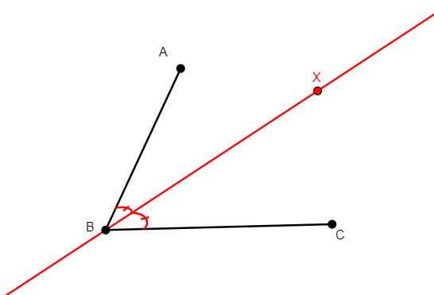

angle_mirror x a b c
^^^^^^^^^^^^^^^^^^^^

.. list-table::
   :widths: 50 25 23 2
   :header-rows: 1

   * - Figure
     - Description
     - Added Statements
     - Construction
   * - |angle_mirror|
     - From non-collinear points a, b, c, creates x on the opposite side of bc with respect to a in a way that angle abx doubles angle abc. (Compare to :ref:`on_aline0 x a b c d e f g` below.)
     - :math:`\widehat{abc}=\widehat{cbx}` (eqangle b a b c b c b x).
     - Ray

.. |angle_mirror| image:: ../../_static/images/defs/angle_mirror.png
    :width: 100%

circle x a b c
^^^^^^^^^^^^^^

.. list-table::
   :widths: 50 25 23 2
   :header-rows: 1

   * - Figure
     - Description
     - Added Statements
     - Construction
   * - |circle|
     - From non-collinear points a, b, c, creates x the center of the circle through a, b, c.
     - :math:`xa=xb \wedge xb=xc`  (cong x a x b, cong x b x c)
     - Point

.. |circle| image:: ../../_static/images/defs/circle.png
    :width: 100%

circumcenter x a b c
^^^^^^^^^^^^^^^^^^^^

Same construction as **circle x a b c**.

eq_quadrangle a b c d
^^^^^^^^^^^^^^^^^^^^^

.. list-table::
   :widths: 50 25 23 2
   :header-rows: 1

   * - Figure
     - Description
     - Added Statements
     - Construction
   * - |eq_quadrangle|
     - From nothings, adds four points in a quadrilateral abcd with two opposing sides (AD and BC) of same length.
     - :math:`ad=bc`  (cong d a b c)
     - Points

.. |eq_quadrangle| image:: ../../_static/images/defs/eq_quadrangle.png
    :width: 100%

iso_trapezoid a b c d
^^^^^^^^^^^^^^^^^^^^^

.. list-table::
   :widths: 50 25 23 2
   :header-rows: 1

   * - Figure
     - Description
     - Added Statements
     - Construction
   * - |iso_trapezoid|
     - From nothing, adds four points on a trapezoid abcd with parallel opposing sides ab and cd and non-parallel opposing sides ad and bc of same length. Adds the congruence statement that ad=bc and the parallel statement that ab//cd.
     - :math:`ab//cd \wedge ad=bc`  (para d c a b, cong d a b c)
     - Points

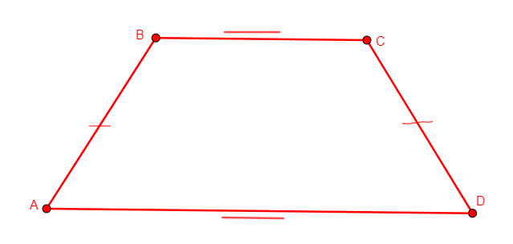

eq_triangle x b c
^^^^^^^^^^^^^^^^^

.. list-table::
   :widths: 50 25 23 2
   :header-rows: 1

   * - Figure
     - Description
     - Added Statements
     - Construction
   * - |eq_triangle|
     - From two different points b, c, adds a third point x such that the triangle xbc is equilateral.
     - :math:`\begin{cases}xb=bx \wedge bc=cx \\ \widehat{xbc} = \widehat{bcx} \wedge \widehat{cxb} = \widehat{xbc}\end{cases}`  (cong x b b c, cong b c c x; eqangle b x b c c b c x, eqangle x c x b b x b c)
     - Point

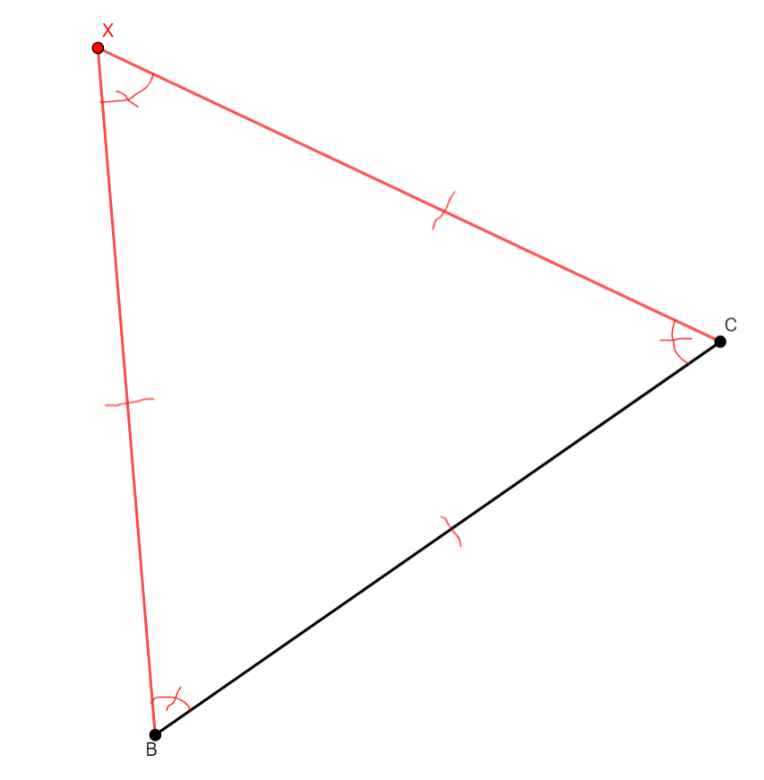

eqangle2 x a b c
^^^^^^^^^^^^^^^^

.. list-table::
   :widths: 50 25 23 2
   :header-rows: 1

   * - Figure
     - Description
     - Added Statements
     - Construction
   * - |eqangle2|
     - From three non-collinear points a, b, c, adds a third point x such that the quadrilateral abcx has two opposite angles that are congruent, bax and bcx.
     - :math:`\widehat{bax} = \widehat{xcb}`  (eqangle a b a x c x c b)
     - Point (Locus could be hyperbola.)

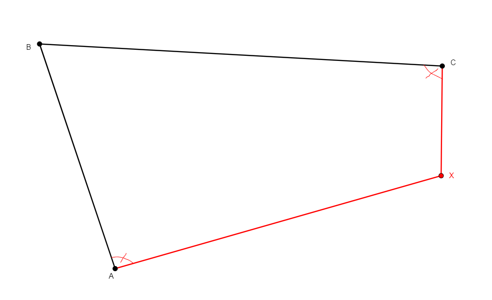

eqdia_quadrangle a b c d
^^^^^^^^^^^^^^^^^^^^^^^^

.. list-table::
   :widths: 50 25 23 2
   :header-rows: 1

   * - Figure
     - Description
     - Added Statements
     - Construction
   * - |eqdia_quadrangle|
     - From nothing, adds four points on a quadrilateral abcd with the two diagonals of same length.
     - :math:`bd=ac`  (cong d b a c)
     - Points

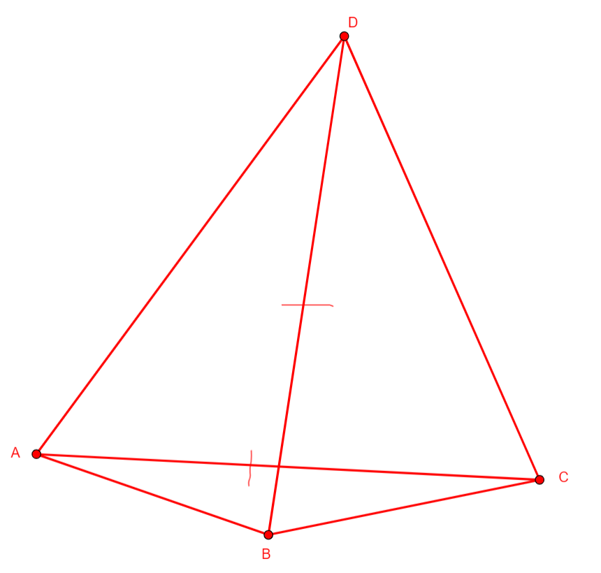

eqdistance x a b c
^^^^^^^^^^^^^^^^^^

.. list-table::
   :widths: 50 25 23 2
   :header-rows: 1

   * - Figure
     - Description
     - Added Statements
     - Construction
   * - |eqdistance|
     - From two different points b, c, and with a base point a (that can be either b or c itself), adds x such that the distance from x to a is equal to the distance from b to c.
     - :math:`ax=bc`  (cong x a b c)
     - Circle

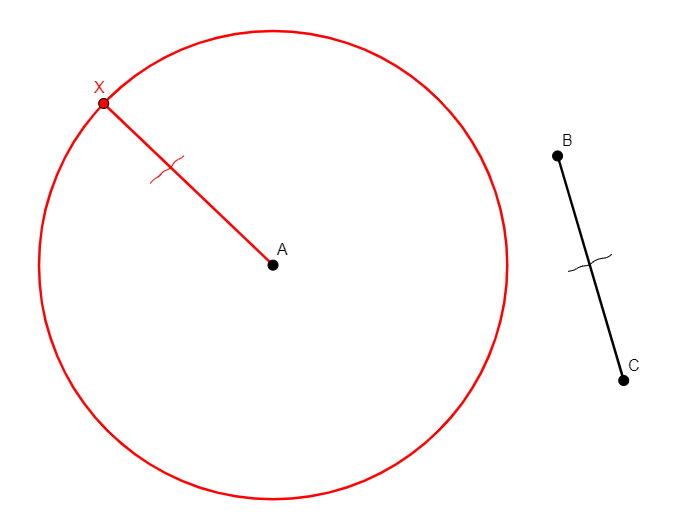

foot x a b c
^^^^^^^^^^^^

.. list-table::
   :widths: 50 25 23 2
   :header-rows: 1

   * - Figure
     - Description
     - Added Statements
     - Construction
   * - |foot|
     - From three non-collinear points a, b, c, adds x that is the perpendicular projection of a onto line bc.
     - :math:`\begin{cases}x,b,c\ collinear\\ ax\perp bc\end{cases}`  (coll x b c, perp x a b c)
     - Point

.. |foot| image:: ../../_static/images/defs/foot.png
    :width: 100%

free a
^^^^^^

.. list-table::
   :widths: 50 25 23 2
   :header-rows: 1

   * - Figure
     - Description
     - Added Statements
     - Construction
   * - |free|
     - From nothing, adds point a with random coordinates.
     - No statement added
     - Point

.. |free| image:: ../../_static/images/defs/free.png
    :width: 100%

incenter x a b c
^^^^^^^^^^^^^^^^

.. list-table::
   :widths: 50 25 23 2
   :header-rows: 1

   * - Figure
     - Description
     - Added Statements
     - Construction
   * - |incenter|
     - From three non-collinear points a, b, c, adds x the incenter of the triangle abc. It acknowledges the fact that it is the intersection of the three internal bisectors of the angles of the triangle.
     - :math:`\begin{cases}\widehat{bax}=\widehat{xac}\\ \widehat{acx}=\widehat{xcb}\\ \widehat{cbx}=\widehat{xba}\end{cases}`  (eqangle a b a x a x a c, eqangle c a c x c x c b, eqangle b c b x b x b a)
     - Point

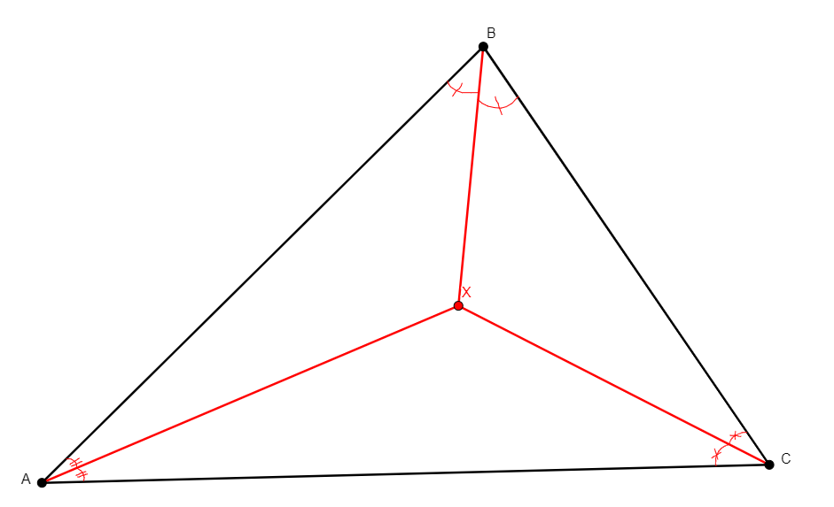

incenter2 x y z i a b c
^^^^^^^^^^^^^^^^^^^^^^^

.. list-table::
   :widths: 50 25 23 2
   :header-rows: 1

   * - Figure
     - Description
     - Added Statements
     - Construction
   * - |incenter2|
     - From three non-collinear points a, b, c, adds i, the incenter of the triangle abc, as well as x, y, and z, the tangent points of the incircle with sides bc, ac, and ab, respectively. It acknowledges the fact that the incenter is the intersection of the three internal bisectors of the angles of the triangle, and that a radius of a circle and the tangent line are perpendicular at the point of tangency.
     - :math:`\begin{cases}\widehat{bax}=\widehat{xac}\\ \widehat{acx}=\widehat{xcb}\\ \widehat{cbx}=\widehat{xba}\\ x,b,c\ collinear\\ ix\perp bc\\ y,c,a\ collinear\\ iy\perp ca\\ z,a,b\ collinear\\ iz\perp ab\\ ix=iy, iy=iz\end{cases}`  (eqangle a b a i a i a c, eqangle c a c i c i c b, eqangle b c b i b i b a, coll x b c, perp i x b c, coll y c a, perp i y c a, coll z a b, perp i z a b, cong i x i y, cong i y i z)
     - Points

.. |incenter2| image:: ../../_static/images/defs/incenter2.png
    :width: 100%

excenter x a b c
^^^^^^^^^^^^^^^^

.. list-table::
   :widths: 50 25 23 2
   :header-rows: 1

   * - Figure
     - Description
     - Added Statements
     - Construction
   * - |excenter|
     - From three non-collinear points a, b, c, adds x the excenter of triangle abc in a way that the corresponding excircle is externally tangent to side bc. Symbolically, it works exactly as the incenter construction because the angle constructions in DD do not differentiate the two bisectors of an angle crossing.
     - :math:`\begin{cases}\widehat{bax}=\widehat{xac}\\ \widehat{acx}=\widehat{xcb}\\ \widehat{cbx}=\widehat{xba}\end{cases}` (eqangle a b a x a x a c, eqangle c a c x c x c b, eqangle b c b x b x b a)
     - Point

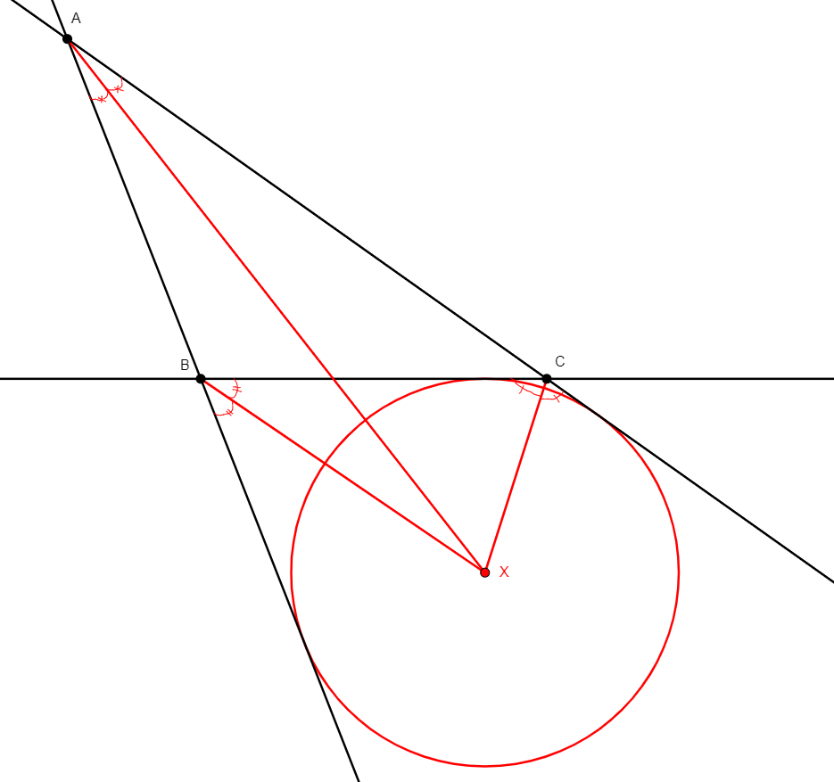

excenter2 x y z i a b c
^^^^^^^^^^^^^^^^^^^^^^^

.. list-table::
   :widths: 50 25 23 2
   :header-rows: 1

   * - Figure
     - Description
     - Added Statements
     - Construction
   * - |excenter2|
     - From three non-collinear points a, b, c, adds i, the excenter of the triangle abc in a way that the corresponding excircle is externally tangent to side bc. It also adds x, y, and z, the tangent points of the incircle with the lines containing sides bc, ac, and ab, respectively. Symbolically, it works exactly as the incenter construction because the angle constructions in DD do not differentiate the two bisectors of an angle crossing.
     - :math:`\begin{cases}\widehat{bax}=\widehat{xac}\\ \widehat{acx}=\widehat{xcb}\\ \widehat{cbx}=\widehat{xba}\\ x,b,c\ collinear\\ ix\perp bc\\ y,c,a\ collinear\\ iy\perp ca\\ z,a,b\ collinear\\ iz\perp ab\\ ix=iy, iy=iz\end{cases}`  (eqangle a b a i a i a c, eqangle c a c i c i c b, eqangle b c b i b i b a, coll x b c, perp i x b c, coll y c a, perp i y c a, coll z a b, perp i z a b, cong i x i y, cong i y i z)
     - Points

.. |excenter2| image:: ../../_static/images/defs/excenter2.png
    :width: 100%

centroid x y z i a b c
^^^^^^^^^^^^^^^^^^^^^^

.. list-table::
   :widths: 50 25 23 2
   :header-rows: 1

   * - Figure
     - Description
     - Added Statements
     - Construction
   * - |centroid|
     - From three non-collinear points a, b, c, adds i, the centroid of the triangle. It also adds x, y, and z, the midpoints of sides bc, ac, and ab, respectively.
     - :math:`\begin{cases}x,b,c\ collinear\\ bx=xc\\ y,c,a\ collinear\\ cy=ya\\ z,a,b\ collinear\\ az=zb\\ a,i,x\ collinear\\b,i,y\ collinear\\c,i,z\ collinear\end{cases}`  (coll x b c, cong x b x c, coll y c a, cong y c y a, coll z a b, cong z a z b, coll a x i, coll b y i, coll c z i)
     - Points

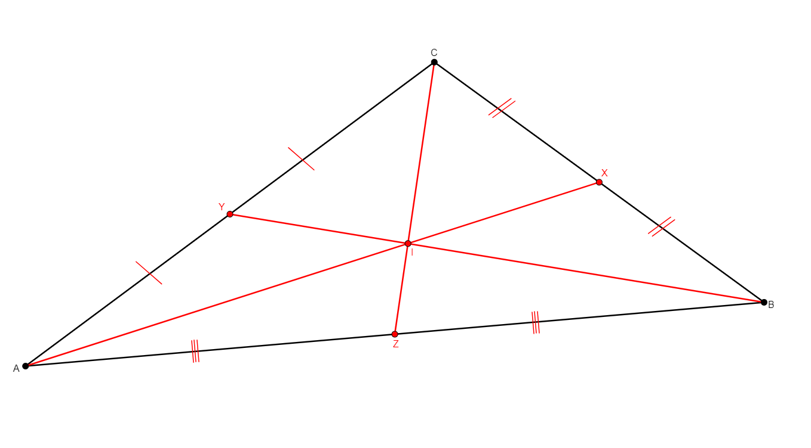

ninepoints x y z i a b c
^^^^^^^^^^^^^^^^^^^^^^^^

.. list-table::
   :widths: 50 25 23 2
   :header-rows: 1

   * - Figure
     - Description
     - Added Statements
     - Construction
   * - |ninepoints|
     - From three non-collinear points a, b, c, adds x, y, and z, the midpoints of sides bc, ac, and ab, respectively. It also adds i, the center of the circle going through x, y, and z, which is also the nine points circle of the triangle abc.
     - :math:`\begin{cases}x,b,c\ collinear\\ bx=xc\\ y,c,a\ collinear\\ cy=ya\\ z,a,b\ collinear\\ az=zb\\ xi=iy\\ yi=iz\end{cases}`  (coll x b c, cong x b x c, coll y c a, cong y c y a, coll z a b, cong z a z b, cong i x i y, cong i y i z)
     - Points

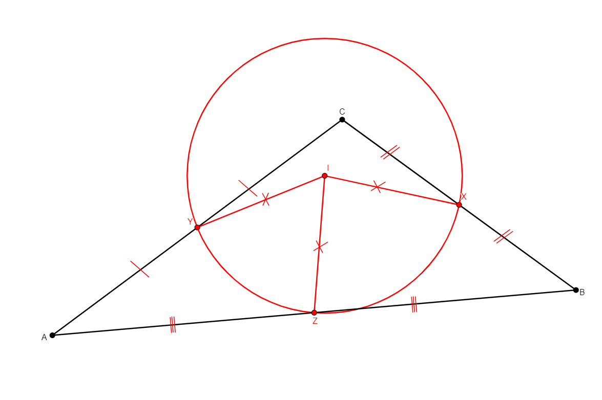

intersection_cc x o w a
^^^^^^^^^^^^^^^^^^^^^^^

.. list-table::
   :widths: 50 25 23 2
   :header-rows: 1

   * - Figure
     - Description
     - Added Statements
     - Construction
   * - |intersection_cc|
     - From three non-colinear points, o, w, and a, adds x, the other intersection of the circle of center o through a and the circle of center w through a.
     - :math:`\begin{cases}oa=ox\\ wa=wx\end{cases}`  (cong o a o x, cong w a w x)
     - Point

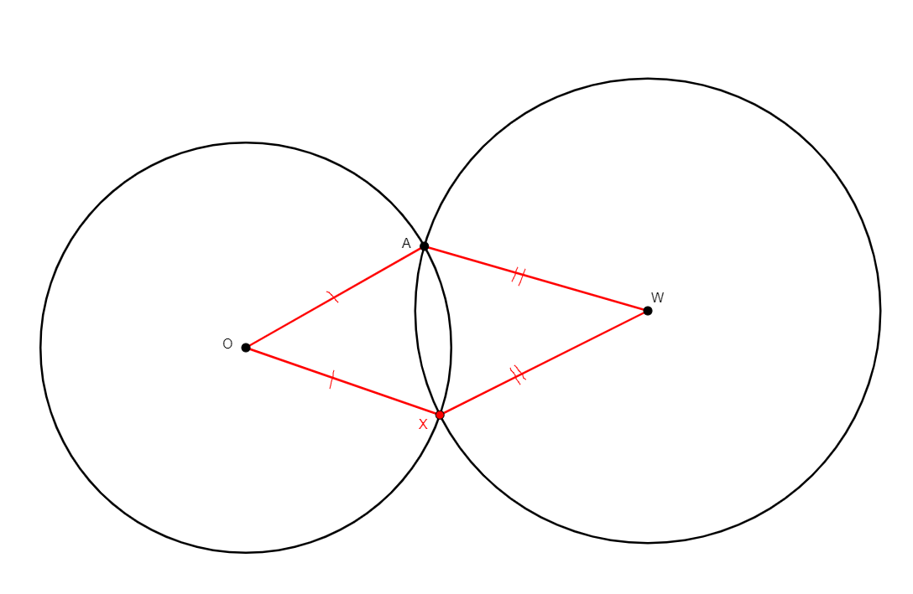

intersection_lc x a o b
^^^^^^^^^^^^^^^^^^^^^^^

.. list-table::
   :widths: 50 25 23 2
   :header-rows: 1

   * - Figure
     - Description
     - Added Statements
     - Construction
   * - |intersection_lc|
     - From three points, a, o, and b, b different from both a and o, such that bo is not perpendicular to ba (to avoid the situation of a line tangent to a circle at b), adds point x, the second intersection of line ab with the circle of center o going through b.
     - :math:`\begin{cases}x, a, b\ collinear\\ ob=ox\end{cases}`  (coll x a b, cong o b o x)
     - Point

.. |intersection_lc| image:: ../../_static/images/defs/intersection_lc.png
    :width: 100%

intersection_ll x a b c d
^^^^^^^^^^^^^^^^^^^^^^^^^

.. list-table::
   :widths: 50 25 23 2
   :header-rows: 1

   * - Figure
     - Description
     - Added Statements
     - Construction
   * - |intersection_ll|
     - From four points a, b, c, d, such that lines ab and cd are not parallel and such that they do are not all collinear, build point x on the intersection of lines ab and cd.
     - :math:`\begin{cases}x, a, b\ collinear\\ x, c, d\ collinear\end{cases}`  (coll x a b, coll x c d)
     - Point

.. |intersection_ll| image:: ../../_static/images/defs/intersection_ll.png
    :width: 100%

intersection_lp x a b c m n
^^^^^^^^^^^^^^^^^^^^^^^^^^^

.. list-table::
   :widths: 50 25 23 2
   :header-rows: 1

   * - Figure
     - Description
     - Added Statements
     - Construction
   * - |intersection_lp|
     - From five points a, b, c, m, and n, such that lines ab and mn are not parallel, and that c is neither on line ab nor on line mn, builds x, the intersection of line ab with the line through c that is parallel to mn.
     - :math:`\begin{cases}x, a, b\ collinear\\ cx\parallel mn\end{cases}`  (coll x a b, para c x m n)
     - Point

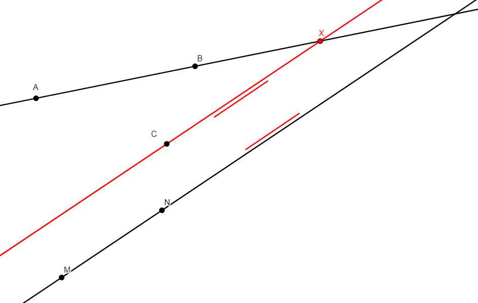

intersection_lt x a b c d e
^^^^^^^^^^^^^^^^^^^^^^^^^^^

.. list-table::
   :widths: 50 25 23 2
   :header-rows: 1

   * - Figure
     - Description
     - Added Statements
     - Construction
   * - |intersection_lt|
     - From five points a, b, c, d, and e, such that lines ab and de are not perpendicular and c is not on line ab, build x, the intersection of line ab and the line through c perpendicular to de.
     - :math:`\begin{cases}x, a, b\ collinear\\ cx\perp de\end{cases}`  (coll x a b, perp x c d e)
     - Point

.. |intersection_lt| image:: ../../_static/images/defs/intersection_lt.png
    :width: 100%

intersection_pp x a b c d e f
^^^^^^^^^^^^^^^^^^^^^^^^^^^^^

.. list-table::
   :widths: 50 25 23 2
   :header-rows: 1

   * - Figure
     - Description
     - Added Statements
     - Construction
   * - |intersection_pp|
     - From six points, a, b, c, d, e, f, such that a and d are different and that lines bc and ef are not parallel, builds point x in the intersection of the line through a parallel to bc and the line through d parallel to ef.
     - :math:`\begin{cases}xa\parallel bc\\ xd\parallel ef\end{cases}`  (para x a b c, para x d e f)
     - Point

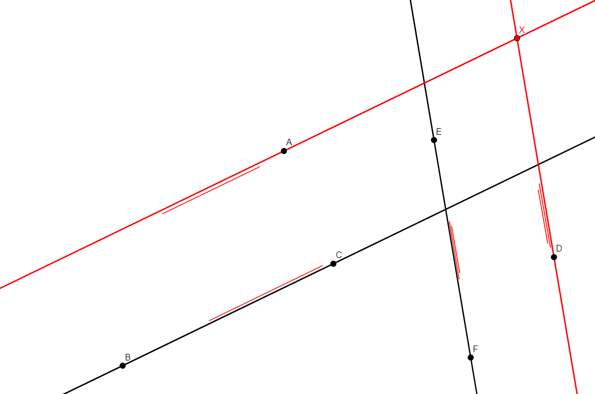

intersection_tt x a b c d e f
^^^^^^^^^^^^^^^^^^^^^^^^^^^^^

.. list-table::
   :widths: 50 25 23 2
   :header-rows: 1

   * - Figure
     - Description
     - Added Statements
     - Construction
   * - |intersection_tt|
     - From six points, a, b, c, d, e, f, such that a and d are different and lines bc and ef are not parallel, build point x in the intersection of the line through a perpendicular to bc and the line through d perpendicular to ef.
     - :math:`\begin{cases}xa\perp bc\\ xd\perp ef\end{cases}`  (perp x a b c, perp x d e f)
     - Point

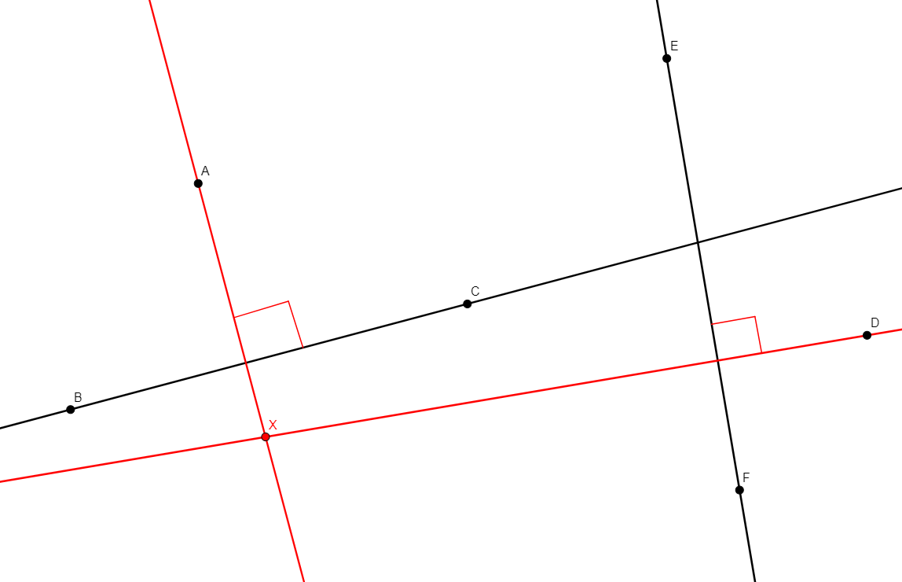

iso_triangle a b c
^^^^^^^^^^^^^^^^^^

.. list-table::
   :widths: 50 25 23 2
   :header-rows: 1

   * - Figure
     - Description
     - Added Statements
     - Construction
   * - |iso_triangle|
     - From nothing, creates the three vertices a, b, c of an isosceles triangle with ab=ac. (Compare to :ref:`iso_triangle0 a b c` below).
     - :math:`\begin{cases}ab= ac\\ \widehat{abc}=\widehat{bca}\end{cases}`  (cong a b a c, eqangle b a b c c b c a)
     - Points

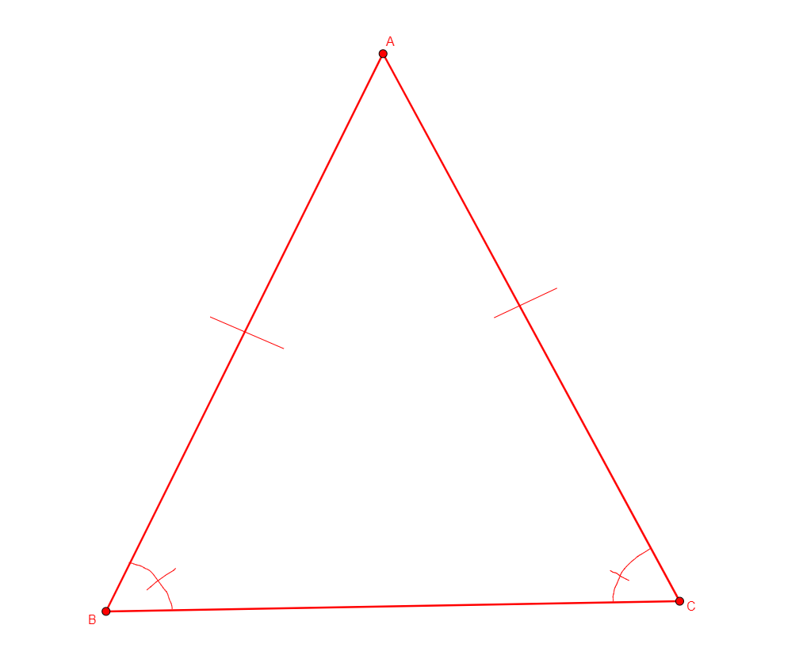

lc_tangent x a o
^^^^^^^^^^^^^^^^

.. list-table::
   :widths: 50 25 23 2
   :header-rows: 1

   * - Figure
     - Description
     - Added Statements
     - Construction
   * - |lc_tangent|
     - From two different points a, o, builds x, a point on the line perpendicular to ao through a (the line tangent to the circle of center o through a, with tangent point a). It is equivalent to on_tline x a a o (see on_tline below).
     - :math:`ax \perp ao`  (perp a x a o)
     - Line

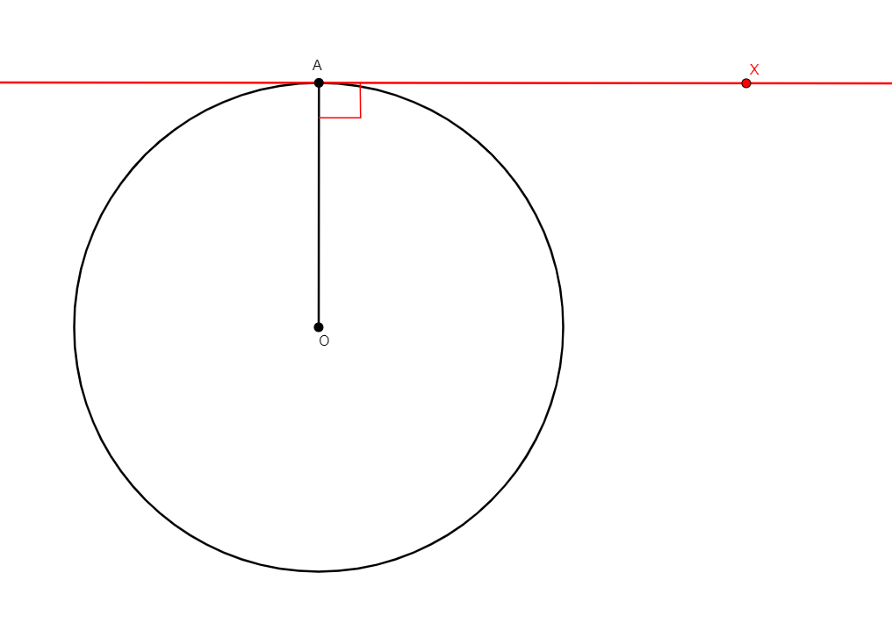

midpoint x a b
^^^^^^^^^^^^^^

.. list-table::
   :widths: 50 25 23 2
   :header-rows: 1

   * - Figure
     - Description
     - Added Statements
     - Construction
   * - |midpoint|
     - From a pair of points a, b, that are different, builds x, the midpoint of a and b. **The original version of AlphaGeometry did not return midpoint as a predicate, resulting in solutions where a midpoint construction would have to be recovered as a predicate during the proof. We fixed that.**
     - :math:`x\text{ midpoint of }ab`  (midp x a b)
     - Point

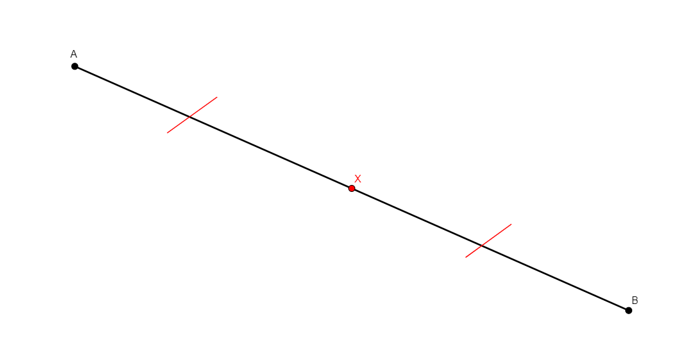

mirror x a b
^^^^^^^^^^^^

.. list-table::
   :widths: 50 25 23 2
   :header-rows: 1

   * - Figure
     - Description
     - Added Statements
     - Construction
   * - |mirror|
     - From two points a, b that are different, builds x, the reflection of point a with respect to point b (so that b is the midpoint of ax).
     - :math:`\begin{cases}x, a, b\text{ collinear}\\ ba=bx\end{cases}`  (coll x a b, cong b a b x)
     - Point

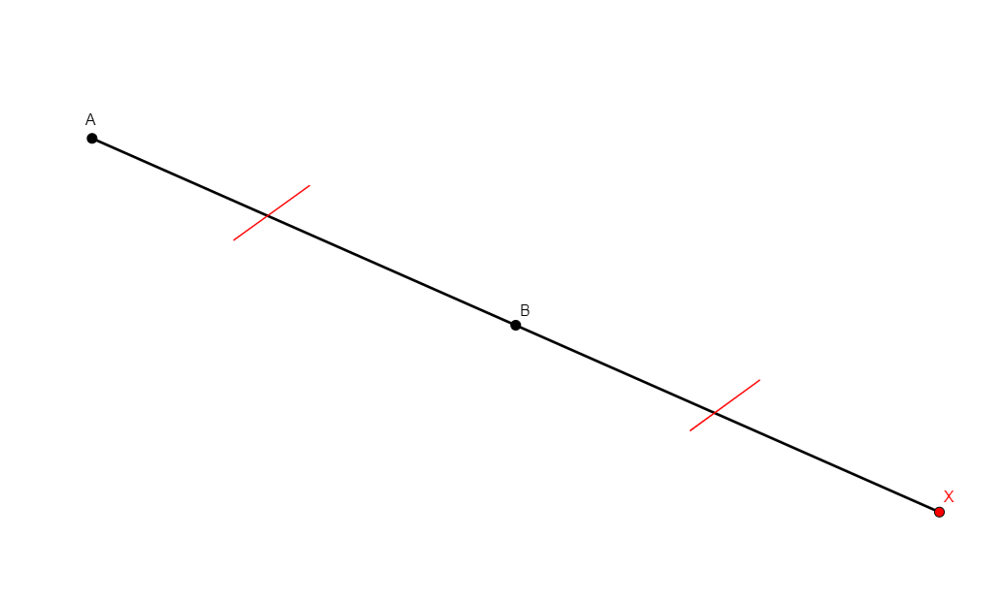

nsquare x a b
^^^^^^^^^^^^^

.. list-table::
   :widths: 50 25 23 2
   :header-rows: 1

   * - Figure
     - Description
     - Added Statements
     - Construction
   * - |nsquare|
     - Given two distinct points a, b, builds x such that the triangle xab is an isosceles right triangle.
     - :math:`\begin{cases}xa=ab\\ xa\perp ab\end{cases}`  (cong x a a b, perp x a a b)
     - Point

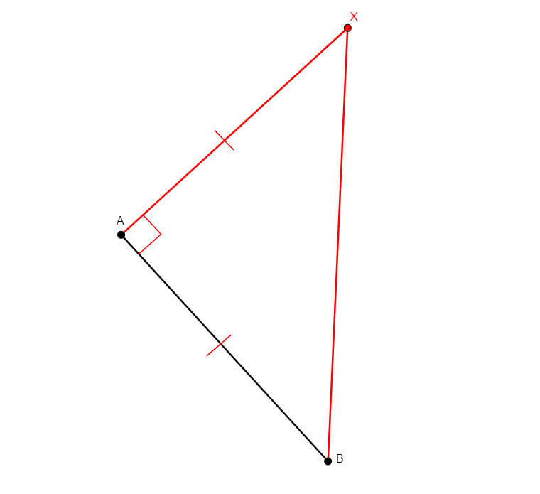

on_aline x a b c d e
^^^^^^^^^^^^^^^^^^^^

.. list-table::
   :widths: 50 25 23 2
   :header-rows: 1

   * - Figure
     - Description
     - Added Statements
     - Construction
   * - |on_aline|
     - From five points a, b, c, d, e, such that c, d, e are non-collinear, adds point x in a way that the angle bax is the same as the angle edc (up to a rotation and a translation). It transfers the angle measure between lines with the vertices specified (compare to :ref:`on_aline0 x a b c d e f g` below).
     - :math:`\widehat{xab}= \widehat{cde}`  (eqangle a x a b d c d e)
     - Line

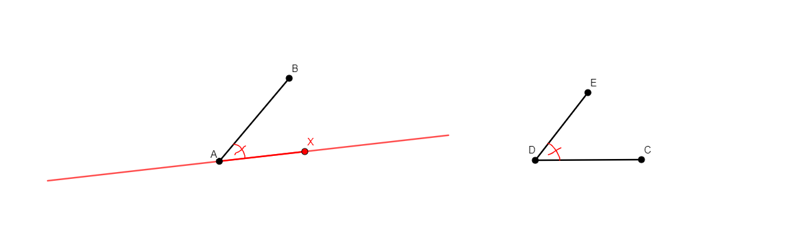

on_bline x a b
^^^^^^^^^^^^^^

.. list-table::
   :widths: 50 25 23 2
   :header-rows: 1

   * - Figure
     - Description
     - Added Statements
     - Construction
   * - |on_bline|
     - Given two distinct points a, b, builds x a point on the perpendicular bisector of the segment ab. (Compare to :ref:`iso_triangle_vertex x b c` and to :ref:`iso_triangle_vertex_angle x b c` below).
     - :math:`\begin{cases}xa=xb\\ \widehat{xab}= \widehat{abx}\end{cases}`  (cong x a x b, eqangle a x a b b a b x)
     - Line

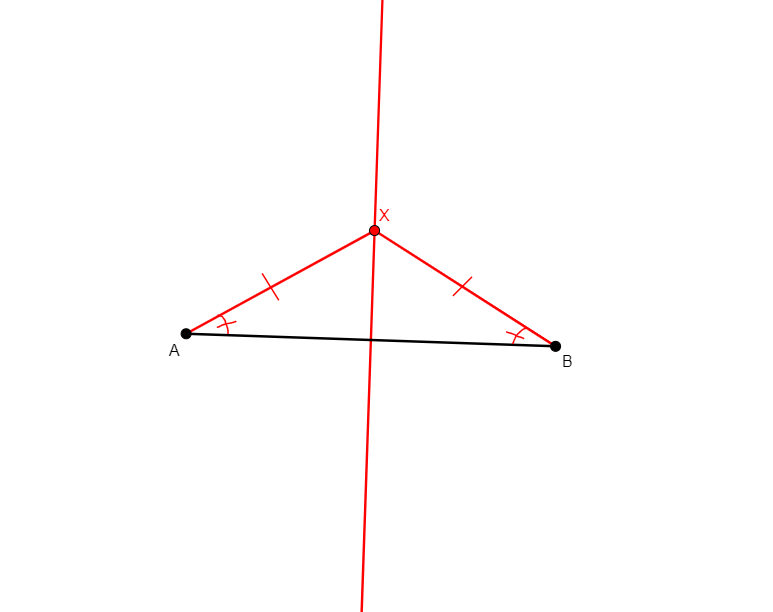

on_circle x o a
^^^^^^^^^^^^^^^

.. list-table::
   :widths: 50 25 23 2
   :header-rows: 1

   * - Figure
     - Description
     - Added Statements
     - Construction
   * - |on_circle|
     - From two distinct points o, a, builds x a point on the circle of center o through a. Equivalent to eqdistance x a a o (see :ref:`eqdistance x a b c` above).
     - :math:`ox=oa`  (cong o x o a)
     - Circle

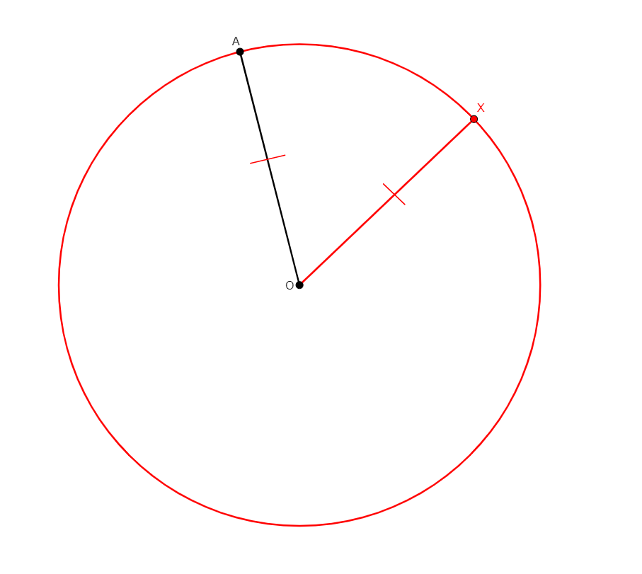

on_line x a b
^^^^^^^^^^^^^

.. list-table::
   :widths: 50 25 23 2
   :header-rows: 1

   * - Figure
     - Description
     - Added Statements
     - Construction
   * - |on_line|
     - From two distinct point a, b, builds x another point on the line ab.
     - :math:`x, a, b\text{ collinear}`  (coll x a b)
     - Line

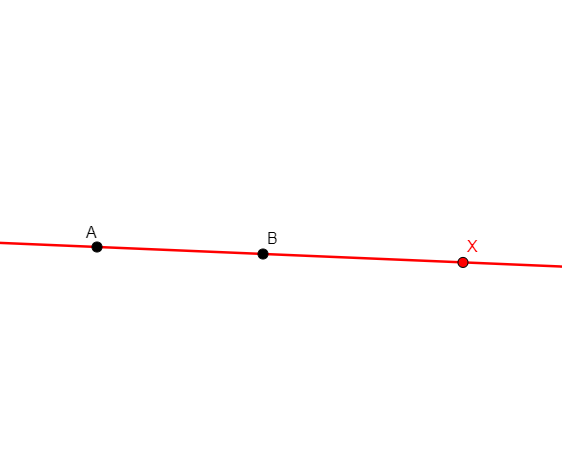

on_pline x a b c
^^^^^^^^^^^^^^^^

.. list-table::
   :widths: 50 25 23 2
   :header-rows: 1

   * - Figure
     - Description
     - Added Statements
     - Construction
   * - |on_pline|
     - From three non-colinear points a, b, c, with b different from c, builds x on the line parallel to bc through a. (Compare to the simpler :ref:`on_pline0 x a b c` below).
     - :math:`xa\parallel bc`  (para x a b c)
     - Line

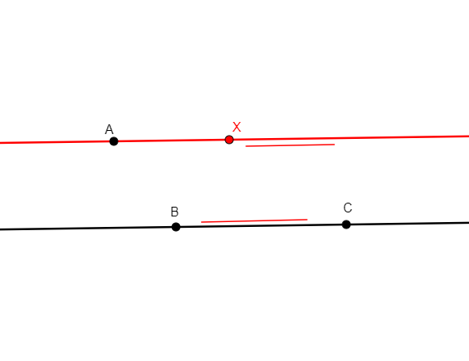

on_tline x a b c
^^^^^^^^^^^^^^^^

.. list-table::
   :widths: 50 25 23 2
   :header-rows: 1

   * - Figure
     - Description
     - Added Statements
     - Construction
   * - |on_tline|
     - From three points a, b, c, with b different from c, builds x on the line through a perpendicular to bc.
     - :math:`xa\perp bc`  (perp x a b c)
     - Line

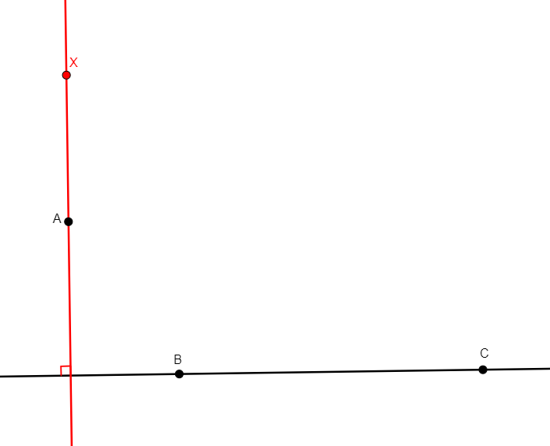

orthocenter x a b c
^^^^^^^^^^^^^^^^^^^

.. list-table::
   :widths: 50 25 23 2
   :header-rows: 1

   * - Figure
     - Description
     - Added Statements
     - Construction
   * - |orthocenter|
     - From three non-collinear points a, b, and c, builds x the orthocenter of the triangle abc.
     - :math:`\begin{cases}xa\perp bc\\ xb\perp ac\\ xb\perp ab\end{cases}`  (perp x a b c, perp x b c a; perp x c a b)
     - Point

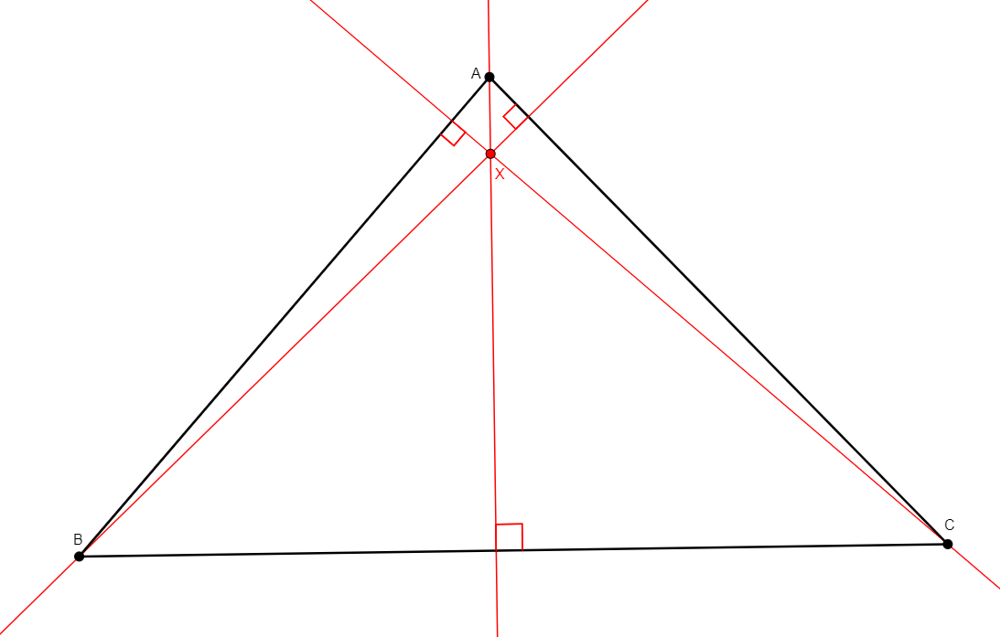

parallelogram a b c x
^^^^^^^^^^^^^^^^^^^^^

.. list-table::
   :widths: 50 25 23 2
   :header-rows: 1

   * - Figure
     - Description
     - Added Statements
     - Construction
   * - |parallelogram|
     - From three non-collinear points a, b, and c, builds x such that abcx is a parallelogram.
     - :math:`\begin{cases}ab\parallel cx\\ ax\parallel bc\\ ab=cx\\ ax=bc\end{cases}`  (para a b c x, para a x b c; cong a b c x, cong a x b c)
     - Point

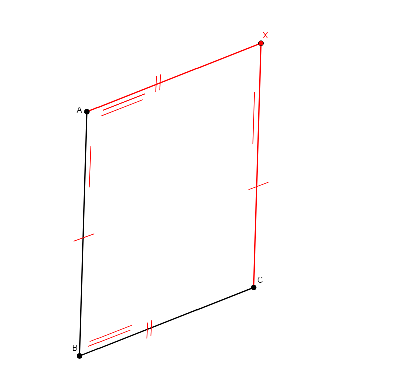

pentagon a b c d e
^^^^^^^^^^^^^^^^^^

.. list-table::
   :widths: 50 25 23 2
   :header-rows: 1

   * - Figure
     - Description
     - Added Statements
     - Construction
   * - |pentagon|
     - From nothing, creates five points a, b, c, d, e. The coordinates are a random conformal deformation (isometry combined with scaling) of a random inscribed convex pentagon.
     - No statement added
     - Points

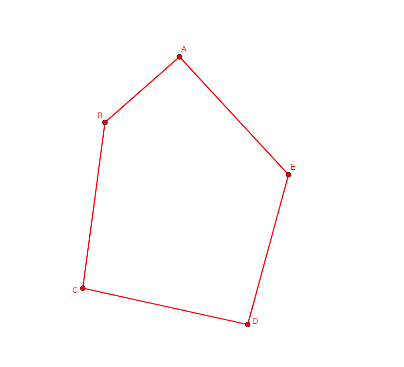

psquare x a b
^^^^^^^^^^^^^

.. list-table::
   :widths: 50 25 23 2
   :header-rows: 1

   * - Figure
     - Description
     - Added Statements
     - Construction
   * - |psquare|
     - From two points a, b that are distinct, builds x the image of b under a rotation of 90 degrees around a.
     - :math:`\begin{cases}ax=ab\\ ax\perp ab\end{cases}`  (cong x a a b, perp x a a b)
     - Point

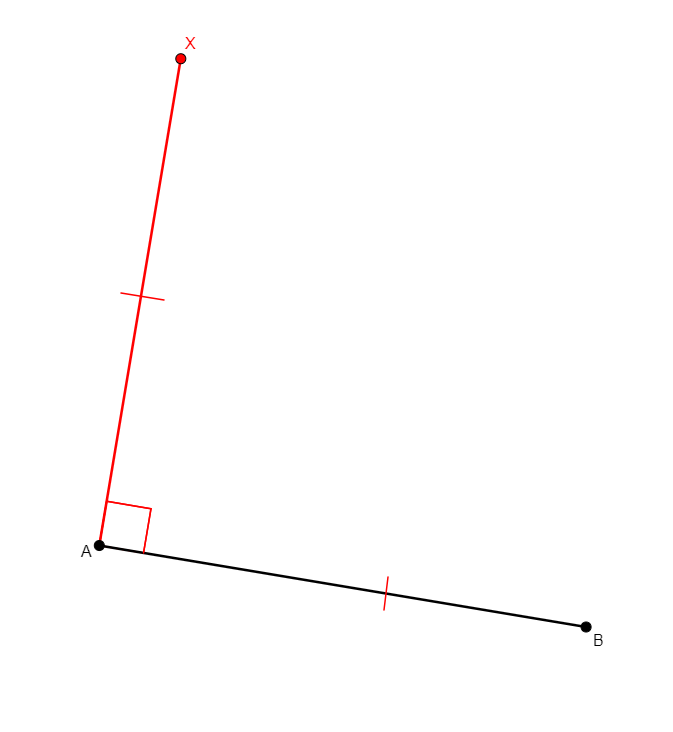

quadrangle a b c d
^^^^^^^^^^^^^^^^^^

.. list-table::
   :widths: 50 25 23 2
   :header-rows: 1

   * - Figure
     - Description
     - Added Statements
     - Construction
   * - |quadrangle|
     - From nothing, creates four points, a, b, c, d which are vertices of a random convex quadrilateral.
     - No statement added
     - Points

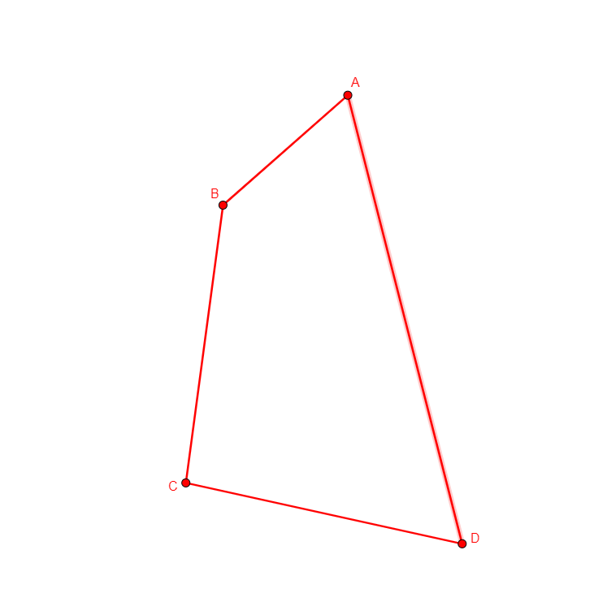

r_trapezoid a b c d
^^^^^^^^^^^^^^^^^^^

.. list-table::
   :widths: 50 25 23 2
   :header-rows: 1

   * - Figure
     - Description
     - Added Statements
     - Construction
   * - |r_trapezoid|
     - From nothing, creates a, b, c, d, the four vertices of a trapezoid with parallel sides ab and cd, and a right angle at a.
     - :math:`\begin{cases}ab\parallel cd\\ ab\perp ad\end{cases}`  (para a b c d, perp a b a d)
     - Points

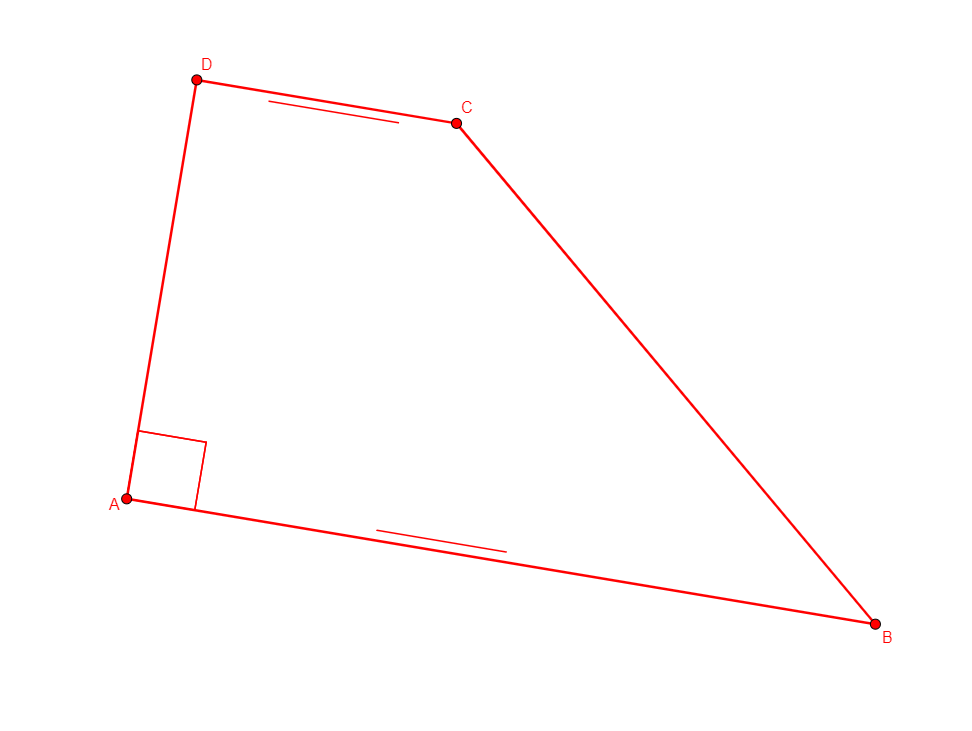

r_triangle a b c
^^^^^^^^^^^^^^^^

.. list-table::
   :widths: 50 25 23 2
   :header-rows: 1

   * - Figure
     - Description
     - Added Statements
     - Construction
   * - |r_triangle|
     - From nothing, creates a, b, c the vertices of a right triangle with a right angle at a.
     - :math:`ab\perp ac`  (perp a b a c)
     - Points

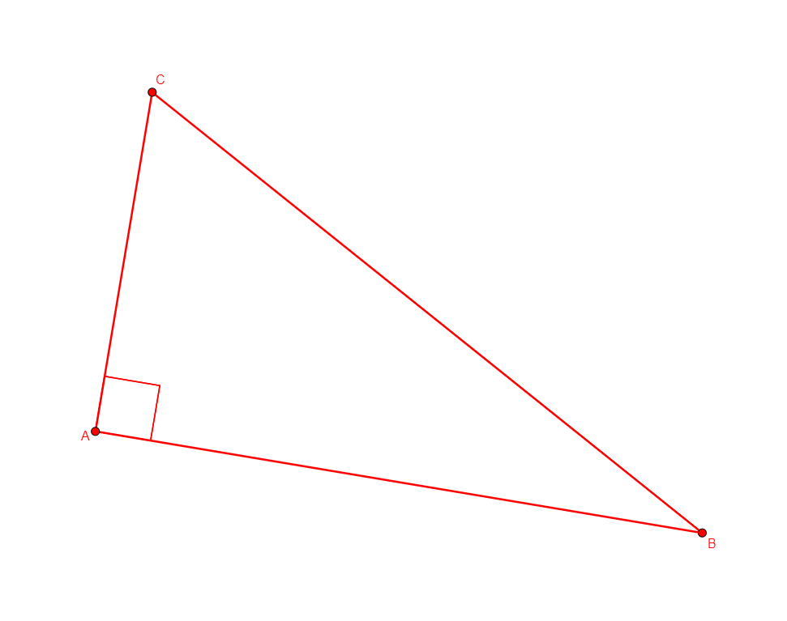

rectangle a b c d
^^^^^^^^^^^^^^^^^

.. list-table::
   :widths: 50 25 23 2
   :header-rows: 1

   * - Figure
     - Description
     - Added Statements
     - Construction
   * - |rectangle|
     - From nothing, creates a, b, c, d the four vertices rectangle abcd.
     - :math:`\begin{cases}ab\perp bc\\ ab\parallel cd\\ ad\parallel bc\\ba\perp ad\\ ab=cd\\ ad=bc\\ ac=bd\end{cases}`  (perp a b b c, para a b c d, para a d b c, perp a b a d, cong a b c d, cong a d b c, cong a c b d)
     - Points

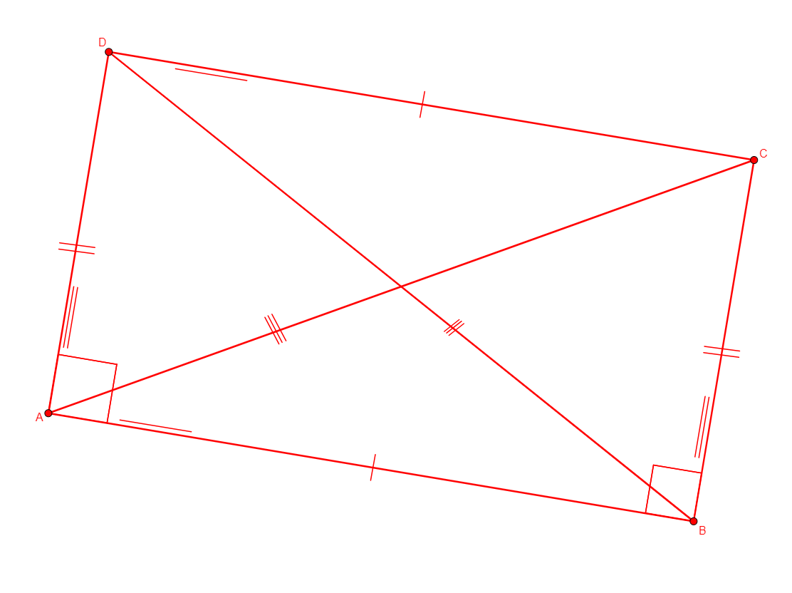

reflect x a b c
^^^^^^^^^^^^^^^

.. list-table::
   :widths: 50 25 23 2
   :header-rows: 1

   * - Figure
     - Description
     - Added Statements
     - Construction
   * - |reflect|
     - From three non-collinear points a, b, c, in particular with b different from c, builds x the reflection of a by the line bc.
     - :math:`\begin{cases}ab=bx\\ ac=cx\\ bc\perp ax\end{cases}`  (cong b a b x, cong c a c x; perp b c a x)
     - Point

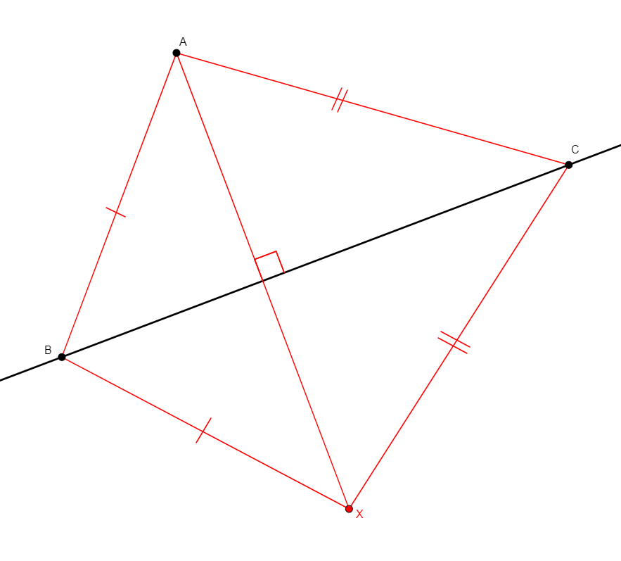

risos a b c
^^^^^^^^^^^

.. list-table::
   :widths: 50 25 23 2
   :header-rows: 1

   * - Figure
     - Description
     - Added Statements
     - Construction
   * - |risos|
     - From nothing, builds a, b, c such that the triangle abc is an isosceles right triangle with a right angle at a.
     - :math:`\begin{cases}ab\perp ac\\ ab=ac\\ \widehat{abc}=\widehat{bca}\end{cases}`  (perp a b a c, cong a b a c; eqangle b a b c c b c a)
     - Points

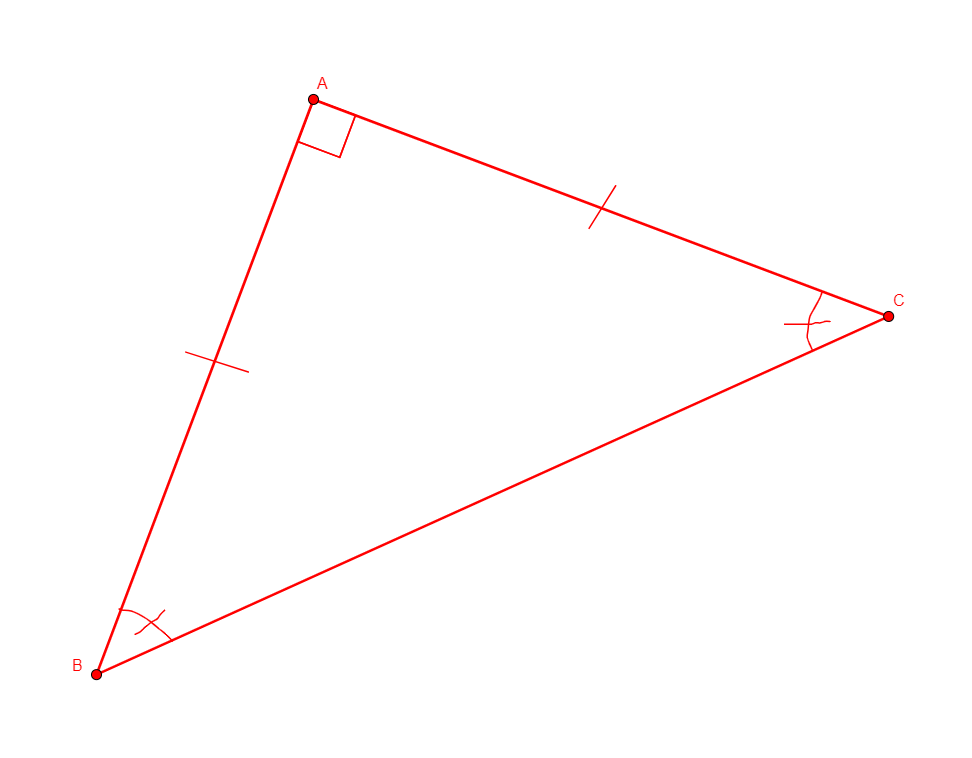

segment a b
^^^^^^^^^^^

.. list-table::
   :widths: 50 25 23 2
   :header-rows: 1

   * - Figure
     - Description
     - Added Statements
     - Construction
   * - |segment|
     - From nothing, adds two points a, b, with random coordinates.
     - No statement added
     - Points

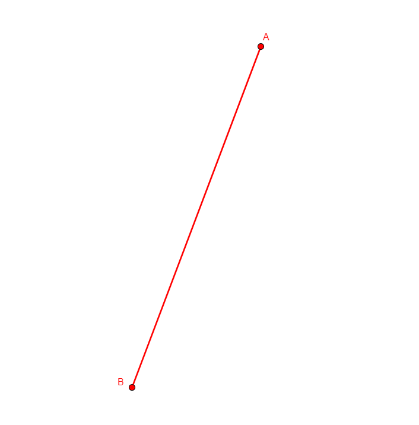

shift x b c d
^^^^^^^^^^^^^

.. list-table::
   :widths: 50 25 23 2
   :header-rows: 1

   * - Figure
     - Description
     - Added Statements
     - Construction
   * - |shift|
     - From three points b, c, d, with b different from d (prevents the building of two points with the same coordinates), build x, the translation of b by the vector from d to c.
     - :math:`\begin{cases}bx=cd\\ cx=bd\end{cases}`  (cong x b c d, cong x c b d)
     - Point

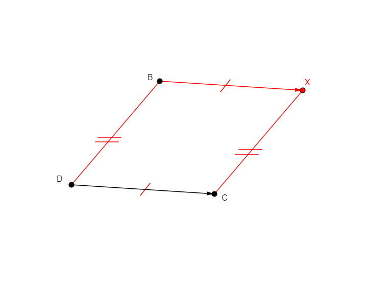

square a b x y
^^^^^^^^^^^^^^

.. list-table::
   :widths: 50 25 23 2
   :header-rows: 1

   * - Figure
     - Description
     - Added Statements
     - Construction
   * - |square|
     - From two points a, b, with a different from b, builds x, y, the other two vertices of a square with side ab.
     - :math:`\begin{cases}ab\perp bx\\ ab=bx\\ ab\parallel xy\\ ay\parallel bx\\ ay\perp yx\\ bx=xy\\ xy=ya\\ ax\perp by\\ ax=by\end{cases}`  (perp a b b x, cong a b b x, para a b x y, para a y b x, perp a y y x, cong b x x y, cong x y y a, perp a x b y, cong a x b y)
     - Points

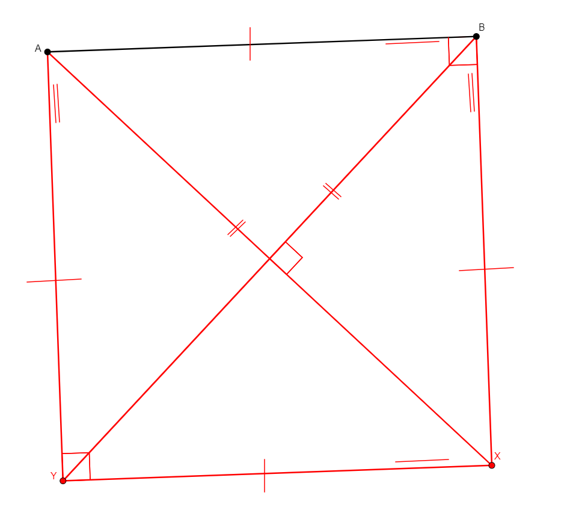

isquare a b c d
^^^^^^^^^^^^^^^

.. list-table::
   :widths: 50 25 23 2
   :header-rows: 1

   * - Figure
     - Description
     - Added Statements
     - Construction
   * - |isquare|
     - From nothing, creates the four vertices of a square abcd.
     - :math:`\begin{cases}ab\perp bc\\ ab=bc\\ ab\parallel cd\\ ad\parallel bc\\ ad\perp dc\\ bc=cd\\ cd=da\\ ac\perp bd\\ ac=bd\end{cases}`  (perp a b b c, cong a b b c, para a b c d, para a d b c, perp a d d c, cong b c c d, cong c d d a, perp a c b d, cong a c b d)
     - Points

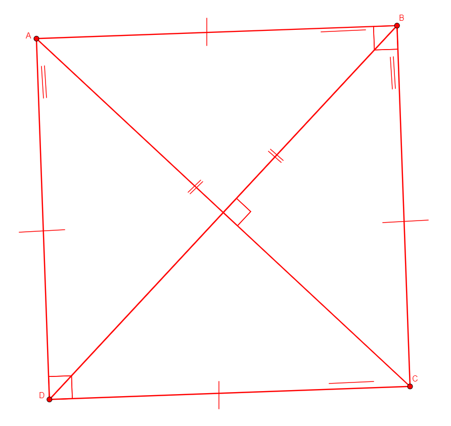

trapezoid a b c d
^^^^^^^^^^^^^^^^^

.. list-table::
   :widths: 50 25 23 2
   :header-rows: 1

   * - Figure
     - Description
     - Added Statements
     - Construction
   * - |trapezoid|
     - From nothing, creates four vertices of a trapezoid abcd, with ab parallel to cd.
     - :math:`ab\parallel cd`  (para a b c d)
     - Points

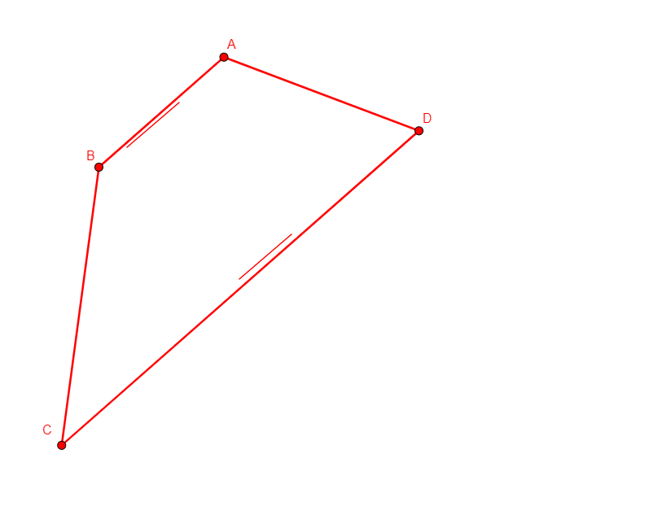

triangle a b c
^^^^^^^^^^^^^^

.. list-table::
   :widths: 50 25 23 2
   :header-rows: 1

   * - Figure
     - Description
     - Added Statements
     - Construction
   * - |triangle|
     - From nothing, creates three points a, b, and c, with random coordinates.
     - No statement added
     - Points

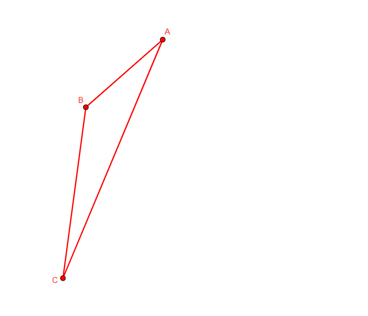

triangle12 a b c
^^^^^^^^^^^^^^^^

.. list-table::
   :widths: 50 25 23 2
   :header-rows: 1

   * - Figure
     - Description
     - Added Statements
     - Construction
   * - |triangle12|
     - From nothing, builds the three vertices a, b, c of a triangle such that the proportion ab:ac is 1:2. **The current statement of this definition was changed with respect to the original one to adapt to the new formulation of the rconst predicate.**
     - :math:`\frac{ab}{ac}=\frac{1}{2}`  (rconst a b a c 1/2)
     - Points

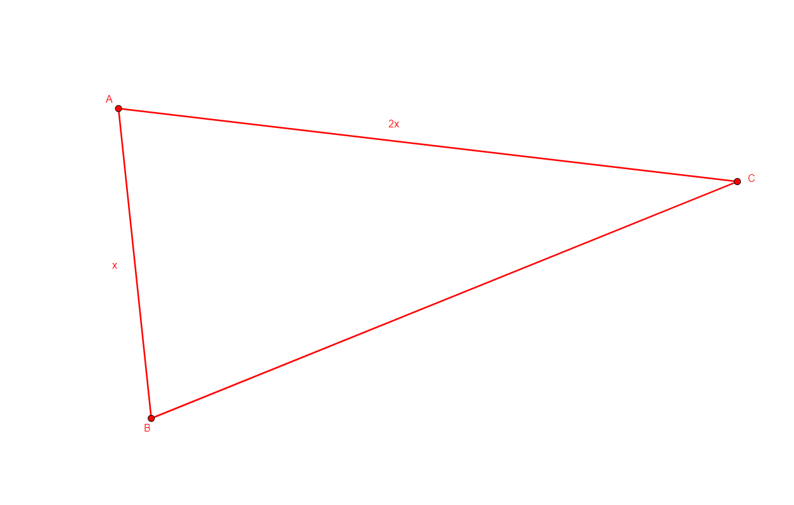

2l1c x y z i a b c o
^^^^^^^^^^^^^^^^^^^^

.. list-table::
   :widths: 50 25 23 2
   :header-rows: 1

   * - Figure
     - Description
     - Added Statements
     - Construction
   * - |2l1c|
     - Given three points o, a, b, with b in the center through a of center o, and c a point not in the line ab, builds i, the center of a circle tangent to the circle centered at o through a, to the line ac and to the line bc. It also builds the tangency points x to ac, y to bc and z to the circle of center o through a.
     - :math:`\begin{cases}x, a, c\text{ collinear}\\y, b, c\text{ collinear}\\ i, o, z\text{ collinear}\\ oa=oz\\ ix=iy\\ iy=iz\\ ix\perp ac\\ iy\perp bc\end{cases}`  (coll x a c, coll y b c, coll i o z, cong o a o z, cong i y i z, perp i x a c, perp i y b c)
     - Points

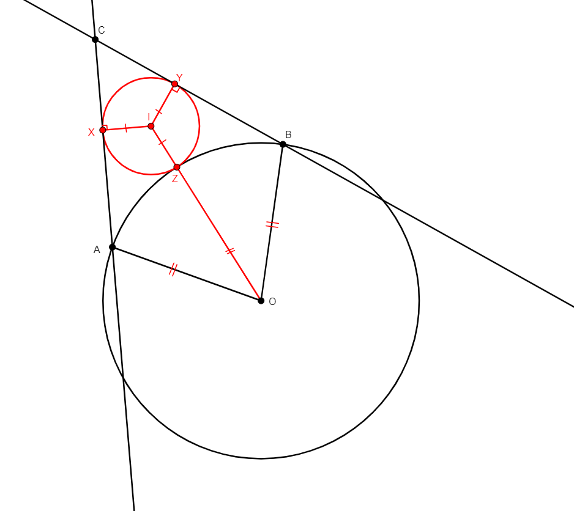

e5128 x y a b c d
^^^^^^^^^^^^^^^^^

.. list-table::
   :widths: 50 25 23 2
   :header-rows: 1

   * - Figure
     - Description
     - Added Statements
     - Construction
   * - |e5128|
     - Given four points a, b, c, d, with bc=cd and bc perpendicular to ba, builds y the midpoint of ab and x the intersection of line dy and the circle centered at c through b. It transfers the angle bad to axy in a specific way. **It was created specifically for problem complete_015_7_Book_00EE_06_E051-28.gex in the** :ref:`jgex_ag_231` **problem database, for which we do not have the original statement.**
     - :math:`\begin{cases}bc=cx\\ y,a,b\ collinear\\ x,y,d\ collinear\\ \widehat{bad}=\widehat{axy}\end{cases}`  (cong c b c x, coll y a b, coll x y d, eqangle a b a d x a x y)
     - Points

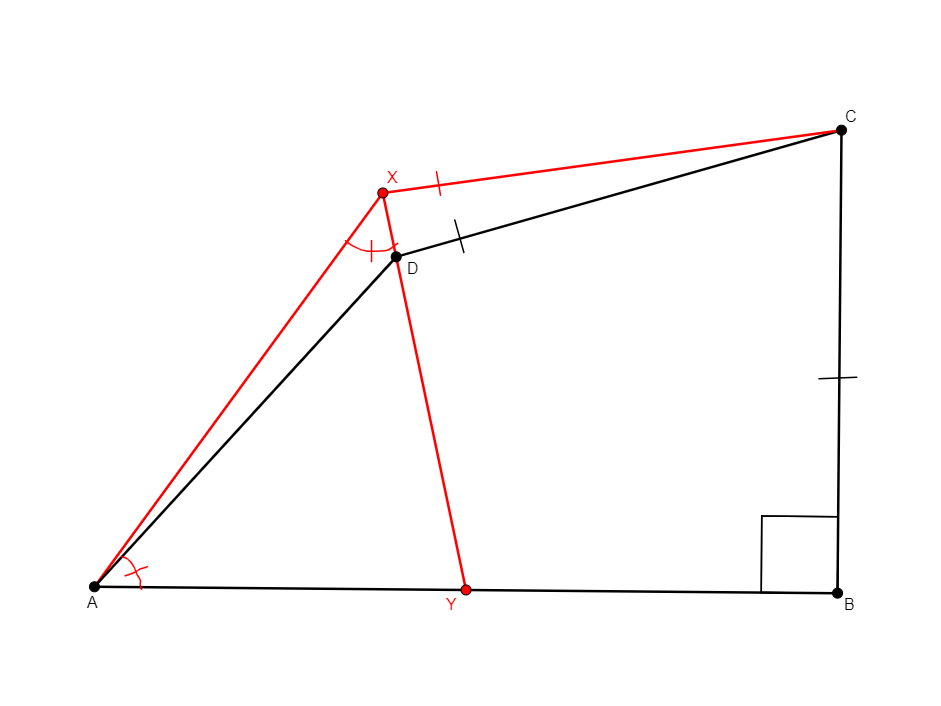

3peq x y z a b c
^^^^^^^^^^^^^^^^

.. list-table::
   :widths: 50 25 23 2
   :header-rows: 1

   * - Figure
     - Description
     - Added Statements
     - Construction
   * - |3peq|
     - Given three non-collinear points a, b, c, builds points x on the extended side ab, y in the extended side ac, and z on the extended side bc of triangle abc in a way that z is the midpoint of xy. **It was created specifically for problem complete_010_Other_Auxiliary_ye_aux_think.gex in the** :ref:`jgex_ag_231` **problem database, for which we do not have the original statement.**
     - :math:`\begin{cases}z,b,c\ collinear\\ x,a,b\ collinear\\ y,a,c\ collinear\\ x,y,z\ collinear\\ xz=yz\end{cases}`  (coll z b c, coll x a b, coll y a c, coll x y z, cong z x z y)
     - Points

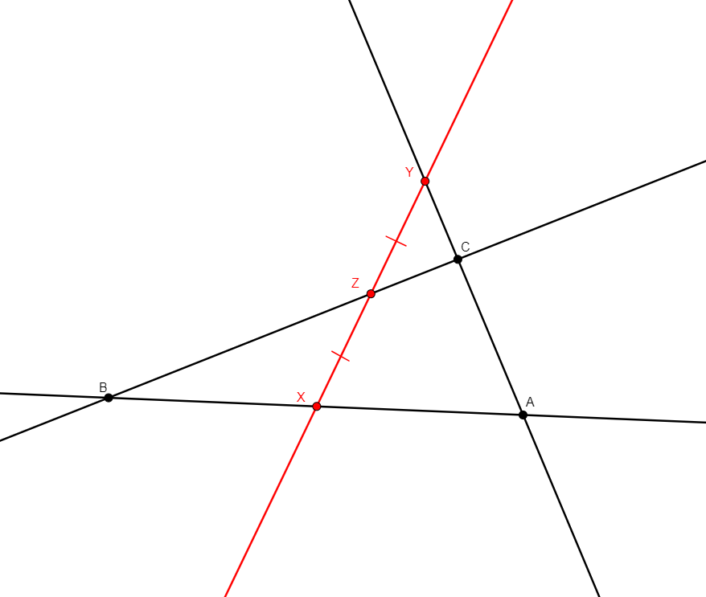

trisect x y a b c
^^^^^^^^^^^^^^^^^

.. list-table::
   :widths: 50 25 23 2
   :header-rows: 1

   * - Figure
     - Description
     - Added Statements
     - Construction
   * - |trisect|
     - From three non-collinear point a, b, c, builds x, y, the points on segment ac that trisect the angle abc.
     - :math:`\begin{cases}x, a, c\text{ collinear}\\y, a, c\text{ collinear}\\ \widehat{abx}=\widehat{xby}\\ \widehat{xby}=\widehat{ybc}\end{cases}`  (coll x a c, coll y a c, eqangle b a b x b x b y, eqangle b x b y b y b c)
     - Points

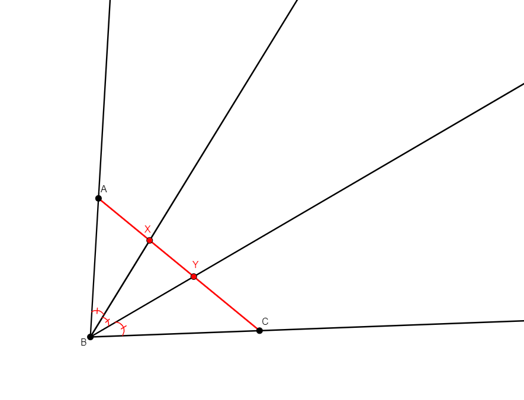

trisegment x y a b
^^^^^^^^^^^^^^^^^^

.. list-table::
   :widths: 50 25 23 2
   :header-rows: 1

   * - Figure
     - Description
     - Added Statements
     - Construction
   * - |trisegment|
     - Given two different points a, b, builds x, y the two points trisecting the segment ab.
     - :math:`\begin{cases}x, a, b\text{ collinear}\\y, a, b\text{ collinear}\\ ax=xy\\ xy=yb\end{cases}`  (coll x a b, coll y a b, cong x a x y, cong y x y b)
     - Points

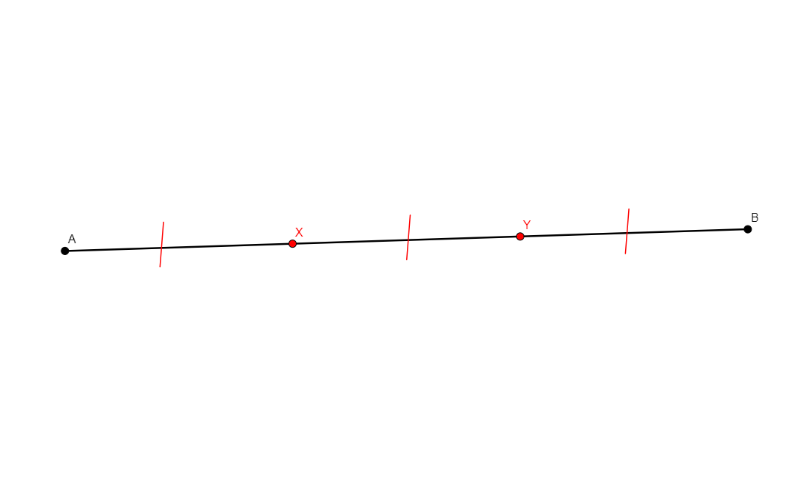

on_dia x a b
^^^^^^^^^^^^

.. list-table::
   :widths: 50 25 23 2
   :header-rows: 1

   * - Figure
     - Description
     - Added Statements
     - Construction
   * - |on_dia|
     - Given two different points a, b, builds x a point such that the triangle axb is a right triangle with a right angle at x.
     - :math:`xa\perp xb`  (perp x a x b)
     - Circle

.. |on_dia| image:: ../../_static/images/defs/on_dia.png
    :width: 100%

ieq_triangle a b c
^^^^^^^^^^^^^^^^^^

.. list-table::
   :widths: 50 25 23 2
   :header-rows: 1

   * - Figure
     - Description
     - Added Statements
     - Construction
   * - |ieq_triangle|
     - From nothing, creates the three vertices of an equilateral triangle abc.
     - :math:`\begin{cases}ab=bc\\ bc=ca\\ \widehat{bac}=\widehat{acb}\\ \widehat{acb}=\widehat{cba}\end{cases}`  (cong a b b c, cong b c c a, eqangle a b a c c a c b, eqangle c a c b b c b a)
     - Points

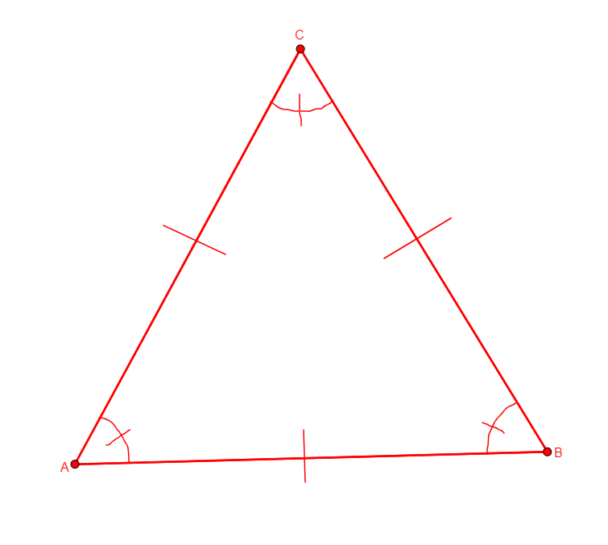

cc_tangent x y z i o a w b
^^^^^^^^^^^^^^^^^^^^^^^^^^

.. list-table::
   :widths: 50 25 23 2
   :header-rows: 1

   * - Figure
     - Description
     - Added Statements
     - Construction
   * - |cc_tangent|
     - From four points o, a, w, b, such that o is neither a nor w, and such that w and b are distinct, builds x, y, z, i on a pair of lines xy and zi that are simultaneously tangent to both the circle of center o through a and the circle of center w through b. x and z are the tangent points on the circle centered at o through a, and y and i are the tangent points on the circle centered at w through b.
     - :math:`\begin{cases}ox=oa\\ wy=wb\\ ox\perp xy\\ wy\perp yx\\oz=oa\\wi=wb\\oz\perp zi\\wi\perp iz\end{cases}`  (cong o x o a, cong w y w b, perp x o x y, perp y w y x, cong o z o a, cong w i w b, perp z o z i, perp i w i z)
     - Points

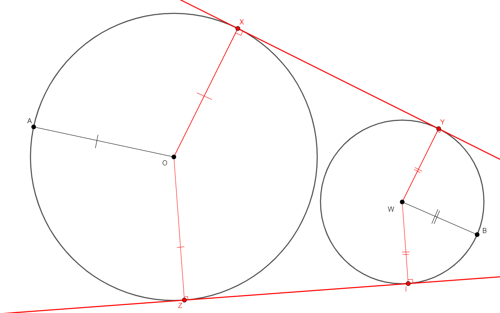

eqangle3 x a b d e f
^^^^^^^^^^^^^^^^^^^^

.. list-table::
   :widths: 50 25 23 2
   :header-rows: 1

   * - Figure
     - Description
     - Added Statements
     - Construction
   * - |eqangle3|
     - From five points a, b, d, e, f disposed in a way that a is distinct from b and d, e, f form a non-degenerate triangle, builds x the vertex of an angle in such a way that the angles axb and edf are the same (up to a rotation and a translation).
     - :math:`\widehat{axb}=\widehat{edf}`  (eqangle x a x b d e d f)
     - Circle

.. |eqangle3| image:: ../../_static/images/defs/eqangle3.png
    :width: 100%

tangent x y a o b
^^^^^^^^^^^^^^^^^

.. list-table::
   :widths: 50 25 23 2
   :header-rows: 1

   * - Figure
     - Description
     - Added Statements
     - Construction
   * - |tangent|
     - From three different points a, b, c, builds x and y, the points of tangency of the two lines through a tangent to the circle of center o through b.
     - :math:`\begin{cases}ox=ob\\ ax\perp ox\\ oy=ob\\ ay\perp yo\end{cases}`  (cong o x o b, perp a x o x, cong o y o b, perp a y o y)
     - Points

.. |tangent| image:: ../../_static/images/defs/tangent.png
    :width: 100%

on_circum x a b c
^^^^^^^^^^^^^^^^^

.. list-table::
   :widths: 50 25 23 2
   :header-rows: 1

   * - Figure
     - Description
     - Added Statements
     - Construction
   * - |on_circum|
     - From three non-collinear points a, b, and c, builds x a point on the circle through a, b, and c.
     - :math:`x, a, b, c\text{ concyclic}`  (cyclic a b c x)
     - Point

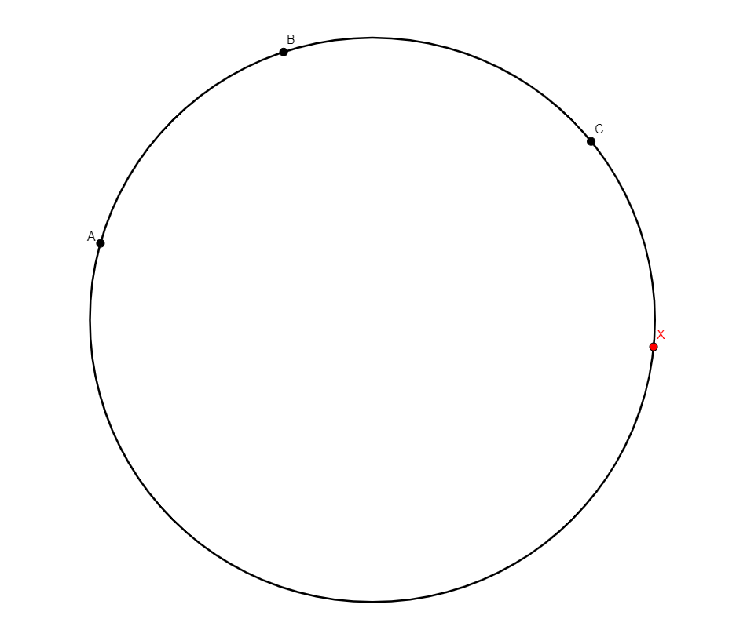

New Definitions
---------------

on_pline0 x a b c
^^^^^^^^^^^^^^^^^

.. list-table::
   :widths: 50 25 23 2
   :header-rows: 1

   * - Figure
     - Description
     - Added Statements
     - Construction
   * - |on_pline|
     - From three points a, b, c, with b different from c, builds x on the line parallel to bc through a. (Compare to :ref:`on_pline x a b c` above). **This definition was created to allow for the addition of a parallel statement on overlapping lines, by dismissing the restriction of a, b, c being non-collinear, without which r28 would be a rule that could not occur.**
     - :math:`xa\parallel bc`  (para x a b c)
     - Line

iso_triangle0 a b c
^^^^^^^^^^^^^^^^^^^

.. list-table::
   :widths: 50 25 23 2
   :header-rows: 1

   * - Figure
     - Description
     - Added Statements
     - Construction
   * - |iso_triangle0|
     - From nothing, creates the three vertices a, b, c of an isosceles triangle with ab=ac. **It was created as a simplified version of** :ref:`iso_triangle a b c` **above, without adding the statement about the equality of base angles, which should come from rule r13.**
     - :math:`ab= ac`  (cong a b a c)
     - Points

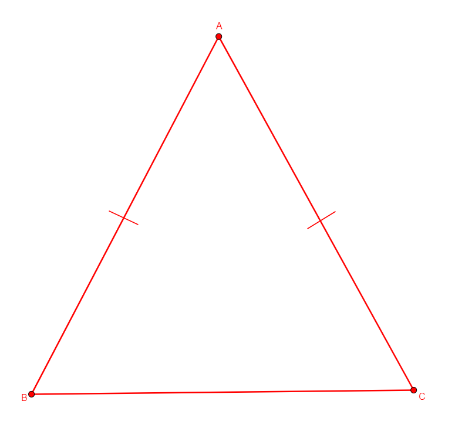

iso_triangle_vertex x b c
^^^^^^^^^^^^^^^^^^^^^^^^^

.. list-table::
   :widths: 50 25 23 2
   :header-rows: 1

   * - Figure
     - Description
     - Added Statements
     - Construction
   * - |iso_triangle_vertex|
     - From two points b, c that are distinct, builds a, the vertex of an isosceles triangle with base bc. **It was created for explicitly creating isosceles triangles from a given base, but it is also a simplified version of** :ref:`on_bline x a b` **above, without adding the statement about the equality of base angles, which should come from rule r13. There is also a definition adding only the statement about the equality of the angles below (see** :ref:`iso_triangle_vertex_angle x b c` **).**
     - :math:`xb = xc`  (cong x b x c)
     - Line

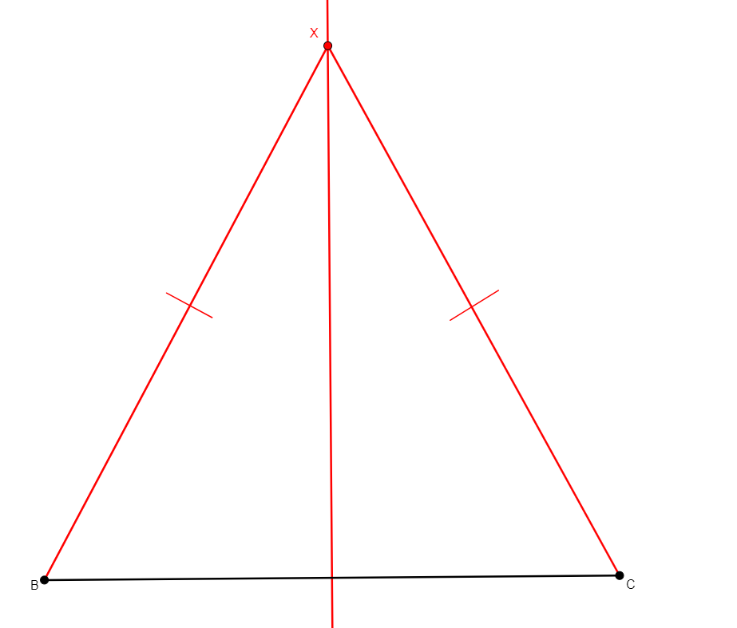

iso_triangle_vertex_angle x b c
^^^^^^^^^^^^^^^^^^^^^^^^^^^^^^^

.. list-table::
   :widths: 50 25 23 2
   :header-rows: 1

   * - Figure
     - Description
     - Added Statements
     - Construction
   * - |iso_triangle_vertex_angle|
     - From two points b, c that are distinct, builds a, the vertex of an isosceles triangle with base bc. **It was created for explicitly creating isosceles triangles from a given base, but it is also a simplified version of** :ref:`on_bline x a b` **above, only adding the statement about the equality of base angles. The segment congruence statement in the on_bline definition should come from rule r14. Compare also to** :ref:`iso_triangle_vertex x b c` **above.**
     - :math:`\widehat{xbc}=\widehat{bcx}`  (eqangle x b b c b c x c)
     - Line

.. |iso_triangle_vertex_angle| image:: ../../_static/images/defs/iso_triangle_vertex_angle.png
    :width: 100%

on_aline0 x a b c d e f g
^^^^^^^^^^^^^^^^^^^^^^^^^

.. list-table::
   :widths: 50 25 23 2
   :header-rows: 1

   * - Figure
     - Description
     - Added Statements
     - Construction
   * - |on_aline0|
     - From seven points a, b, c, d, e, f, g, with the constraint that a, b, c, and d do not lie all on the same line, build x such that the angle formed at the intersection of lines ef and gx is the same (up to a rotation and a translation) to the angle formed at the intersection between lines ab and cd. **This definition was created as a base general case for the creation of congruent angles. Indeed,** :ref:`angle_mirror x a b c` **is equivalent to on_aline0 x b a b c b c b, and** :ref:`on_aline x a b c d e` **is equivalent to on_aline0 x d e d c a b a.**
     - :math:`\angle (ab\times cd)=\angle (ef\times gx)`  (eqangle a b c d e f g x)
     - Line

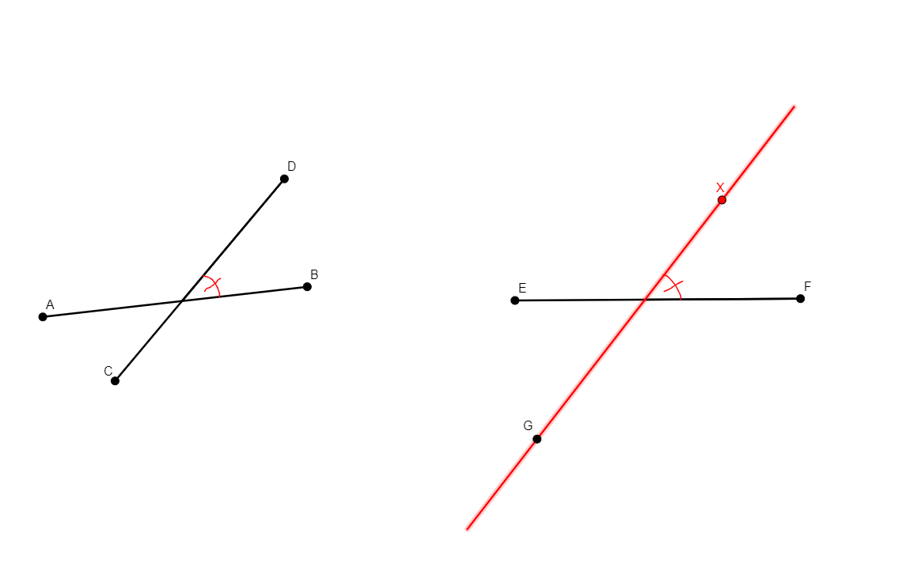

eqratio x a b c d e f g
^^^^^^^^^^^^^^^^^^^^^^^

.. list-table::
   :widths: 50 25 23 2
   :header-rows: 1

   * - Figure
     - Description
     - Added Statements
     - Construction
   * - |eqratio|
     - From seven points a, b, c, d, e, f, g, builds x, a point such that ab/cd=ef/gx. **This definition was created to allow for the explicit prescription of eqratio statements on problems.**
     - :math:`\frac{ab}{cd}=\frac{ef}{gx}`  (eqratio a b c d e f g x)
     - Circle

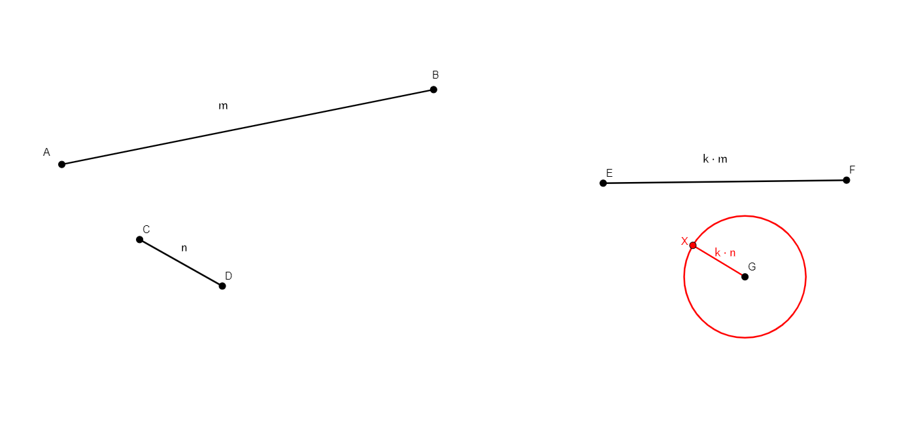

eqratio6 x a c e f g h
^^^^^^^^^^^^^^^^^^^^^^

.. list-table::
   :widths: 50 25 23 2
   :header-rows: 1

   * - Figure
     - Description
     - Added Statements
     - Construction
   * - |eqratio6|
     - From six points a, c, e, f, g, h, builds x,  a point such that ax/cx=ef/gh. **This definition was created to allow a common case for prescription of eqratio statements, when the new point shows up twice in the ratio equality (particularly common when subdividing a segment).**
     - :math:`\frac{ax}{cx}=\frac{ef}{gh}`  (eqratio a x c x e f g h)
     - Line if ef=gh, Circle otherwise

.. |eqratio6| image:: ../../_static/images/defs/eqratio6.png
    :width: 100%

rconst a b c x r
^^^^^^^^^^^^^^^^

.. list-table::
   :widths: 50 25 23 2
   :header-rows: 1

   * - Figure
     - Description
     - Added Statements
     - Construction
   * - |rconst|
     - Given three points a, b, c such that a is different from b, and a fraction r, builds x a point such that ab/cx=r. r should be entered as a fraction m/n, m, n two integers separated by "/". **This definition was created to allow for the prescription of pairs of segments satisfying a given constant ratio.**
     - :math:`\frac{ab}{cx}=r=\frac{m}{n}`  (rconst a b c x r)
     - Circle

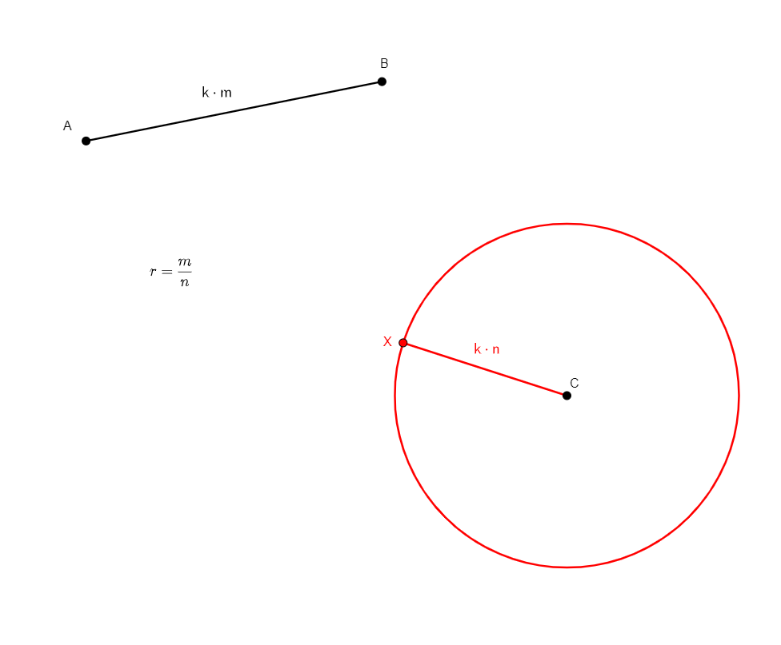

rconst2 x a b r
^^^^^^^^^^^^^^^

.. list-table::
   :widths: 50 25 23 2
   :header-rows: 1

   * - Figure
     - Description
     - Added Statements
     - Construction
   * - |rconst2|
     - Given two points a, b that are distinct, and a fraction r, builds x a point such that ax/bx=r. r should be entered as a fraction m/n, m, n two integers separated by "/". **This definition was created to cover a different case of prescription of segments satisfying a constant ratio, in this case when the new point connects the segment which ratio we are taking. It is typically used to split a given segment into two pieces with the given ratio.**
     - :math:`\frac{ax}{bx}=r=\frac{m}{n}`  (rconst x a x b r)
     - Line if r=1/1, Circle otherwise

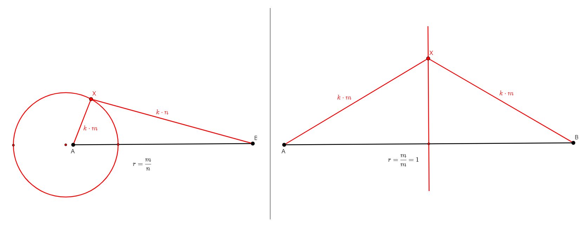

aconst a b c x r
^^^^^^^^^^^^^^^^

.. list-table::
   :widths: 50 25 23 2
   :header-rows: 1

   * - Figure
     - Description
     - Added Statements
     - Construction
   * - |aconst|
     - Given three points a, b, c, with a, b distinct, and an angle r, builds x a point such that the angle from line ab to line cx taken in the conterclockwise direction is r. r should be entered either as a fraction in radians in the form mpi/n, m, n two integers separated by "pi/", or in degrees in the from Ro, R an integer followed by the letter "o". **This definition was created to allow for the insertion of a prescribed angle between two lines without fixing the intersection of the lines. It was necessary for the effectivity of the aconst predicate.**
     - :math:`\angle (ab\times cx)=r`  (aconst a b c x r)
     - Line

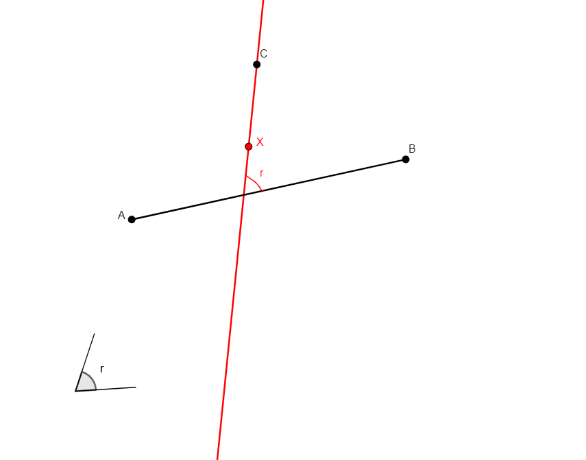

s_angle a b x y
^^^^^^^^^^^^^^^

.. list-table::
   :widths: 50 25 23 2
   :header-rows: 1

   * - Figure
     - Description
     - Added Statements
     - Construction
   * - |s_angle|
     - Given two points a, b that are distinct, and an angle y, builds x a point such that the angle from line ab to line bx taken in the conterclockwise direction is y. y should be entered either as a fraction in radians in the form mpi/n, m, n two integers separated by "pi/", or in degrees in the from Ro, R an integer followed by the letter "o". **This definition was created to allow for the insertion of a prescribed angle between two lines with a fixed vertex. It is a modification of the previous s_angle definition in accordance to the aconst predicate.**
     - :math:`\widehat{abx}=y`  (aconst a b b x y)
     - Line

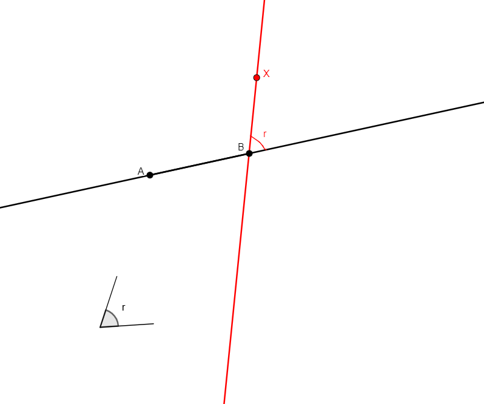

lconst x a l
^^^^^^^^^^^^

.. list-table::
   :widths: 50 25 23 2
   :header-rows: 1

   * - Figure
     - Description
     - Added Statements
     - Construction
   * - |lconst|
     - From a point a, builds x with an integer distance l from a to x. **This definition was created as an entry point to add the manipulation of lengths to DDAR.**
     - :math:`x, a, b, c\text{ concyclic}`  (lconst x a l)
     - Circle

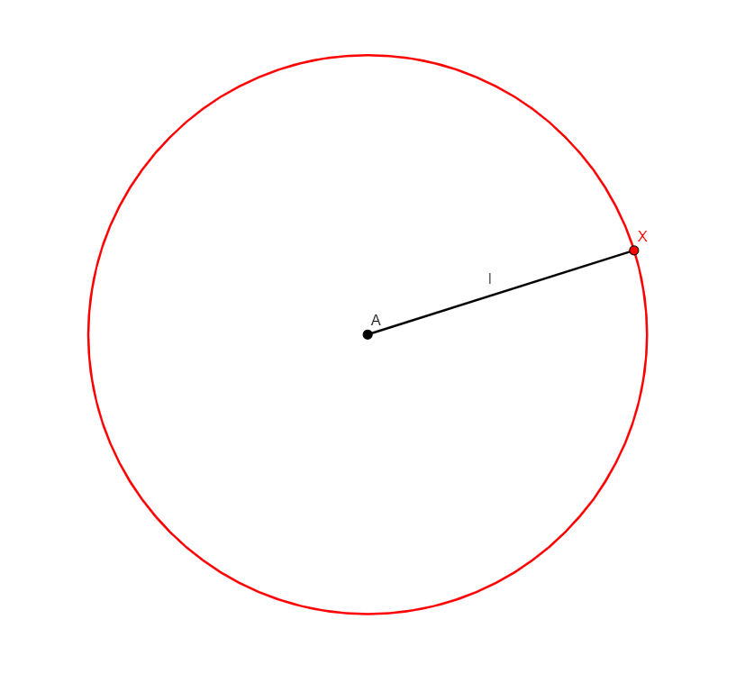