Rules
=====

Rules are the deduction rules that allow, from a given set of true facts, the derivation of new ones. Each rule asks for a collection of arguments, demanded by its premise predicates, that has to be "matched". Next, the rule is "applied", at which point the corresponding predicate is added to the proof state.

Rules are labelled in order (r00 to r63) to keep consistency through sources (documentation. papers, code), and a more specific name, for readability. The naming shows in the proof step, as the reason a proof step is true.

Through development, different combinations of rules have been tried, and some have been abandoned, typically for efficiency considerations. r00 through r42 are the ones from the original AlphaGeometry paper, while our standard rules are in the rules.txt file in the codebase.

The default_configs folder also contains the file unabridged_rules.txt, with all the rules that have been tried, abandoned or not, and empty_rules.txt, a blank txt file that can be used for testing the intrinsic working of the engine.

From the original rules, our version of rules.txt contains changes in the statements of r07, r26, r34, r35, and r42 if compared to the original AlphaGeometry work.

Legacy rules
------------

r00 : Perpendiculars give parallel
^^^^^^^^^^^^^^^^^^^^^^^^^^^^^^^^^^
.. list-table::
   :widths: 30 45 25
   :header-rows: 1

   * - Figure
     - Formal Statement
     - Description
   * - |r00|
     - :math:`\begin{cases}AB \perp CD\\ CD \perp EF \\ABE \text{ non-collinear}\end{cases} \implies AB \parallel EF`
     - Two lines AB, EF, that are orthogonal to a same line CD are parallel to one another. **This rule is not in the final rules.txt file because it is covered by AR.**

.. |r00| image:: ../../_static/images/rules/r00.png
    :width: 100%

r01 : Definition of circle
^^^^^^^^^^^^^^^^^^^^^^^^^^
.. list-table::
   :widths: 50 25 25
   :header-rows: 1

   * - Figure
     - Formal Statement
     - Description
   * - |r01|
     - :math:`|OA|=|OB|=|OC|=|OD|\implies ABCD\text{ on a circle}`
     - Four points A, B, C, D equidistant from a center O all lie on a same circle. (One side of the definition of a circle.)

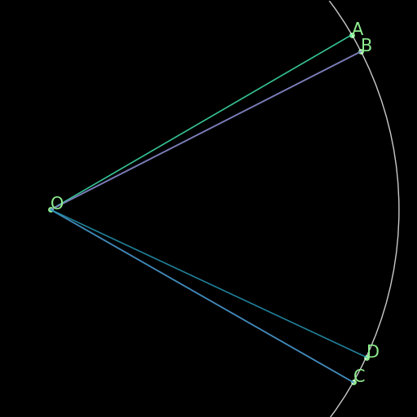

r02 : Parallel from inclination
^^^^^^^^^^^^^^^^^^^^^^^^^^^^^^^
.. list-table::
   :widths: 50 25 25
   :header-rows: 1

   * - Figure
     - Formal Statement
     - Description
   * - |r02|
     - :math:`\angle (AB \times PQ)=\angle (CD \times PQ)\implies AB \parallel CD`
     - If two lines AB and CD define the same angle with respect to a fixed transverse line PQ, they are parallel. **This rule is not in the final rules.txt file because it is covered by AR.**

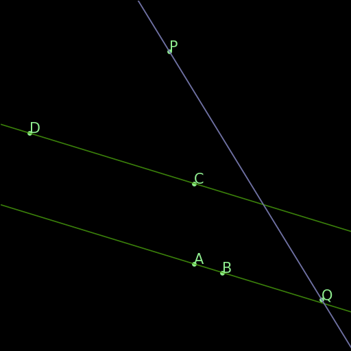

r03 : Arc determines internal angles
^^^^^^^^^^^^^^^^^^^^^^^^^^^^^^^^^^^^
.. list-table::
   :widths: 50 25 25
   :header-rows: 1

   * - Figure
     - Formal Statement
     - Description
   * - |r03|
     - :math:`ABPQ\text{ on a circle}\implies \angle (PA\times PB)=\angle (QA\times QB)`
     - Two angles with the vertices P, Q on a circle that determine the same arc AB on that same circle are congruent.

.. |r03| image:: ../../_static/images/rules/r03.png
    :width: 100%

r04 : Congruent angles are in a circle
^^^^^^^^^^^^^^^^^^^^^^^^^^^^^^^^^^^^^^
.. list-table::
   :widths: 50 25 25
   :header-rows: 1

   * - Figure
     - Formal Statement
     - Description
   * - |r04|
     - :math:`\begin{cases}\angle (PA\times PB)=\angle (QA\times QB)\\ ABPQ\text{ non-collinear} \end{cases}\implies ABPQ\text{ on a circle}`
     - Reverse direction of r03: If P, Q are vertices of congruent angles, and A and B are the intersections of the legs of the angles with vertices P and Q, there is a circle through A, B, P, and Q.

.. |r04| image:: ../../_static/images/rules/r04.png
    :width: 100%

r05 : Same arc same chord
^^^^^^^^^^^^^^^^^^^^^^^^^
.. list-table::
   :widths: 50 25 25
   :header-rows: 1

   * - Figure
     - Formal Statement
     - Description
   * - |r05|
     - :math:`\begin{cases}ABCPQR\text{ on a circle}\\ \angle (CA\times CB)=\angle (RP\times RQ)\end{cases}\implies |AB|=|PQ|`
     - From r03, two congruent angles on a circle determine arcs on that circle of the same length. This rule says that arcs of the same length determine chords of the same length on the same circle.

.. |r05| image:: ../../_static/images/rules/r05.png
    :width: 100%

r06 : Base of half triangle
^^^^^^^^^^^^^^^^^^^^^^^^^^^
.. list-table::
   :widths: 50 25 25
   :header-rows: 1

   * - Figure
     - Formal Statement
     - Description
   * - |r06|
     - :math:`\begin{cases}E\text{ midpoint of } AB\\ F\text{ midpoint of }AC\end{cases} \implies EF \parallel BC`
     - The line connecting the midpoints of two sides of a triangle is parallel to the third side of the same triangle. (This is a special instance of Thales' Theorem with "midpoint" predicates).

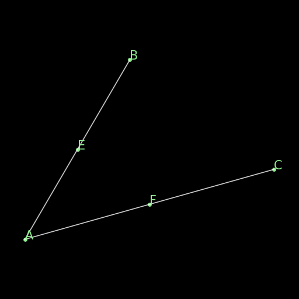

r07 : Thales Theorem I
^^^^^^^^^^^^^^^^^^^^^^
.. list-table::
   :widths: 50 25 25
   :header-rows: 1

   * - Figure
     - Formal Statement
     - Description
   * - |r07|
     - :math:`\begin{cases}AB\parallel CD\\ OAC \text{ collinear}\\ OBD\text{ collinear}\\ OAB\text{ non-collinear}\end{cases}\implies \begin{cases}\frac{OA}{OC}=\frac{OB}{OD}\\ \frac{AO}{AC}=\frac{BO}{BD}\\ \frac{OC}{AC}=\frac{OD}{BD}\end{cases}`
     - This is an instance of Thales's theorem, saying that two parallel lines AB and CD cut by two intersecting transverse lines AC and BD, will determine a collection of proportional segments. **The original statement of this rule did not have the non-degeneracy condition ncoll O A B as a hypothesis.**

.. |r07| image:: ../../_static/images/rules/r07.png
    :width: 100%

r08 : Right triangles common angle I
^^^^^^^^^^^^^^^^^^^^^^^^^^^^^^^^^^^^
.. list-table::
   :widths: 50 25 25
   :header-rows: 1

   * - Figure
     - Formal Statement
     - Description
   * - |r08|
     - :math:`AB \perp CD \wedge EF \perp GH \implies \angle (AB\times EF) = \angle (CD\times GH)`
     - This rule says that if two right triangles share an acute angle, the third angles of both triangles are congruent, as a consequence of the theorem for the sum of angles of a triangle being :math:`180^\circ`. **This rule is not in the final rules.txt file because it is covered by AR.**

.. |r08| image:: ../../_static/images/rules/r08.png
    :width: 100%

r09 : Sum of angles of a triangle
^^^^^^^^^^^^^^^^^^^^^^^^^^^^^^^^^
.. list-table::
   :widths: 50 25 25
   :header-rows: 1

   * - Figure
     - Formal Statement
     - Description
   * - |r09|
     - :math:`\begin{cases}\angle (AB\times CD)=\angle (MN\times PQ)\\ \angle (CD\times EF)=\angle (PQ\times RU)\end{cases}\implies \angle(AB\times EF)=\angle(MN\times RU)`
     - This rule says that if two triangles have two pairs of congruent angles, the third pair of angles will be congruent as well. It is a non-numerical version of the statement that the angles of a triangle always add to a given constant. **This rule is not in the final rules.txt file because it is covered by AR.**

.. |r09| image:: ../../_static/images/rules/r09.png
    :width: 100%

r10 : Ratio cancellation
^^^^^^^^^^^^^^^^^^^^^^^^
.. list-table::
   :widths: 50 25 25
   :header-rows: 1

   * - Figure
     - Formal Statement
     - Description
   * - (Just a multiplication)
     - :math:`\frac{AB}{CD} = \frac{MN}{PQ} \wedge \frac{CD}{EF} = \frac{PQ}{RU} \implies \frac{AB}{EF} = \frac{MN}{RU}`
     - This is a simple algebraic fact: if you multiply the two equalities from the hypothesis together, there will be a cancellation of numerators and denominators giving you the consequence. **This rule is not in the final rules.txt file because it is covered by AR.**

r11 : Bisector theorem I
^^^^^^^^^^^^^^^^^^^^^^^^
.. list-table::
   :widths: 50 25 25
   :header-rows: 1

   * - Figure
     - Formal Statement
     - Description
   * - |r11|
     - :math:`\begin{cases}\frac{DB}{DC} = \frac{AB}{AC} \\DBC\text{ collinear}\\ ABC\text{ non-collinear} \end{cases}\implies \angle (AB\times AD)=\angle(AD\times AC)`
     - One direction of the bisector theorem: if a line through a vertex of a triangle cuts the opposite side into two segments that are in proportion as the neighboring sides of the triangle, the line bisects the angle at the vertex it cuts.

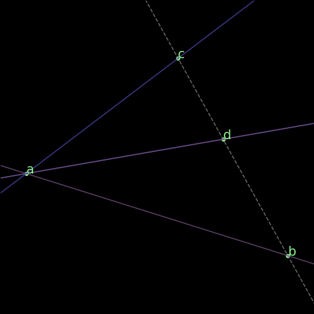

r12 : Bisector theorem II
^^^^^^^^^^^^^^^^^^^^^^^^^
.. list-table::
   :widths: 50 25 25
   :header-rows: 1

   * - Figure
     - Formal Statement
     - Description
   * - |r12|
     - :math:`\begin{cases}\angle (AB\times AD) = \angle (AD\times AC) \\ DBC\text{ collinear}\\ ABC\text{ non-collinear}\end{cases} \implies \frac{DB}{DC} = \frac{AB}{AC}`
     - Opposite direction of the bisector theorem: the internal bisector of a vertex of a triangle divides the opposite side into two segments that are in proportion to the neighboring sides of the triangle.

.. |r12| image:: ../../_static/images/rules/r12.png
    :width: 100%

r13 : Isosceles triangle equal angles
^^^^^^^^^^^^^^^^^^^^^^^^^^^^^^^^^^^^^
.. list-table::
   :widths: 50 25 25
   :header-rows: 1

   * - Figure
     - Formal Statement
     - Description
   * - |r13|
     - :math:`\begin{cases}|OA|=|OB|\\ OAB\text{ non-collinear} \end{cases}\implies \angle (OA\times AB) = \angle (AB\times OB)`
     - The theorem says that the base angles of an isosceles triangle are congruent.

.. |r13| image:: ../../_static/images/rules/r13.png
    :width: 100%

r14 : Equal base angles imply isosceles
^^^^^^^^^^^^^^^^^^^^^^^^^^^^^^^^^^^^^^^
.. list-table::
   :widths: 50 25 25
   :header-rows: 1

   * - Figure
     - Formal Statement
     - Description
   * - |r14|
     - :math:`\begin{cases}\angle (AO\times AB) = \angle (BA\times BO)\\ OAB\text{ non-collinear}\end{cases} \implies |OA|=|OB|`
     - This is the reverse direction of r13, saying that if the base angles of a triangle are congruent, the triangle is isosceles.

.. |r14| image:: ../../_static/images/rules/r14.png
    :width: 100%

r15 : Arc determines inscribed angles (tangent)
^^^^^^^^^^^^^^^^^^^^^^^^^^^^^^^^^^^^^^^^^^^^^^^
.. list-table::
   :widths: 50 25 25
   :header-rows: 1

   * - Figure
     - Formal Statement
     - Description
   * - |r15|
     - :math:`\begin{cases} O\text{ center of circle }ABC \\ OA \perp AX\end{cases} \implies \angle (AX\times AB) = \angle (CA\times CB)`
     - This rule corresponds to r03 in the case the arc is determined by a tangent line. An inscribed angle determining that same arc will be congruent to the angle determining that arc with one leg being the tangent line at the vertex of the arc.

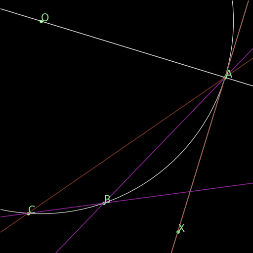

r16 : Same arc giving tangent
^^^^^^^^^^^^^^^^^^^^^^^^^^^^^
.. list-table::
   :widths: 50 25 25
   :header-rows: 1

   * - Figure
     - Formal Statement
     - Description
   * - |r16|
     - :math:`\begin{cases} O\text{ center of circle }ABC \\ \angle (AX\times AB)=\angle(CA\times CB)\end{cases} \implies OA\perp AX`
     - Reverse direction of r15: if two angles with vertices on a circle see the same arc, but one vertex is also an extremal point of the arc, a leg of the angle through this extremal point is the tangent to the circle at that same point.

.. |r16| image:: ../../_static/images/rules/r16.png
    :width: 100%

r17 : Central angle vs inscribed angle I
^^^^^^^^^^^^^^^^^^^^^^^^^^^^^^^^^^^^^^^^
.. list-table::
   :widths: 50 25 25
   :header-rows: 1

   * - Figure
     - Formal Statement
     - Description
   * - |r17|
     - :math:`\begin{cases} O\text{ center of circle }ABC \\ M\text{ midpoint of }BC\end{cases} \implies \angle(AB\times AC)=\angle(OB\times OM)`
     - This rule implies that the central angle doubles the inscribed angle when both determine the same arc in a circle. It mentions "bisects the chord" as an hypotheis instead of "halves the angle" because midpoint of a segment is a predicate, while bisector of an angle is not.

.. |r17| image:: ../../_static/images/rules/r17.png
    :width: 100%

r18 : Central angle vs inscribed angle II
^^^^^^^^^^^^^^^^^^^^^^^^^^^^^^^^^^^^^^^^^
.. list-table::
   :widths: 50 25 25
   :header-rows: 1

   * - Figure
     - Formal Statement
     - Description
   * - |r18|
     - :math:`\begin{cases} O\text{ center of circle }ABC \\ MBC\text{ collinear}\\ \angle(AB\times AC)=\angle(OB\times OM)\end{cases} \implies M\text{ midpoint of }BC`
     - This is the other direction of rule r17. It also has a statement about the bisection of a chord in the circle. Specifically, it says that if a central angle has the same measure as a given inscribed angle on a circle, it will cut the chord corresponding to that angle in half.

.. |r18| image:: ../../_static/images/rules/r18.png
    :width: 100%

r19 : Hypothenuse is diameter
^^^^^^^^^^^^^^^^^^^^^^^^^^^^^
.. list-table::
   :widths: 50 25 25
   :header-rows: 1

   * - Figure
     - Formal Statement
     - Description
   * - |r19|
     - :math:`\begin{cases}AB\perp BC \\ M\text{ midpoint of}AC\end{cases} \implies |AM|=|BM|`
     - This rule says that the hypothenuse of a right triangle is a diameter of its circumcircle, or that the midpoint of the hypothenuse is the circumcenter of the right triangle.

.. |r19| image:: ../../_static/images/rules/r19.png
    :width: 100%

r20 : Diameter is hypotenuse
^^^^^^^^^^^^^^^^^^^^^^^^^^^^
.. list-table::
   :widths: 50 25 25
   :header-rows: 1

   * - Figure
     - Formal Statement
     - Description
   * - |r20|
     - :math:`\begin{cases}O \text{ center of the circle } ABC \\ OAC\text{ collinear} \end{cases}\implies AB \perp BC`
     - This theorem is the reverse direction of r19. It says that if two points are the edges of the diameter of a circle, and at the same time are vertices of an inscribed triangle, the triangle has a right angle at the third vertex.

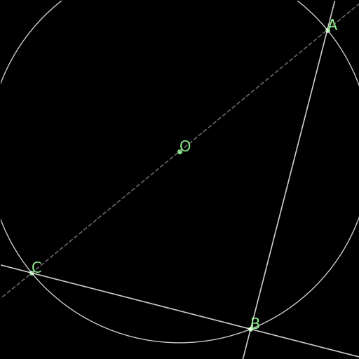

r21 : Cyclic trapezoid
^^^^^^^^^^^^^^^^^^^^^^
.. list-table::
   :widths: 50 25 25
   :header-rows: 1

   * - Figure
     - Formal Statement
     - Description
   * - |r21|
     - :math:`\begin{cases}ABCD\text{ on a circle} \\ AB \parallel CD\end{cases} \implies \angle (AD\times CD) = \angle (CD\times CB)`
     - This rule says that a cyclic trapezoid is isosceles (refering specifically to the congruence of the angles on a base).

.. |r21| image:: ../../_static/images/rules/r21.png
    :width: 100%

r22 : Bisector Construction
^^^^^^^^^^^^^^^^^^^^^^^^^^^
.. list-table::
   :widths: 50 25 25
   :header-rows: 1

   * - Figure
     - Formal Statement
     - Description
   * - |r22|
     - :math:`\begin{cases}M \text{ midpoint of }AB \\ OM\perp AB \end{cases} \implies |OA|=|OB|`
     - This rule says that the perpendicular line through the midpoint of the segment is the perpendicular bisector of the segment (the locus of all equidistant points to the vertices of the segment).

.. |r22| image:: ../../_static/images/rules/r22.png
    :width: 100%

r23 : Bisector is perpendicular
^^^^^^^^^^^^^^^^^^^^^^^^^^^^^^^
.. list-table::
   :widths: 50 25 25
   :header-rows: 1

   * - Figure
     - Formal Statement
     - Description
   * - |r23|
     - :math:`|AP|=|BP| \wedge |AQ|=|BQ| \implies AB\perp PQ`
     - This rule is the reverse direction of r22. It says that the locus of the points that are equidistant to the two vertices of a segment AB is a straight line perpendicular to AB.

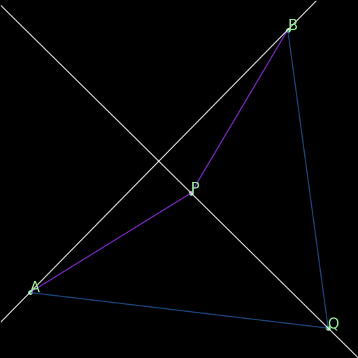

r24 : Cyclic kite
^^^^^^^^^^^^^^^^^
.. list-table::
   :widths: 50 25 25
   :header-rows: 1

   * - Figure
     - Formal Statement
     - Description
   * - |r24|
     - :math:`\begin{cases}|AP|=|BP| \\ |AQ|=|BQ| \\ ABPQ\text{ on a circle}\end{cases} \implies PA\perp AQ`
     - This theorem says that a cyclic kite is always formed by two symmetric right triangles.

.. |r24| image:: ../../_static/images/rules/r24.png
    :width: 100%

r25 : Diagonals of parallelogram I
^^^^^^^^^^^^^^^^^^^^^^^^^^^^^^^^^^
.. list-table::
   :widths: 50 25 25
   :header-rows: 1

   * - Figure
     - Formal Statement
     - Description
   * - |r25|
     - :math:`\begin{cases}M\text{ midpoint of }AB \\M \text{ midpoint of }CD\end{cases} \implies AC \parallel BD`
     - If two segments intersect at their common midpoint, the vertices of the segments are the vertices of a parallelogram.

.. |r25| image:: ../../_static/images/rules/r25.png
    :width: 100%

r26 : Diagonals of parallelogram II
^^^^^^^^^^^^^^^^^^^^^^^^^^^^^^^^^^^
.. list-table::
   :widths: 50 25 25
   :header-rows: 1

   * - Figure
     - Formal Statement
     - Description
   * - |r26|
     - :math:`\begin{cases}M \text{ midpoint of }AB \\ AC \parallel BD \\ AD \parallel BC\\ ABD\text{ non-collinear} \end{cases}\implies M \text{ midpoint of }CD`
     - The other direction of the previous rule, it says the diagonals of a parallelogram meet at their common midpoint. **The original statement of this rule did not have the non-degeneracy condition ncoll A B D as a hypothesis.**

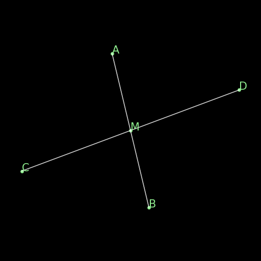

r27 : Thales theorem II
^^^^^^^^^^^^^^^^^^^^^^^
.. list-table::
   :widths: 50 25 25
   :header-rows: 1

   * - Figure
     - Formal Statement
     - Description
   * - |r27|
     - :math:`\begin{cases}\frac{OA}{AC}=\frac{OB}{BD}\\ OAC\text{ collinear}\\OBD\text{ collinear}\\ ABC \text{ non-collinear}\\ A\text{ to the same side of }O\to C\text{ as }B\text{ to }O\to D\end{cases}\implies AB\parallel CD`
     - This is another instance of Thales theorem, one saying that if two points C and D split to legs of a triangle on the same ratio, the line CD will be parallel to the base of the triangle.

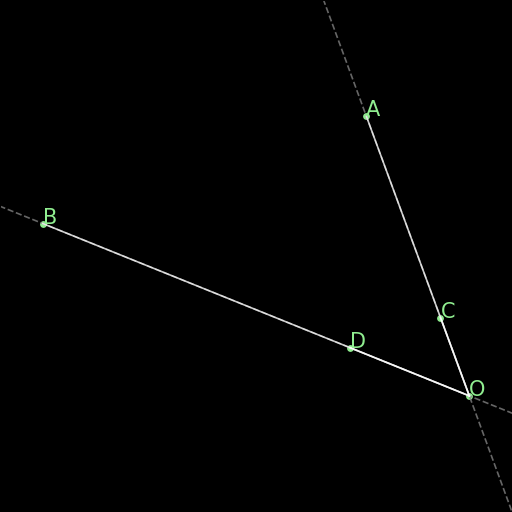

r28 : Overlapping parallels
^^^^^^^^^^^^^^^^^^^^^^^^^^^
.. list-table::
   :widths: 50 25 25
   :header-rows: 1

   * - Figure
     - Formal Statement
     - Description
   * - |r28|
     - :math:`AB \parallel AC \implies ABC\text{ collinear}`
     - This rule encompasses the fact that two intersecting parallel lines are actually the same.

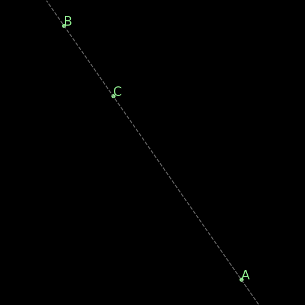

r29 : Midpoint is an eqratio
^^^^^^^^^^^^^^^^^^^^^^^^^^^^
.. list-table::
   :widths: 50 25 25
   :header-rows: 1

   * - Figure
     - Formal Statement
     - Description
   * - |r29|
     - :math:`\begin{cases} M \text{ midpoint of }AB \\ N\text{ midpoint of } CD \end{cases}\implies \frac{MA}{AB} = \frac{NC}{CD}`
     - This rule exists to help the solver process the fact that is obvious to humans: midpoints split segments in the same ratio (1:2).

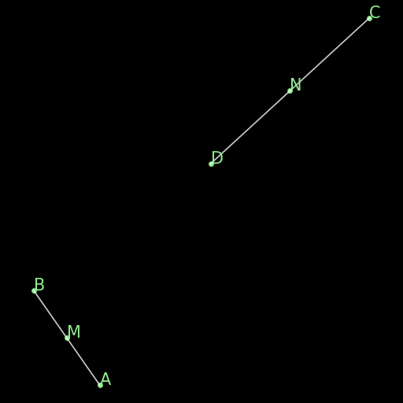

r30 : Right triangles common angle II
^^^^^^^^^^^^^^^^^^^^^^^^^^^^^^^^^^^^^
.. list-table::
   :widths: 50 25 25
   :header-rows: 1

   * - Figure
     - Formal Statement
     - Description
   * - |r30|
     - :math:`\begin{cases}\angle (AB\times PQ)=\angle (CD\times UV) \\ PQ\perp UV \end{cases}\implies AB\perp CD`
     - This rule is the reverse direction of rule r08 (as can be seen by renaming Q->E, P->F, U->H, and V->G), and it is also a consequence of two triangles sharing a same vertex. **This rule is not in the final rules.txt file because it is covered by AR.**

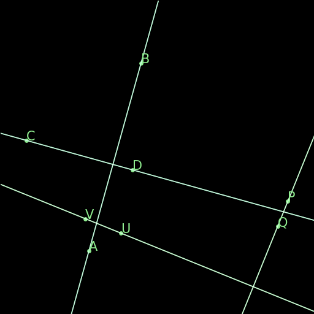

r31 : Denominator cancelling
^^^^^^^^^^^^^^^^^^^^^^^^^^^^
.. list-table::
   :widths: 50 25 25
   :header-rows: 1

   * - Figure
     - Formal Statement
     - Description
   * - |r31|
     - :math:`\frac{AB}{PQ} = \frac{CD}{UV} \wedge |PQ| = |UV| \implies |AB| = |CD|`
     - This rule simply eliminates equal denominators in an equality of ratios. **This rule is not in the final rules.txt file because it is covered by AR.**

r32 : SSS Triangle congruence
^^^^^^^^^^^^^^^^^^^^^^^^^^^^^
.. list-table::
   :widths: 50 25 25
   :header-rows: 1

   * - Figure
     - Formal Statement
     - Description
   * - |r32|
     - :math:`\begin{cases}|AB| = |PQ| \\ |BC| = |QR| \\ |CA| = |RP|\end{cases}\implies \Delta ABC\cong^\ast \Delta PQR`
     - This rule covers the congruence case for two triangles when both have corresponding equal sides. The * in the congruence sign denotes the matching function checks both for triangles that have the same vertex orientation and a different one. **This rule has been replaced by rules r64 and r65 to prevent hiding the orientation checking inside the matching funtion.**

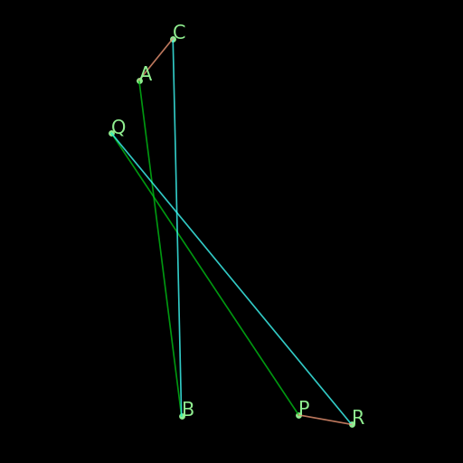

r33 : SAS Triangle congruence
^^^^^^^^^^^^^^^^^^^^^^^^^^^^^
.. list-table::
   :widths: 50 25 25
   :header-rows: 1

   * - Figure
     - Formal Statement
     - Description
   * - |r33|
     - :math:`\begin{cases}|AB| = |PQ| \\ |BC| = |QR| \\ \angle (BA\times BC) = \angle (QP\times QR)\end{cases}\implies \Delta ABC\cong^\ast\Delta PQR`
     - This rule covers the congruence case for two triangles when both have two corresponding equal sides and an equal angle between them. The * in the congruence sign denotes the matching function checks both for triangles that have the same vertex orientation and a different one. **This rule has been replaced by rules r66 and r67 to prevent hiding the orientation checking inside the matching funtion.**

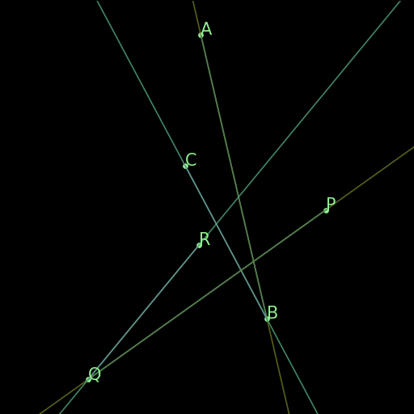

r34 : AA Similarity of triangles (direct)
^^^^^^^^^^^^^^^^^^^^^^^^^^^^^^^^^^^^^^^^^
.. list-table::
   :widths: 50 25 25
   :header-rows: 1

   * - Figure
     - Formal Statement
     - Description
   * - |r34|
     - :math:`\begin{cases}\angle (BA\times BC) = \angle (QP\times QR) \\ \angle (CA\times CB) = \angle (RP\times RQ)\\ \Delta ABC\text{ has the same orientation as }\Delta PQR\end{cases}\implies \Delta ABC\sim \Delta PQR`
     - This is a similarity condition for a pair of triangles: that of two pairs of congruent angles between the triangles (angle-angle similarity). This rule covers the case of direct similarity, that is, both triangles have the same orientation of vertices. **The original statement of this rule did not have the orientation check sameclock A B C P Q R as an explicit hypothesis, it was done in the background.**

.. |r34| image:: ../../_static/images/rules/r34.png
    :width: 100%

r35 : AA Similarity of triangles (reverse)
^^^^^^^^^^^^^^^^^^^^^^^^^^^^^^^^^^^^^^^^^^
.. list-table::
   :widths: 50 25 25
   :header-rows: 1

   * - Figure
     - Formal Statement
     - Description
   * - |r35|
     - :math:`\begin{cases}\angle (BA\times BC) = \angle (QR\times QP) \\ \angle (CA\times CB) = \angle (RQ\times RP)\\ \Delta ABC\text{ has the same orientation as }\Delta PRQ\end{cases}\implies \Delta ABC\sim^r \Delta PQR`
     - This is a similarity condition for a pair of triangles: that of two pairs of congruent angles between the triangles (angle-angle similarity). This rule covers the case of reverse similarity, that is, the triangles have reversed orientation for the vertices. **The original statement of this rule did not have the orientation check sameclock A B C P R Q as an explicit hypothesis, it was done in the background.**

.. |r35| image:: ../../_static/images/rules/r35.png
    :width: 100%

r36 : ASA Congruence of triangles (direct)
^^^^^^^^^^^^^^^^^^^^^^^^^^^^^^^^^^^^^^^^^^
.. list-table::
   :widths: 50 25 25
   :header-rows: 1

   * - Figure
     - Formal Statement
     - Description
   * - |r36|
     - :math:`\begin{cases}\angle (BA\times BC) = \angle (QP\times QR) \\ \angle (CA\times CB) = \angle (RP\times RQ)\\ |AB| = |PQ| \\ ABC\text{ non-collinear} \end{cases}\implies \Delta ABC\cong \Delta PQR`
     - This rule covers the congruence case for two triangles when both have two corresponding equal angles and an equal side. This rule covers the case of direct congruence, that is, both triangles have the same orientation of vertices.

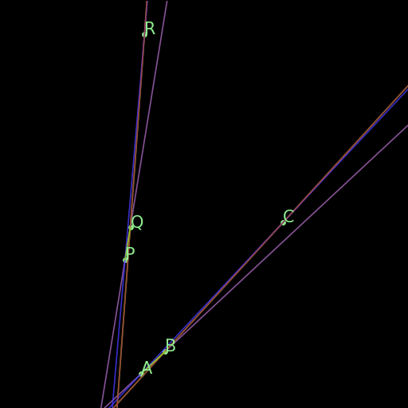

r37 : ASA Congruence of triangles (reverse)
^^^^^^^^^^^^^^^^^^^^^^^^^^^^^^^^^^^^^^^^^^^
.. list-table::
   :widths: 50 25 25
   :header-rows: 1

   * - Figure
     - Formal Statement
     - Description
   * - |r37|
     - :math:`\begin{cases}\angle (BA\times BC) = \angle (QP\times QR) \\ \angle (CA\times CB) = \angle (RP\times RQ)\\ |AB| = |PQ| \\ ABC\text{ non-collinear} \end{cases}\implies \Delta ABC\cong^r \Delta PQR`
     - This rule covers the congruence case for two triangles when both have two corresponding equal angles and an equal side. This rule covers the case of reverse congruence, that is, both triangles have the opposite orientation for the vertices.

.. |r37| image:: ../../_static/images/rules/r37.png
    :width: 100%

r38 : SSS Triangle similarity (original)
^^^^^^^^^^^^^^^^^^^^^^^^^^^^^^^^^^^^^^^^
.. list-table::
   :widths: 50 25 25
   :header-rows: 1

   * - Figure
     - Formal Statement
     - Description
   * - |r38|
     - :math:`\begin{cases}\frac{BA}{BC} = \frac{QP}{QR} \\ \frac{CA}{CB} = \frac{RP}{RQ}\\ ABC\text{ non-collinear} \end{cases}\implies \Delta ABC\sim^\ast \Delta PQR`
     - This rule covers the similarity case for two triangles when both have corresponding proportional sides. The * in the similarity sign denotes the matching function checks both for triangles that have the same vertex orientation and a different one. **This rule has been replaced by rules r60 and r61 to prevent hiding the orientation checking inside the matching funtion.**

.. |r38| image:: ../../_static/images/rules/r38.png
    :width: 100%

r39 : SAS Triangle similarity (original)
^^^^^^^^^^^^^^^^^^^^^^^^^^^^^^^^^^^^^^^^
.. list-table::
   :widths: 50 25 25
   :header-rows: 1

   * - Figure
     - Formal Statement
     - Description
   * - |r39|
     - :math:`\begin{cases}\frac{BA}{BC} = \frac{QP}{QR} \\ \angle (BA\times BC)\rangle = \angle (QP\times QR)\\ ABC\text{ non-collinear}\end{cases} \implies \Delta ABC\sim^\ast \Delta PQR`
     - This rule covers the similarity case for two triangles when both have a corresponding pair of proportional sides, with an equal angle between them. The * in the similarity sign denotes the matching function checks both for triangles that have the same vertex orientation and a different one. **This rule has been replaced by rules r62 and r63 to prevent hiding the orientation checking inside the matching funtion.**

.. |r39| image:: ../../_static/images/rules/r39.png
    :width: 100%

r40 : Similarity without scaling
^^^^^^^^^^^^^^^^^^^^^^^^^^^^^^^^
.. list-table::
   :widths: 50 25 25
   :header-rows: 1

   * - Figure
     - Formal Statement
     - Description
   * - |r40|
     - :math:`\begin{cases}\frac{BA}{BC} = \frac{QP}{QR} \\ \frac{CA}{CB} = \frac{RP}{RQ}\\ ABC\text{ non-collinear} \\ |AB| = |PQ|\end{cases}\implies \Delta ABC\cong^\ast \Delta PQR`
     - This rule encompasses the fact that if the ratio of similarity of two similar triangles is one (they have corresponding congruent sides), the triangles are congruent. **This rule has been replaced by rules r68 and r69 to prevent hiding the orientation checking inside the matching funtion.**

.. |r40| image:: ../../_static/images/rules/r40.png
    :width: 100%

r41 : Thales theorem III
^^^^^^^^^^^^^^^^^^^^^^^^
.. list-table::
   :widths: 50 25 25
   :header-rows: 1

   * - Figure
     - Formal Statement
     - Description
   * - |r41|
     - :math:`\begin{cases}AB\parallel CD \\ MAD\text{ collinear} \\ NBC \text{ collinear} \\ \frac{MA}{MD}=\frac{NB}{NC}\\ M\text{ to the same side of } A\to D\text{ as }N\text{ to }B\to C \end{cases}\implies MN\parallel A B`
     - This is still another instance of Thales theorem, one that saying that if two transverse lines cross three lines, two of which are parallel, with proportional pairs of segments in the proper configuration, the third line crossed is also parallel to the other two.

.. |r41| image:: ../../_static/images/rules/r41.png
    :width: 100%

r42 : Thales theorem IV
^^^^^^^^^^^^^^^^^^^^^^^
.. list-table::
   :widths: 50 25 25
   :header-rows: 1

   * - Figure
     - Formal Statement
     - Description
   * - |r42|
     - :math:`\begin{cases}AB\parallel CD \\ MAD\text{ collinear} \\ NBC\text{ collinear}\\ MN\parallel AB\\ ABC\text{ non-collinear}\end{cases}\implies \frac{MA}{MD}=\frac{NB}{NC}`
     - This is probably the most common version of Thales theorem: if three parallel lines are cut by two other lines, there is a corresponding pair of proportional segments determined by the intersection points. It is the other direction of the theorem in rule r41. **The original version of this rule did not contain the non-degeneracy condition ncoll a b c as a hypothesis.**

.. |r42| image:: ../../_static/images/rules/r42.png
    :width: 100%

New rules
---------

r43 : Orthocenter theorem
^^^^^^^^^^^^^^^^^^^^^^^^^
.. list-table::
   :widths: 50 25 25
   :header-rows: 1

   * - Figure
     - Formal Statement
     - Description
   * - |r43|
     - :math:`AB\perp CD \wedge AC\perp BD\implies AD\perp BC`
     - This rule says that the three heights of a triangle meet at a single point (the orthocenter).

.. |r43| image:: ../../_static/images/rules/r43.png
    :width: 100%

r44 : Pappus's theorem
^^^^^^^^^^^^^^^^^^^^^^
.. list-table::
   :widths: 50 25 25
   :header-rows: 1

   * - Figure
     - Formal Statement
     - Description
   * - |r44|
     - :math:`\begin{cases}ABC\text{ collinear} \\ PQR\text{ collinear} \\ XAQ\text{ collinear}\\ XPB\text{ collinear} \\ YAR\text{ collinear} \\ YPC\text{ collinear}\\ ZBR\text{ collinear} \\ ZCQ\text{ collinear}\end{cases}\implies XYZ\text{ collinear}`
     - This rule is Pappus's hexagon theorem.

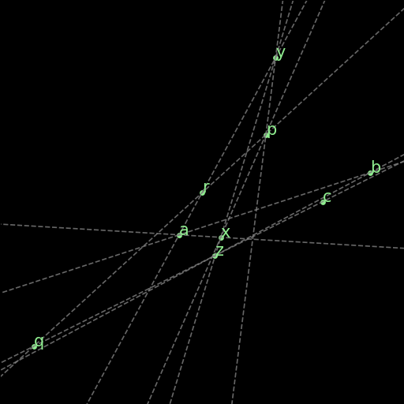

r45 : Simson's line theorem
^^^^^^^^^^^^^^^^^^^^^^^^^^^
.. list-table::
   :widths: 50 25 25
   :header-rows: 1

   * - Figure
     - Formal Statement
     - Description
   * - |r45|
     - :math:`\begin{cases} ABCP\text{ on a circle} \\ ALC\text{ collinear} \\ PL\perp AC\\ MBC\text{ collinear} \\ PM\perp BC\\ NAB\text{ collinear} \\ PN\perp AB\end{cases}\implies LMN\text{ collinear}`
     - This rule is Simson's line theorem: The orthogonal projections of a point on the circumcircle of a triangle onto its three sides lie on a same line (Simson's line).

.. |r45| image:: ../../_static/images/rules/r45.png
    :width: 100%

r46 : Incenter theorem
^^^^^^^^^^^^^^^^^^^^^^
.. list-table::
   :widths: 50 25 25
   :header-rows: 1

   * - Figure
     - Formal Statement
     - Description
   * - |r46|
     - :math:`\begin{cases}\angle(AB\times AX)=\angle (AX\times AC) \\ \angle(BA\times BX)=\angle (BX\times BC)\\ ABC\text{ non-collinear}\end{cases}\implies \angle (CB\times CX)=\angle (CX\times CA)`
     - The three bisectors of a triangle meet at a single point (the incenter).

.. |r46| image:: ../../_static/images/rules/r46.png
    :width: 100%

r47 : Circumcenter theorem
^^^^^^^^^^^^^^^^^^^^^^^^^^
.. list-table::
   :widths: 50 25 25
   :header-rows: 1

   * - Figure
     - Formal Statement
     - Description
   * - |r47|
     - :math:`\begin{cases}M\text{ midpoint of }AB \\ XM\perp AB \\ N\text{ midpoint of }BC\\ XN\perp BC \\ P\text{ midpoint of }CA\end{cases}\implies XP\perp CA`
     - The three perpendicular bisectors of the sides of a triangle meet at a single point (the circumcenter).

.. |r47| image:: ../../_static/images/rules/r47.png
    :width: 100%

r48 : Centroid theorem
^^^^^^^^^^^^^^^^^^^^^^
.. list-table::
   :widths: 50 25 25
   :header-rows: 1

   * - Figure
     - Formal Statement
     - Description
   * - |r48|
     - :math:`\begin{cases}M\text{ midpoint of }AB \\ MXC\text{ collinear}\\ N\text{ midpoint of }BC \\ NXC\text{ collinear}\\ P\text{ midpoint of }CA\end{cases}\implies XPB\text{ collinear}`
     - The three medians of a triangle meet at a single point (the centroid).

.. |r48| image:: ../../_static/images/rules/r48.png
    :width: 100%

r49 : Recognize center of cyclic (circle)
^^^^^^^^^^^^^^^^^^^^^^^^^^^^^^^^^^^^^^^^^
.. list-table::
   :widths: 50 25 25
   :header-rows: 1

   * - Figure
     - Formal Statement
     - Description
   * - |r49|
     - :math:`\begin{cases}O\text{ center of the circle }ABC \\ABCD\text{ on a circle}\end{cases}\implies OA= OD`
     - This rule gives an information that is immediate for humans, but previously undetected to the solver: if three points lie on a circle with a known center, and there is a fourth point on that circle, the distance of the center of the circle to this fourth point is the same as to other points in a circle.

.. |r49| image:: ../../_static/images/rules/r49.png
    :width: 100%

r50 : Recognize center of cyclic (cong)
^^^^^^^^^^^^^^^^^^^^^^^^^^^^^^^^^^^^^^^
.. list-table::
   :widths: 50 25 25
   :header-rows: 1

   * - Figure
     - Formal Statement
     - Description
   * - |r50|
     - :math:`\begin{cases}ABCD\text{ on a circle}\\ OA=OB\\ OC=OD\\ AB\not\parallel CD\end{cases}\implies OA=OC`
     - The intersection of the bisectors of two segments of points that lie on a circle is the center of the circle (if the bisectors do not overlap).

.. |r50| image:: ../../_static/images/rules/r50.png
    :width: 100%

r51 : Midpoint splits in two
^^^^^^^^^^^^^^^^^^^^^^^^^^^^
.. list-table::
   :widths: 50 25 25
   :header-rows: 1

   * - Figure
     - Formal Statement
     - Description
   * - (Feeds algebraic module)
     - :math:`M\text{ midpoint of AB}\implies \frac{MA}{AB}=\frac{1}{2}`
     - This rule converts a symbolic statement (M is the midpoint of AB) into an algebraic one (the ratio between AM and AB is 1:2). This allows AR to process information from midpoints.

r52 : Properties of similar triangles (Direct)
^^^^^^^^^^^^^^^^^^^^^^^^^^^^^^^^^^^^^^^^^^^^^^
.. list-table::
   :widths: 50 25 25
   :header-rows: 1

   * - Figure
     - Formal Statement
     - Description
   * - |r52|
     - :math:`\Delta ABC\sim \Delta PQR\implies \begin{cases}\angle(BA\times BC)=\angle(QP\times QR)\\ \frac{BA}{BC}=\frac{QP}{QR}\end{cases}`
     - This rule was created to explicitate the definition of what a similar triangle is, by going from the pure statement that two triangles are similar to spilling out the corresponding statements about the proportion of the lengths of the sides and the equivalence of angles on both triangles. This rule covers the case where the vertices of both triangles have the same orientation, and is the reverse direction of rule r62.

.. |r52| image:: ../../_static/images/rules/r52.png
    :width: 100%

r53 : Properties of similar triangles (Reverse)
^^^^^^^^^^^^^^^^^^^^^^^^^^^^^^^^^^^^^^^^^^^^^^^
.. list-table::
   :widths: 50 25 25
   :header-rows: 1

   * - Figure
     - Formal Statement
     - Description
   * - |r53|
     - :math:`\Delta ABC\sim^r \Delta PQR\implies \begin{cases}\angle(BA\times BC)=\angle(QR\times QP)\\ \frac{BA}{BC}=\frac{QP}{QR}\end{cases}`
     - This rule was created to explicitate the definition of what a similar triangle is, by going from the pure statement that two triangles are similar to spilling out the corresponding statements about the proportion of the lengths of the sides and the equivalence of angles on both triangles. This rule covers the case where the vertices of both triangles have the opposite orientation, and is the reverse direction of rule r63.

.. |r53| image:: ../../_static/images/rules/r53.png
    :width: 100%

r54 : Definition of midpoint
^^^^^^^^^^^^^^^^^^^^^^^^^^^^
.. list-table::
   :widths: 50 25 25
   :header-rows: 1

   * - Figure
     - Formal Statement
     - Description
   * - |r54|
     - :math:`\begin{cases}MA=MB\\ MAB\text{ collinear}\end{cases}\implies M\text{ midpoint of AB}`
     - This rule was created to detect midpoints by their defining axiomatic properties. It solidifies midp as a predicate.

.. |r54| image:: ../../_static/images/rules/r54.png
    :width: 100%

r55 : Properties of midpoint (cong)
^^^^^^^^^^^^^^^^^^^^^^^^^^^^^^^^^^^
.. list-table::
   :widths: 50 25 25
   :header-rows: 1

   * - Figure
     - Formal Statement
     - Description
   * - |r55|
     - :math:`M\text{ midpoint of }AB\implies MA=MB`
     - This rule extracts from the midp predicate the property that the midpoint is equidistant from the extremes of the segment. **This was done previously inside the definition of a midpoint. Our change makes this implication explicit.**

.. |r55| image:: ../../_static/images/rules/r55.png
    :width: 100%

r56 : Properties of midpoint (coll)
^^^^^^^^^^^^^^^^^^^^^^^^^^^^^^^^^^^
.. list-table::
   :widths: 50 25 25
   :header-rows: 1

   * - Figure
     - Formal Statement
     - Description
   * - |r56|
     - :math:`M\text{ midpoint of }AB\implies MAB\text{ collinear}`
     - This rule extracts symbolically from the midp predicate the property that the midpoint is on the line of the segment. **This was done previously inside the definition of a midpoint. Our change makes this implication explicit.**

.. |r56| image:: ../../_static/images/rules/r56.png
    :width: 100%

r57 : Pythagoras theorem
^^^^^^^^^^^^^^^^^^^^^^^^
.. list-table::
   :widths: 50 25 25
   :header-rows: 1

   * - Figure
     - Formal Statement
     - Description
   * - |r57|
     - :math:`\begin{array}{c}\Delta ABC\text{ is a right triangle with hypotenuse }BC\\ \Downarrow\\\text{ Missing information from Pythagoras theorem}\end{array}`
     - This rule behaves differently from the others, as both directions of Pythagoras theorem are checked at the same time. If we have a right triangle ABC, it will verify what conditions are already in the proof state. If the proof state symbolically knows the three lengths of the sides, and they satisfy that the sum of the squares of the lengths of the legs is equal to the square of the hypothenuse, it will add the proper orthogonal relation to the proof state. If the proof state has a perpendicular statement and two lengths of sides of the correspoding right triangle, it will add the lconst predicate corresponding to the missing length. The operation does not solve the algebra, it verifies if enough information exists and if that is the case it numerically gets the missing side when using the famous formula.

.. |r57| image:: ../../_static/images/rules/r57.png
    :width: 100%

r58 : Same chord same arc I
^^^^^^^^^^^^^^^^^^^^^^^^^^^
.. list-table::
   :widths: 50 25 25
   :header-rows: 1

   * - Figure
     - Formal Statement
     - Description
   * - |r58|
     - :math:`\begin{cases}ABCPQR\text{ on a circle}\\ AB=PQ\\ \Delta CAB\text{ has the same orientation as }\Delta RPQ\\ C\text{ to the same side of }A\to B\text{ as }R\text{ to }P\to Q\end{cases}\implies \angle(CA\times CB)=\angle(RP\times RQ)`
     - This is one of the rules that gives the opposite direction of r05, giving conditions for inscribed angles on a circle defining chords of the same length to have the same measure. It has to consider two different configurations to account for complications of using full angles. The other configuration is given in r59.

.. |r58| image:: ../../_static/images/rules/r58.png
    :width: 100%

r59 : Same chord same arc II
^^^^^^^^^^^^^^^^^^^^^^^^^^^^
.. list-table::
   :widths: 50 25 25
   :header-rows: 1

   * - Figure
     - Formal Statement
     - Description
   * - |r59|
     - :math:`\begin{cases}ABCPQR\text{ on a circle}\\ AB=PQ\\ \Delta CBA\text{ has the same orientation as }\Delta RPQ\\ C\text{ not to the same side of }A\to B\text{ as }R\text{ to }P\to Q\end{cases}\implies \angle(CA\times CB)=\angle(RP\times RQ)`
     - This is one of the rules that gives the opposite direction of r05, giving conditions for inscribed angles on a circle defining chords of the same length to have the same measure. It has to consider two different configurations to account for complications of using full angles. The other configuration is given in r58.

.. |r59| image:: ../../_static/images/rules/r59.png
    :width: 100%

r60 : SSS Similarity of triangles (Direct)
^^^^^^^^^^^^^^^^^^^^^^^^^^^^^^^^^^^^^^^^^^
.. list-table::
   :widths: 50 25 25
   :header-rows: 1

   * - Figure
     - Formal Statement
     - Description
   * - |r60|
     - :math:`\begin{cases}\frac{BA}{BC}=\frac{QP}{QR}\\ \frac{CA}{CB}=\frac{RP}{RQ}\\ \Delta ABC\text{ has the same orientation as }\Delta PQR\end{cases}\implies \Delta ABC\sim \Delta PQR`
     - This rule covers the similarity case for two triangles when both have corresponding proportional sides and have the same orientation. **This rule, together with r61, replaces the original r38.**

.. |r60| image:: ../../_static/images/rules/r60.png
    :width: 100%

r61 : SSS Similarity of triangles (Reverse)
^^^^^^^^^^^^^^^^^^^^^^^^^^^^^^^^^^^^^^^^^^^
.. list-table::
   :widths: 50 25 25
   :header-rows: 1

   * - Figure
     - Formal Statement
     - Description
   * - |r61|
     - :math:`\begin{cases}\frac{BA}{BC}=\frac{QP}{QR}\\ \frac{CA}{CB}=\frac{RP}{RQ}\\ \Delta ABC\text{ has the same orientation as }\Delta PRQ\end{cases}\implies \Delta ABC\sim^r \Delta PQR`
     - This rule covers the similarity case for two triangles when both have corresponding proportional sides and have opposite orientations. **This rule, together with r60, replaces the original r38.**

.. |r61| image:: ../../_static/images/rules/r61.png
    :width: 100%

r62 : SAS Similarity of triangles (Direct)
^^^^^^^^^^^^^^^^^^^^^^^^^^^^^^^^^^^^^^^^^^
.. list-table::
   :widths: 50 25 25
   :header-rows: 1

   * - Figure
     - Formal Statement
     - Description
   * - |r62|
     - :math:`\begin{cases}\frac{BA}{BC}=\frac{QP}{QR}\\ \angle (BA\times BC)=\angle (QP\times QR)\\ \Delta ABC\text{ has the same orientation as }\Delta PQR\end{cases}\implies \Delta ABC\sim \Delta PQR`
     - This rule covers the similarity case for two triangles when both have a corresponding pair of proportional sides, with an equal angle between them, and have the same orientation. **This rule, together with r63, replaces the original r39.**

.. |r62| image:: ../../_static/images/rules/r62.png
    :width: 100%

r63 : SAS Similarity of triangles (Reverse)
^^^^^^^^^^^^^^^^^^^^^^^^^^^^^^^^^^^^^^^^^^^
.. list-table::
   :widths: 50 25 25
   :header-rows: 1

   * - Figure
     - Formal Statement
     - Description
   * - |r63|
     - :math:`\begin{cases}\frac{BA}{BC}=\frac{QP}{QR}\\ \angle (BA\times BC)=\angle (QR\times QP)\\ \Delta ABC\text{ has the same orientation as }\Delta PRQ\end{cases}\implies \Delta ABC\sim^r \Delta PQR`
     - This rule covers the similarity case for two triangles when both have a corresponding pair of proportional sides, with an equal angle between them, and have opposite orientations. **This rule, together with r62, replaces the original r39.**

.. |r63| image:: ../../_static/images/rules/r63.png
    :width: 100%

r64 : SSS Congruence of triangles (Direct)
^^^^^^^^^^^^^^^^^^^^^^^^^^^^^^^^^^^^^^^^^^
.. list-table::
   :widths: 50 25 25
   :header-rows: 1

   * - Figure
     - Formal Statement
     - Description
   * - |r64|
     - :math:`\begin{cases}AB=PQ\\ BC=QR\\ AC=RP\\ ABC\text{ non-collinear}\\ \Delta ABC\text{ has the same orientation as }\Delta PQR\end{cases}\implies \Delta ABC\cong \Delta PQR`
     - This rule covers the congruence case for two triangles when both have corresponding equal sides, and have the same orientation. **This rule, together with r65, replaces the original r32.**

.. |r64| image:: ../../_static/images/rules/r64.png
    :width: 100%

r65 : SSS Congruence of triangles (Reverse)
^^^^^^^^^^^^^^^^^^^^^^^^^^^^^^^^^^^^^^^^^^^
.. list-table::
   :widths: 50 25 25
   :header-rows: 1

   * - Figure
     - Formal Statement
     - Description
   * - |r65|
     - :math:`\begin{cases}AB=PQ\\ BC=QR\\ AC=RP\\ ABC\text{ non-collinear}\\ \Delta ABC\text{ has the same orientation as }\Delta PRQ\end{cases}\implies \Delta ABC\cong^r \Delta PQR`
     - This rule covers the congruence case for two triangles when both have corresponding equal sides, and have opposite orientations. **This rule, together with r64, replaces the original r32.**

.. |r65| image:: ../../_static/images/rules/r65.png
    :width: 100%

r66 : SAS Congruence of triangles (Direct)
^^^^^^^^^^^^^^^^^^^^^^^^^^^^^^^^^^^^^^^^^^
.. list-table::
   :widths: 50 25 25
   :header-rows: 1

   * - Figure
     - Formal Statement
     - Description
   * - |r66|
     - :math:`\begin{cases}AB=PQ\\ BC=QR\\ \angle (BA\times BC)=\angle (QP\times QR)\\ ABC\text{ non-collinear}\\ \Delta ABC\text{ has the same orientation as }\Delta PQR\end{cases}\implies \Delta ABC\cong \Delta PQR`
     - This rule covers the congruence case for two triangles when both have a pair of corresponding equal sides, and a congruent angle between them, and have the same orientation. **This rule, together with r67, replaces the original r33.**

.. |r66| image:: ../../_static/images/rules/r66.png
    :width: 100%

r67 : SAS Congruence of triangles (Reverse)
^^^^^^^^^^^^^^^^^^^^^^^^^^^^^^^^^^^^^^^^^^^
.. list-table::
   :widths: 50 25 25
   :header-rows: 1

   * - Figure
     - Formal Statement
     - Description
   * - |r67|
     - :math:`\begin{cases}AB=PQ\\ BC=QR\\ \angle (BA\times BC)=\angle (QP\times QR)\\ ABC\text{ non-collinear}\\ \Delta ABC\text{ has the same orientation as }\Delta PRQ\end{cases}\implies \Delta ABC\cong^r \Delta PQR`
     - This rule covers the congruence case for two triangles when both have a pair of corresponding equal sides, and a congruent angle between them, and have opposite orientations. **This rule, together with r66, replaces the original r33.**

.. |r67| image:: ../../_static/images/rules/r67.png
    :width: 100%

r68 : Similarity without scaling (Direct)
^^^^^^^^^^^^^^^^^^^^^^^^^^^^^^^^^^^^^^^^^
.. list-table::
   :widths: 50 25 25
   :header-rows: 1

   * - Figure
     - Formal Statement
     - Description
   * - |r68|
     - :math:`\begin{cases}\frac{AB}{BC}=\frac{PQ}{QR}\\ \frac{AC}{BC}=\frac{PR}{QR}\\ ABC\text{ non-collinear}\\ AB=PQ\\ \Delta ABC\text{ has the same orientation as }\Delta PQR\end{cases}\implies \Delta ABC\cong \Delta PQR`
     - This rule encompasses the fact that if the ratio of similarity of two similar triangles is one (they have corresponding congruent sides), the triangles are congruent. It considers the case when triangles have the same orientation. **This rule, together with r69, replaces the original r40.**

.. |r68| image:: ../../_static/images/rules/r68.png
    :width: 100%

r69 : Similarity without scaling (Reverse)
^^^^^^^^^^^^^^^^^^^^^^^^^^^^^^^^^^^^^^^^^^
.. list-table::
   :widths: 50 25 25
   :header-rows: 1

   * - Figure
     - Formal Statement
     - Description
   * - |r69|
     - :math:`\begin{cases}\frac{AB}{BC}=\frac{PQ}{QR}\\ \frac{AC}{BC}=\frac{PR}{QR}\\ ABC\text{ non-collinear}\\ AB=PQ\\ \Delta ABC\text{ has the same orientation as }\Delta PRQ\end{cases}\implies \Delta ABC\cong^r \Delta PQR`
     - This rule encompasses the fact that if the ratio of similarity of two similar triangles is one (they have corresponding congruent sides), the triangles are congruent. It considers the case when triangles have opposite orientation. **This rule, together with r68, replaces the original r40.**

.. |r69| image:: ../../_static/images/rules/r69.png
    :width: 100%