Rules
=====

Rules are the deduction rules that allow, from a given set of true facts, the derivation of new ones. Each rule asks for a collection of arguments, demanded by its premise predicates, that has to be "matched". Next, the rule is "applied", at which point the corresponding predicate is added to the proof state.

As a standard, rules are labelled in order (r00 to r49), but some rules have more specific names, for readability. The naming shows in the proof step, as the reason a proof step is true.

Legacy rules
------------

r00 : Perpendiculars give parallel
^^^^^^^^^^^^^^^^^^^^^^^^^^^^^^^^^^
.. list-table::
   :widths: 50 25 25
   :header-rows: 1

   * - Figure
     - Formal Statement
     - Description
   * - |r00|
     - :math:`\begin{cases}AB \perp CD\\ CD \perp EF \\ABE \text{ non-collinear}\end{cases} \implies AB \parallel EF`
     - Two lines AB, EF, that are orthogonal to a same line CD are parallel to one another.

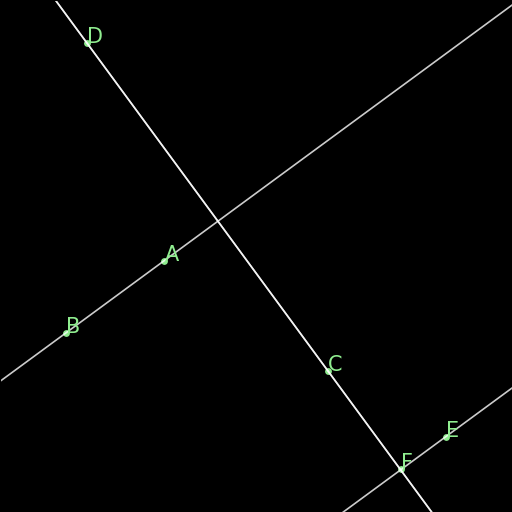

r01 : Definition of circle
^^^^^^^^^^^^^^^^^^^^^^^^^^
.. list-table::
   :widths: 50 25 25
   :header-rows: 1

   * - Figure
     - Formal Statement
     - Description
   * - |r01|
     - :math:`|OA|=|OB|=|OC|=|OD|\implies ABCD\text{ in a circle}`
     - Four points A, B, C, D equidistant from a center O all lie on a same circle. (One side of the definition of a circle.)

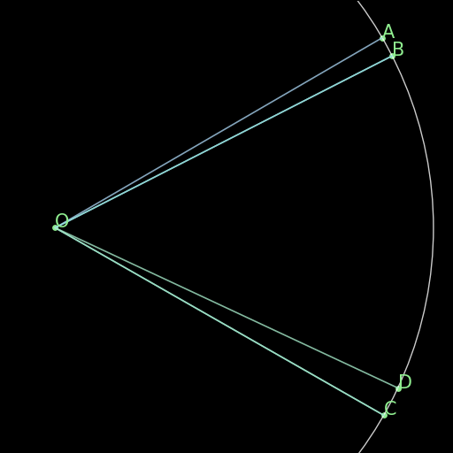

r02 : eqangle2para
^^^^^^^^^^^^^^^^^^
.. list-table::
   :widths: 50 25 25
   :header-rows: 1

   * - Figure
     - Formal Statement
     - Description
   * - |r02|
     - :math:`\angle (AB \times PQ)=\angle (CD \times PQ)\implies AB \parallel CD`
     -

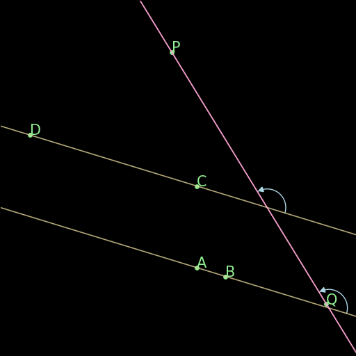

r03 : cyclic2eqangle
^^^^^^^^^^^^^^^^^^^^
.. list-table::
   :widths: 50 25 25
   :header-rows: 1

   * - Figure
     - Formal Statement
     - Description
   * - |r03|
     - :math:`ABPQ\text{ in a circle}\implies \angle (PA\times PB)=\angle (QA\times QB)`
     -

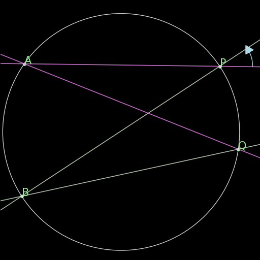

r04 : eqangle2cyclic
^^^^^^^^^^^^^^^^^^^^
.. list-table::
   :widths: 50 25 25
   :header-rows: 1

   * - Figure
     - Formal Statement
     - Description
   * - |r04|
     - :math:`\angle (PA\times PB)=\angle (QA\times QB) \implies ABPQ\text{ in a circle}`
     -

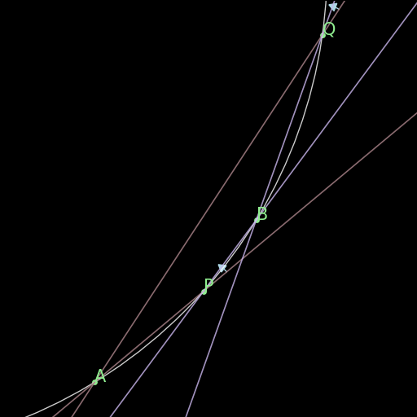

r05 : eqangle_on_circle2cong
^^^^^^^^^^^^^^^^^^^^^^^^^^^^
.. list-table::
   :widths: 50 25 25
   :header-rows: 1

   * - Figure
     - Formal Statement
     - Description
   * - |r05|
     - :math:`\begin{cases}ABCPQR\text{ in a circle}\\ \angle (CA\times CB)=\angle (RP\times RQ)\end{cases}\implies |AB|=|PQ|`
     -

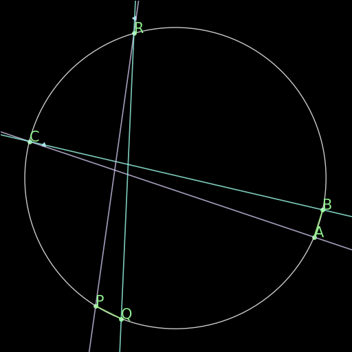

r06 : Base of half triangle
^^^^^^^^^^^^^^^^^^^^^^^^^^^
.. list-table::
   :widths: 50 25 25
   :header-rows: 1

   * - Figure
     - Formal Statement
     - Description
   * - |r06|
     - :math:`\begin{cases}E\text{ midpoint of } AB\\ F\text{ midpoint of }AC\end{cases} \implies EF \parallel BC`
     -

.. |r06| image:: ../../_static/Images/rules/r06.png
    :width: 100%

r07 : para2eqratio3
^^^^^^^^^^^^^^^^^^^
.. list-table::
   :widths: 50 25 25
   :header-rows: 1

   * - Figure
     - Formal Statement
     - Description
   * - |r07|
     - :math:`\begin{cases}AB\parallel CD\\ OAC \text{ collinear}\\ OBD\text{ collinear}\end{cases}\implies \begin{cases}\frac{OA}{OC}=\frac{OB}{OD}\\ \frac{AO}{AC}=\frac{BO}{BD}\\ \frac{OC}{AC}=\frac{OD}{BD}\end{cases}`
     -

.. |r07| image:: ../../_static/Images/rules/r07.png
    :width: 100%

r08 : perp_perp2eqangle
^^^^^^^^^^^^^^^^^^^^^^^
.. list-table::
   :widths: 50 25 25
   :header-rows: 1

   * - Figure
     - Formal Statement
     - Description
   * - |r08|
     - :math:`AB \perp CD \wedge EF \perp GH \implies \angle (AB\times EF) = \angle (CD\times GH)`
     -

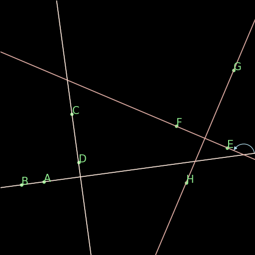

r09 : Sum of angles of a triangle
^^^^^^^^^^^^^^^^^^^^^^^^^^^^^^^^^
.. list-table::
   :widths: 50 25 25
   :header-rows: 1

   * - Figure
     - Formal Statement
     - Description
   * - |r09|
     - :math:`\begin{cases}\angle (AB\times CD)=\angle (MN\times PQ)\\ \angle (CD\times EF)=\angle (PQ\times RU)\end{cases}\implies \angle(AB\times EF)=\angle(MN\times RU)`
     -

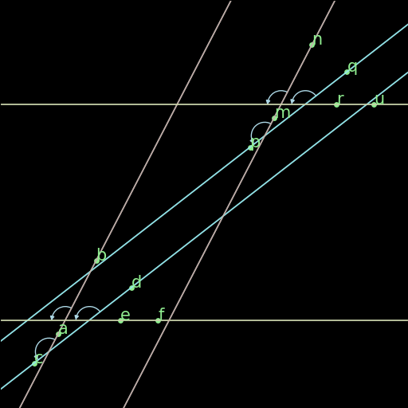

r10 : Ratio cancellation
^^^^^^^^^^^^^^^^^^^^^^^^
.. list-table::
   :widths: 50 25 25
   :header-rows: 1

   * - Figure
     - Formal Statement
     - Description
   * - (Just a multiplication)
     - :math:`\frac{AB}{CD} = \frac{MN}{PQ} \wedge \frac{CD}{EF} = \frac{PQ}{RU} \implies \frac{AB}{EF} = \frac{MN}{RU}`
     - This is a simple algebraic fact: if you multiply the two equalities from the hypothesis together, there will be a cancellation of numerators and denominators giving you the consequence.

r11 : eqratio2angle_bisector
^^^^^^^^^^^^^^^^^^^^^^^^^^^^
.. list-table::
   :widths: 50 25 25
   :header-rows: 1

   * - Figure
     - Formal Statement
     - Description
   * - |r11|
     - :math:`\begin{cases}\frac{DB}{DC} = \frac{AB}{AC} \\DBC\text{ collinear} \end{cases}\implies \angle (AB\times AD)=\angle(AD\times AC)`
     -

.. |r11| image:: ../../_static/Images/rules/r11.png
    :width: 100%

r12 : Bisector theorem
^^^^^^^^^^^^^^^^^^^^^^
.. list-table::
   :widths: 50 25 25
   :header-rows: 1

   * - Figure
     - Formal Statement
     - Description
   * - |r12|
     - :math:`\begin{cases}\angle (AB\times AD) = \angle (AD\times AC) \\ DBC\text{ collinear}\end{cases} \implies \frac{DB}{DC} = \frac{AB}{AC}`
     -

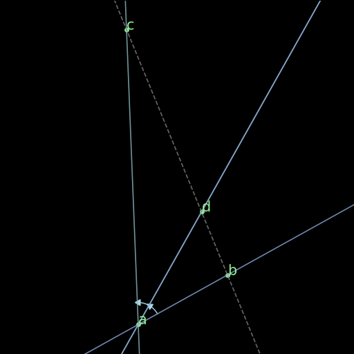

r13 : Isosceles triangle equal angles
^^^^^^^^^^^^^^^^^^^^^^^^^^^^^^^^^^^^^
.. list-table::
   :widths: 50 25 25
   :header-rows: 1

   * - Figure
     - Formal Statement
     - Description
   * - |r13|
     - :math:`|OA|=|OB| \implies \angle (OA\times AB) = \angle (AB\times OB)`
     -

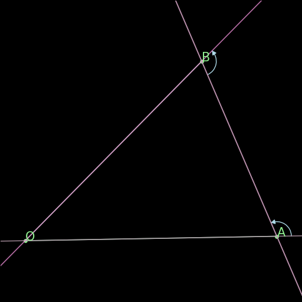

r14 : Equal base angles imply isosceles
^^^^^^^^^^^^^^^^^^^^^^^^^^^^^^^^^^^^^^^
.. list-table::
   :widths: 50 25 25
   :header-rows: 1

   * - Figure
     - Formal Statement
     - Description
   * - |r14|
     - :math:`\angle (AO\times AB) = \angle (BA\times BO) \implies |OA|=|OB|`
     -

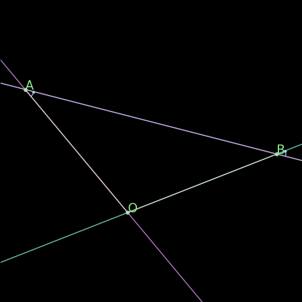

r15 : circle_perp2eqangle
^^^^^^^^^^^^^^^^^^^^^^^^^
.. list-table::
   :widths: 50 25 25
   :header-rows: 1

   * - Figure
     - Formal Statement
     - Description
   * - |r15|
     - :math:`\begin{cases} O\text{ center of circle }ABC \\ OA \perp AX\end{cases} \implies \angle (AX\times AB) = \angle (CA\times CB)`
     -

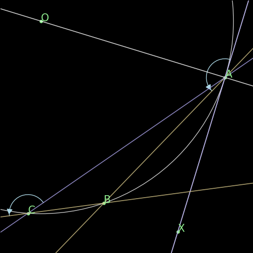

r16 : circle_eqangle2perp
^^^^^^^^^^^^^^^^^^^^^^^^^
.. list-table::
   :widths: 50 25 25
   :header-rows: 1

   * - Figure
     - Formal Statement
     - Description
   * - |r16|
     - :math:`\begin{cases} O\text{ center of circle }ABC \\ \angle (AX\times AB)=\angle(CA\times CB)\end{cases} \implies OA\perp AX`
     -

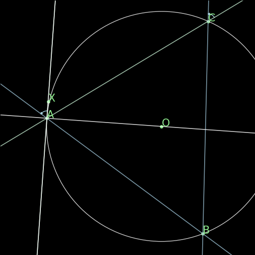

r17 : circle_midp2eqangle
^^^^^^^^^^^^^^^^^^^^^^^^^
.. list-table::
   :widths: 50 25 25
   :header-rows: 1

   * - Figure
     - Formal Statement
     - Description
   * - |r17|
     - :math:`\begin{cases} O\text{ center of circle }ABC \\ M\text{ midpoint of }BC\end{cases} \implies \angle(AB\times AC)=\angle(OB\times OM)`
     -

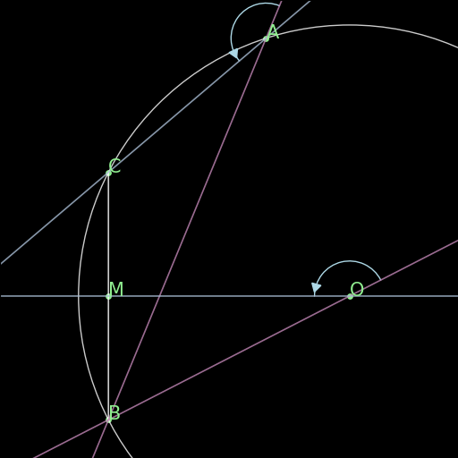

r18 : eqangle2midp
^^^^^^^^^^^^^^^^^^
.. list-table::
   :widths: 50 25 25
   :header-rows: 1

   * - Figure
     - Formal Statement
     - Description
   * - |r18|
     - :math:`\begin{cases} O\text{ center of circle }ABC \\ MBC\text{ collinear}\\ \angle(AB\times AC)=\angle(OB\times OM)\end{cases} \implies M\text{ midpoint of }BC`
     -

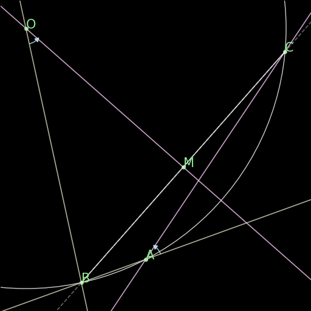

r19 : right_triangle_midp2cong
^^^^^^^^^^^^^^^^^^^^^^^^^^^^^^
.. list-table::
   :widths: 50 25 25
   :header-rows: 1

   * - Figure
     - Formal Statement
     - Description
   * - |r19|
     - :math:`\begin{cases}AB\perp BC \\ M\text{ midpoint of}AC\end{cases} \implies |AM|=|BM|`
     -

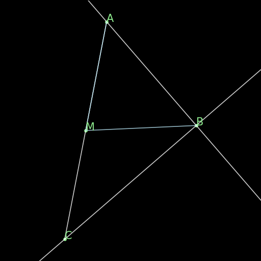

r20 : circle2perp
^^^^^^^^^^^^^^^^^
.. list-table::
   :widths: 50 25 25
   :header-rows: 1

   * - Figure
     - Formal Statement
     - Description
   * - |r20|
     - :math:`\begin{cases}O \text{ center of the circle } ABC \\ OAC\text{ collinear} \end{cases}\implies AB \perp BC`
     -

.. |r20| image:: ../../_static/Images/rules/r20.png
    :width: 100%

r21 : cyclic_para2eqangle
^^^^^^^^^^^^^^^^^^^^^^^^^
.. list-table::
   :widths: 50 25 25
   :header-rows: 1

   * - Figure
     - Formal Statement
     - Description
   * - |r21|
     - :math:`\begin{cases}ABCD\text{ in a circle} \\ AB \parallel CD\end{cases} \implies \angle (AD\times CD) = \angle (CD\times CB)`
     -

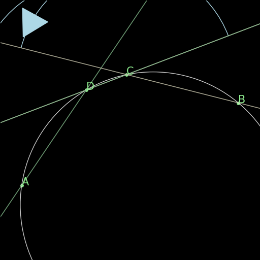

r22 : midp_perp2cong
^^^^^^^^^^^^^^^^^^^^
.. list-table::
   :widths: 50 25 25
   :header-rows: 1

   * - Figure
     - Formal Statement
     - Description
   * - |r22|
     - :math:`\begin{cases}M \text{ midpoint of }AB \\ OM\perp AB \end{cases} \implies |OA|=|OB|`
     -

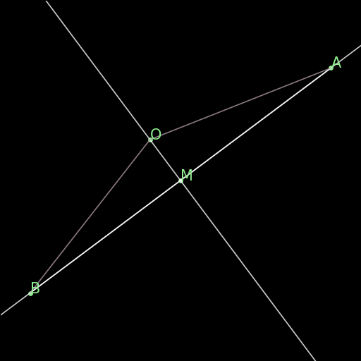

r23 : cong2perp
^^^^^^^^^^^^^^^
.. list-table::
   :widths: 50 25 25
   :header-rows: 1

   * - Figure
     - Formal Statement
     - Description
   * - |r23|
     - :math:`|AP|=|BP| \wedge |AQ|=|BQ| \implies AB\perp PQ`
     -

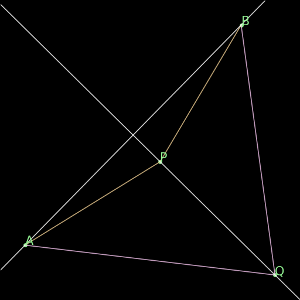

r24 : cong_cyclic2perp
^^^^^^^^^^^^^^^^^^^^^^
.. list-table::
   :widths: 50 25 25
   :header-rows: 1

   * - Figure
     - Formal Statement
     - Description
   * - |r24|
     - :math:`\begin{cases}|AP|=|BP| \\ |AQ|=|BQ| \\ ABPQ\text{ in a circle}\end{cases} \implies PA\perp AQ`
     -

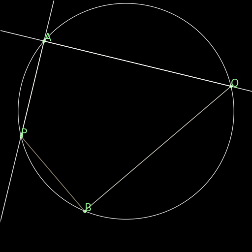

r25 : midp2para
^^^^^^^^^^^^^^^
.. list-table::
   :widths: 50 25 25
   :header-rows: 1

   * - Figure
     - Formal Statement
     - Description
   * - |r25|
     - :math:`\begin{cases}M\text{ midpoint of }AB \\M \text{ midpoint of }CD\end{cases} \implies AC \parallel BD`
     -

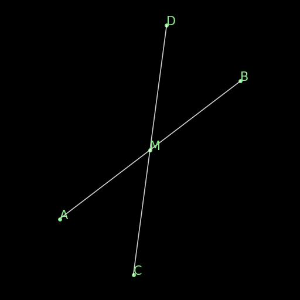

r26 : Diagonals of parallelogram
^^^^^^^^^^^^^^^^^^^^^^^^^^^^^^^^
.. list-table::
   :widths: 50 25 25
   :header-rows: 1

   * - Figure
     - Formal Statement
     - Description
   * - |r26|
     - :math:`\begin{cases}M \text{ midpoint of }AB \\ AC \parallel BD \\ AD \parallel BC \end{cases}\implies M \text{ midpoint of }CD`
     -

.. |r26| image:: ../../_static/Images/rules/r26.png
    :width: 100%

r27 : eqratio_sameside2para
^^^^^^^^^^^^^^^^^^^^^^^^^^^
.. list-table::
   :widths: 50 25 25
   :header-rows: 1

   * - Figure
     - Formal Statement
     - Description
   * - |r27|
     - :math:`\begin{cases}\frac{OA}{AC}=\frac{OB}{BD}\\ OAC\text{ collinear}\\OBD\text{ collinear}\\ OAC\text{ has the same orientation as }BOD\implies AB\parallel CD\end{cases}\implies AB\parallel CD`
     -

.. |r27| image:: ../../_static/Images/rules/r27.png
    :width: 100%

r28 : para2coll
^^^^^^^^^^^^^^^
.. list-table::
   :widths: 50 25 25
   :header-rows: 1

   * - Figure
     - :math:`AB \parallel AC \implies \text{coll}(ABC)`
     - Description
   * - |r28|
     -
       .. code-block :: text

         para A B A C
         => coll A B C
     -

.. |r28| image:: ../../_static/Images/rules/r28.png
    :width: 100%

r29 : midp2eqratio
^^^^^^^^^^^^^^^^^^
.. list-table::
   :widths: 50 25 25
   :header-rows: 1

   * - Figure
     - :math:`\text{midp}(M, AB) \wedge \text{midp}(N, CD) \implies \frac{MA}{AB} = \frac{NC}{CD}`
     - Description
   * - |r29|
     -
       .. code-block :: text

         midp M A B, midp N C D
         => eqratio M A A B N C C D
     -

.. |r29| image:: ../../_static/Images/rules/r29.png
    :width: 100%

r30 : eqangle_perp2perp
^^^^^^^^^^^^^^^^^^^^^^^
.. list-table::
   :widths: 50 25 25
   :header-rows: 1

   * - Figure
     - :math:`\langle AB, PQ\rangle=\langle CD, UV\rangle \wedge \text{perp}(PQ, UV) \implies \text{perp}(AB, CD)`
     - Description
   * - |r30|
     -
       .. code-block :: text

         eqangle A B P Q C D U V, perp P Q U V
         => perp A B C D
     -

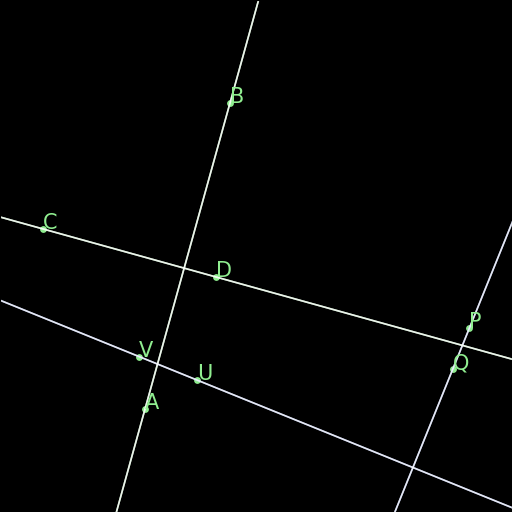

r31 : eqratio_cong2cong
^^^^^^^^^^^^^^^^^^^^^^^
.. list-table::
   :widths: 50 25 25
   :header-rows: 1

   * - Figure
     - :math:`\frac{AB}{PQ} = \frac{CD}{UV} \wedge |PQ| = |UV| \implies |AB| = |CD|`
     - Description
   * - |r31|
     -
       .. code-block :: text

         eqratio A B P Q C D U V, cong P Q U V
         => cong A B C D
     -

.. |r31| image:: ../../_static/Images/rules/r06.png
    :width: 100%

r32 : cong_cong2contri
^^^^^^^^^^^^^^^^^^^^^^
.. list-table::
   :widths: 50 25 25
   :header-rows: 1

   * - Figure
     - :math:`|AB| = |PQ| \wedge |BC| = |QR| \wedge |CA| = |RP|`
       :math:`\implies \text{contri*}(ABC, PQR)`
     - Description
   * - |r32|
     -
       .. code-block :: text

         cong A B P Q, cong B C Q R, cong C A R P, ncoll A B C
         => contri* A B C P Q R
     -

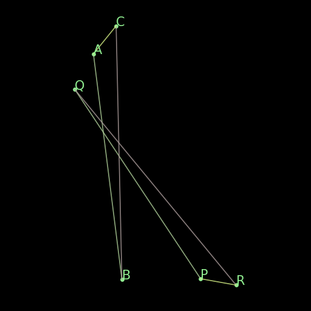

r33 : cong_eqangle2contri
^^^^^^^^^^^^^^^^^^^^^^^^^
.. list-table::
   :widths: 50 25 25
   :header-rows: 1

   * - Figure
     - :math:`|AB| = |PQ| \wedge |BC| = |QR| \wedge \langle BA, B\rangle = \langle QP, QR\rangle`
       :math:`\implies \text{contri*}(ABC, PQR)`
     - Description
   * - |r33|
     -
       .. code-block :: text

         cong A B P Q, cong B C Q R, eqangle6 B A B C Q P Q R, ncoll A B C
         => contri* A B C P Q R
     -

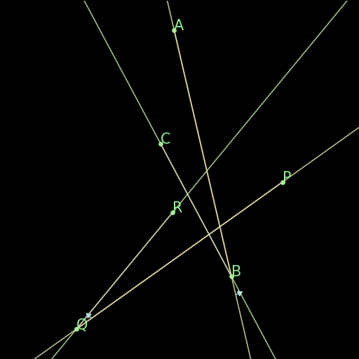

r34 : eqangle2simtri
^^^^^^^^^^^^^^^^^^^^
.. list-table::
   :widths: 50 25 25
   :header-rows: 1

   * - Figure
     - :math:`\langle BA, BC\rangle = \langle QP, QR\rangle \wedge \langle CA, CB\rangle = \langle RP, RQ\rangle`
       :math:`\implies \text{simtri}(ABC, PQR)`
     - Description
   * - |r34|
     -
       .. code-block :: text

         eqangle6 B A B C Q P Q R, eqangle6 C A C B R P R Q, ncoll A B C
         => simtri A B C P Q R
     -

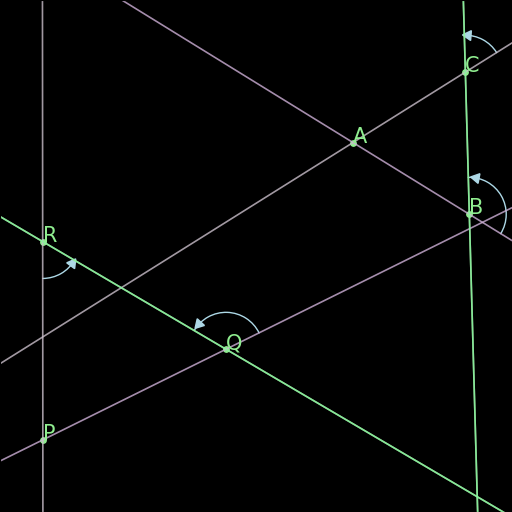

r35 : eqangle2simtri2
^^^^^^^^^^^^^^^^^^^^^
.. list-table::
   :widths: 50 25 25
   :header-rows: 1

   * - Figure
     - :math:`\langle BA, BC\rangle = \langle QP, QR\rangle \wedge \langle CA, CB\rangle = \langle RP, RQ\rangle`
       :math:`\implies \text{simtri2}(ABC, PQR)`
     - Description
   * - |r35|
     -
       .. code-block :: text

         eqangle6 B A B C Q R Q P, eqangle6 C A C B R Q R P, ncoll A B C
         => simtri2 A B C P Q R
     -

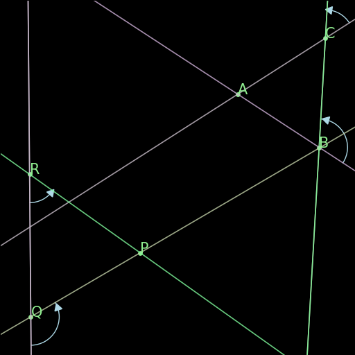

r36 : eqangle_cong2contri
^^^^^^^^^^^^^^^^^^^^^^^^^
.. list-table::
   :widths: 50 25 25
   :header-rows: 1

   * - Figure
     - :math:`\langle BA, BC\rangle = \langle QP, QR\rangle \wedge \langle CA, CB\rangle = \langle RP, RQ\rangle`
       :math:`\wedge |AB| = |PQ| \wedge |BC| = |QR| \wedge \text{ncoll}(ABC)`
       :math:`\wedge |AP| = |QB| \implies \text{contri}(ABC, PQR)`
     - Description
   * - |r36|
     -
       .. code-block :: text

         eqangle6 B A B C Q R Q P, eqangle6 C A C B R Q R P,
         ncoll A B C, cong A B P Q
         => contri A B C P Q R
     -

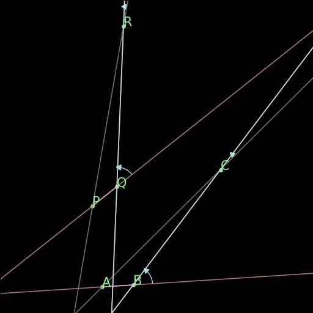

r37 : eqangle_cong2contri
^^^^^^^^^^^^^^^^^^^^^^^^^
.. list-table::
   :widths: 50 25 25
   :header-rows: 1

   * - Figure
     - :math:`\langle BA, BC\rangle = \langle QP, QR\rangle \wedge \langle CA, CB\rangle = \langle RP, RQ\rangle`
       :math:`\wedge |AB| = |PQ| \wedge |BC| = |QR| \wedge \text{ncoll}(ABC)`
       :math:`\wedge |AP| = |QB| \implies \text{contri2}(ABC, PQR)`
     - Description
   * - |r37|
     -
       .. code-block :: text

         eqangle6 B A B C Q R Q P, eqangle6 C A C B R Q R P,
         ncoll A B C, cong A B P Q
         => contri2 A B C P Q R
     -

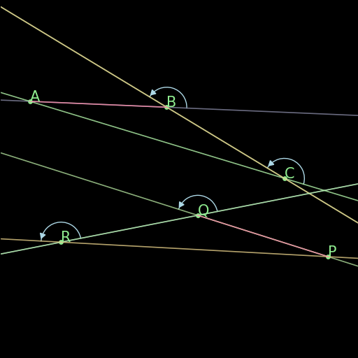

r38 : eqratio_eqangle2simtri
^^^^^^^^^^^^^^^^^^^^^^^^^^^^
.. list-table::
   :widths: 50 25 25
   :header-rows: 1

   * - Figure
     - :math:`\frac{BA}{BC} = \frac{QP}{QR} \wedge \frac{CA}{CB} = \frac{RP}{RQ}`
       :math:`\wedge \text{ncoll}(ABC) \implies \text{simtri*}(ABC, PQR)`
     - Description
   * - |r38|
     -
       .. code-block :: text

         eqratio6 B A B C Q P Q R, eqratio6 C A C B R P R Q,
         ncoll A B C
         => simtri* A B C P Q R
     -

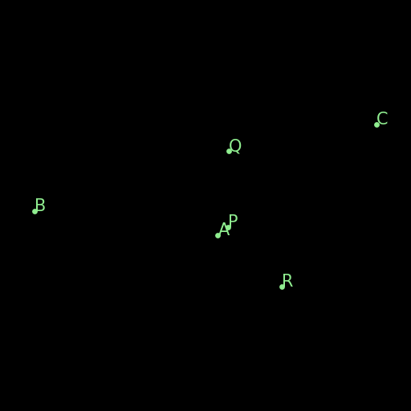

r39 : eqratio_eqangle2simtri
^^^^^^^^^^^^^^^^^^^^^^^^^^^^
.. list-table::
   :widths: 50 25 25
   :header-rows: 1

   * - Figure
     - :math:`\frac{BA}{BC} = \frac{QP}{QR} \wedge \langle BA, B\rangle = \langle QP, Q\rangle`
       :math:`\wedge \text{ncoll}(ABC) \implies \text{simtri*}(ABC, PQR)`
     - Description
   * - |r39|
     -
       .. code-block :: text

         eqratio6 B A B C Q P Q R, eqangle6 B A B C Q P Q R,
         ncoll A B C
         => simtri* A B C P Q R
     -

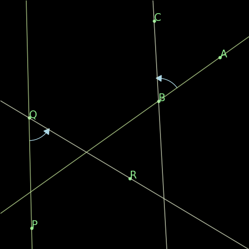

r40 : eqratio_eqratio_cong2contri
^^^^^^^^^^^^^^^^^^^^^^^^^^^^^^^^^
.. list-table::
   :widths: 50 25 25
   :header-rows: 1

   * - Figure
     - :math:`\frac{BA}{BC} = \frac{QP}{QR} \wedge \frac{CA}{CB} = \frac{RP}{RQ}`
       :math:`\wedge \text{ncoll}(ABC) \wedge |AB| = |PQ|`
       :math:`\implies \text{contri*}(ABC, PQR)`
     - Description
   * - |r40|
     -
       .. code-block :: text

         eqratio6 B A B C Q P Q R, eqratio6 C A C B R P R Q,
         ncoll A B C, cong A B P Q
         => contri* A B C P Q R
     -

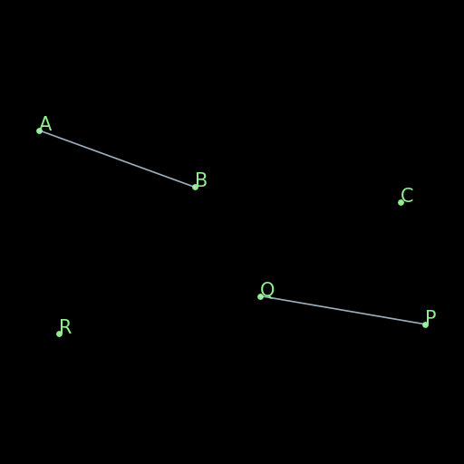

r41 : para2eqratio
^^^^^^^^^^^^^^^^^^
.. list-table::
   :widths: 50 25 25
   :header-rows: 1

   * - Figure
     - :math:`\text{para}(A, B, C, D) \wedge \text{coll}(M, A, D) \wedge \text{coll}(N, B, C)`
       :math:`\wedge \text{eqratio6}(M, A, M, D, N, B, N, C)`
       :math:`\wedge \text{sameside}(M, A, D, N, B, C)`
       :math:`\implies \text{para}(M, N, A, B)`
     - Description
   * - |r41|
     -
       .. code-block :: text

         para A B C D, coll M A D, coll N B C,
         eqratio6 M A M D N B N C, sameside M A D N B C
         => para M N A B
     -

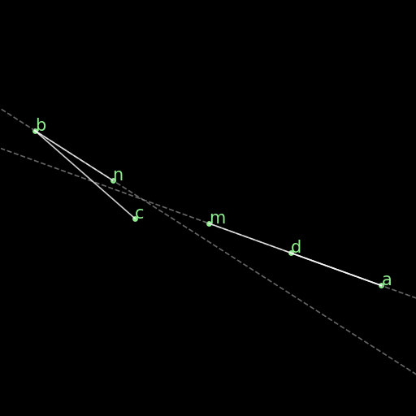

r42 : eqratio62para
^^^^^^^^^^^^^^^^^^^
.. list-table::
   :widths: 50 25 25
   :header-rows: 1

   * - Figure
     - :math:`\text{para}(A, B, C, D) \wedge \text{coll}(M, A, D) \wedge \text{coll}(N, B, C)`
       :math:`\implies \text{eqratio6}(M, A, M, D, N, B, N, C)`
     - Description
   * - |r42|
     -
       .. code-block :: text

         para A B C D, coll M A D, coll N B C, para M N A B
         => eqratio6 M A M D N B N C
     -

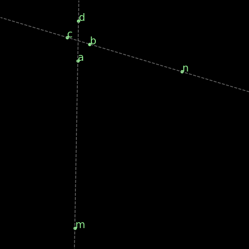

New rules
---------

r43 : Orthocenter theorem
^^^^^^^^^^^^^^^^^^^^^^^^^
.. list-table::
   :widths: 50 25 25
   :header-rows: 1

   * - Figure
     - Formal Statement
     - Description
   * - |r43|
     - :math:`ab \perp cd \wedge ac \perp bd`
       :math:`\implies ad \perp bc`
     -

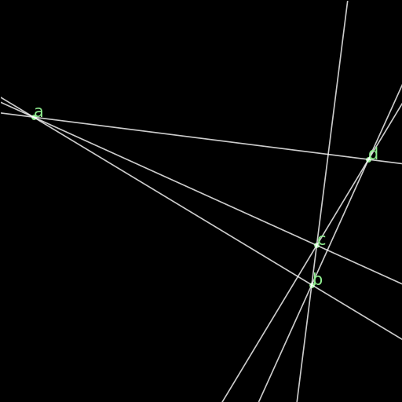

r44 : Pappus's theorem
^^^^^^^^^^^^^^^^^^^^^^
.. list-table::
   :widths: 50 25 25
   :header-rows: 1

   * - Figure
     - Formal Statement
     - Description
   * - |r44|
     - :math:`\text{coll}(a, b, c) \wedge \text{coll}(p, q, r) \wedge \text{coll}(x, a, q)`
       :math:`\wedge \text{coll}(x, p, b) \wedge \text{coll}(y, a, r) \wedge \text{coll}(y, p, c)`
       :math:`\wedge \text{coll}(z, b, r) \wedge \text{coll}(z, c, q)`
       :math:`\implies \text{coll}(x, y, z)`
     -

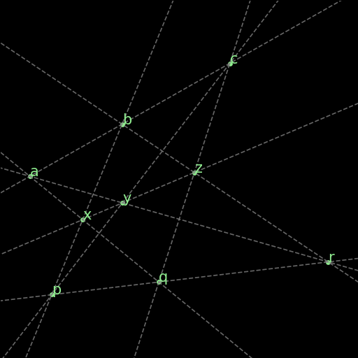

r45 : Simson line theorem
^^^^^^^^^^^^^^^^^^^^^^^^^
.. list-table::
   :widths: 50 25 25
   :header-rows: 1

   * - Figure
     - Formal Statement
     - Description
   * - |r45|
     - :math:`\text{cyclic}(a, b, c, p) \wedge \text{coll}(a, l, c) \wedge pl \perp ac`
       :math:`\wedge \text{coll}(m, b, c) \wedge pm \perp bc`
       :math:`\wedge \text{coll}(n, a, b) \wedge pn\perp ab`
       :math:`\implies \text{coll}(l, m, n)`
     -

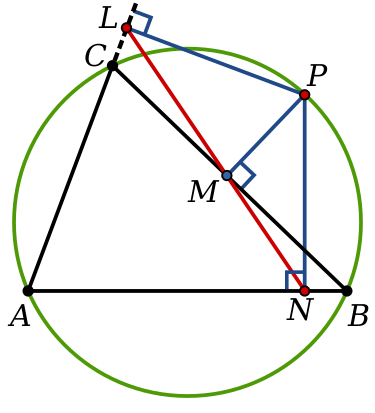

r46 : Incenter theorem
^^^^^^^^^^^^^^^^^^^^^^
.. list-table::
   :widths: 50 25 25
   :header-rows: 1

   * - Figure
     - Formal Statement
     - Description
   * - |r46|
     - :math:`\begin{cases}\angle (AB\times AX) = \angle (AX\times AC)\\ \angle (BA\times BX) =\angle (BX\times BC) \\ \text{ncoll}(A, B, C)\end{cases}`
       :math:`\implies \angle (CB\times CX) = \angle (CX\times CA)`
     -

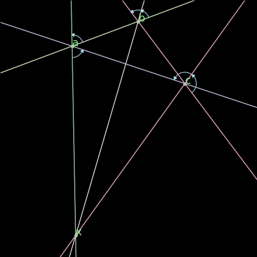

r47 : Circumcenter theorem
^^^^^^^^^^^^^^^^^^^^^^^^^^
.. list-table::
   :widths: 50 25 25
   :header-rows: 1

   * - Figure
     - Formal Description
     - Description
   * - |r47|
     -
       :math:`\text{midp}(m, a, b) \wedge \text{perp}(x, m, a, b) \wedge \text{midp}(n, b, c)`
       :math:`\wedge \text{perp}(x, n, b, c) \wedge \text{midp}(p, c, a)`
       :math:`\implies \text{perp}(x, p, c, a)`

       .. code-block :: text

         midp m a b, perp x m a b, midp n b c, perp x n b c, midp p c a
         => perp x p c a
     -

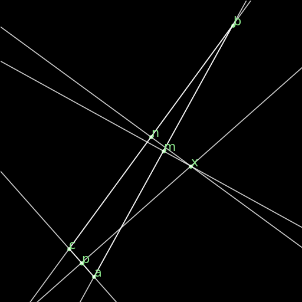

r48 : Centroid theorem
^^^^^^^^^^^^^^^^^^^^^^
.. list-table::
   :widths: 50 25 25
   :header-rows: 1

   * - Figure
     - :math:`\text{midp}(m, a, b) \wedge \text{coll}(m, x, c)`
       :math:`\wedge \text{midp}(n, b, c) \wedge \text{coll}(n, x, c)`
       :math:`\wedge \text{midp}(p, c, a)`
       :math:`\implies \text{coll}(x, p, b)`
     - Description
   * - |r48|
     -
       .. code-block :: text

         midp m a b, coll m x c, midp n b c, coll n x c, midp p c a
         => coll x p b
     -

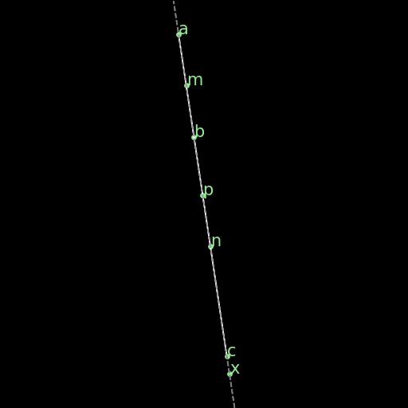

r49 : Recognize center of cyclic
^^^^^^^^^^^^^^^^^^^^^^^^^^^^^^^^
.. list-table::
   :widths: 50 25 25
   :header-rows: 1

   * - Figure
     - :math:`\text{circle}(O, A, B, C) \wedge \text{cyclic}(A, B, C, D)`
       :math:`\implies \text{cong}(O, A, O, D)`
     - Description
   * - |r49|
     -
       .. code-block :: text

         circle O A B C, cyclic A B C D
         => cong O A O D
     -

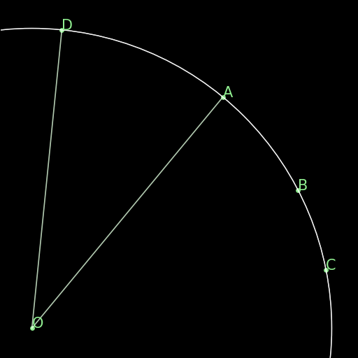