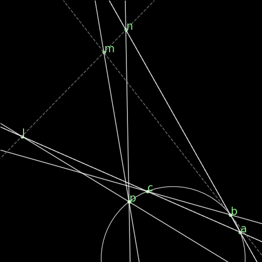

Rules
=====

Rules are the deduction rules that allow, from a given set of true facts, the derivation of new ones. Each rule asks for a collection of arguments, demanded by its premise predicates, that has to be "matched". Next, the rule is "applied", at which point the corresponding predicate is added to the proof state.

As a standard, rules are labelled in order (r00 to r49), but some rules have more specific names, for readability. The naming shows in the proof step, as the reason a proof step is true.

Legacy rules
------------

r00 : Perpendiculars give parallel
^^^^^^^^^^^^^^^^^^^^^^^^^^^^^^^^^^
.. list-table::
   :widths: 50 25 25
   :header-rows: 1

   * - Figure
     - Formal Statement
     - Description
   * - |r00|
     - :math:`\begin{cases}AB \perp CD\\ CD \perp EF \\ABE \text{ non-collinear}\end{cases} \implies AB \parallel EF`
     - Two lines AB, EF, that are orthogonal to a same line CD are parallel to one another.

.. |r00| image:: ../../_static/Images/rules/r00.png
    :width: 100%

         

r01 : Definition of circle
^^^^^^^^^^^^^^^^^^^^^^^^^^
.. list-table::
   :widths: 50 25 25
   :header-rows: 1

   * - Figure
     - Formal Statement
     - Description
   * - |r01|
     - :math:`|OA|=|OB|=|OC|=|OD|\implies ABCD\text{ in a circle}`
     - Four points A, B, C, D equidistant from a center O all lie on a same circle. (One side of the definition of a circle.)

.. |r01| image:: ../../_static/Images/rules/r01.png
    :width: 100%

r02 : eqangle2para
^^^^^^^^^^^^^^^^^^
.. list-table::
   :widths: 50 25 25
   :header-rows: 1

   * - Figure
     - Formal Statement
     - Description
   * - |r02|
     - :math:`\angle (AB \times PQ)=\angle (CD \times PQ)\implies AB \parallel CD`
     - 

.. |r02| image:: ../../_static/Images/rules/r02.png
    :width: 100%

r03 : cyclic2eqangle
^^^^^^^^^^^^^^^^^^^^
.. list-table::
   :widths: 50 25 25
   :header-rows: 1

   * - Figure
     - Formal Statement
     - Description
   * - |r03|
     - :math:`ABPQ\text{ in a circle}\implies \angle (PA\times PB)=\angle (QA\times QB)`
     - 

.. |r03| image:: ../../_static/Images/rules/r03.png
    :width: 100%

r04 : eqangle2cyclic
^^^^^^^^^^^^^^^^^^^^
.. list-table::
   :widths: 50 25 25
   :header-rows: 1

   * - Figure
     - Formal Statement
     - Description
   * - |r04|
     - :math:`\angle (PA\times PB)=\angle (QA\times QB) \implies ABPQ\text{ in a circle}`
     - 

.. |r04| image:: ../../_static/Images/rules/r04.png
    :width: 100%

r05 : eqangle_on_circle2cong
^^^^^^^^^^^^^^^^^^^^^^^^^^^^
.. list-table::
   :widths: 50 25 25
   :header-rows: 1

   * - Figure
     - :math:`\text{cyclic}(ABCPQR)\wedge \langle CA,CB\rangle=\langle RP,RQ\rangle\implies |AB|=|PQ|`
     - 
   * - |r05|
     -
       .. code-block :: text

         cyclic A B C P Q R, eqangle C A C B R P R Q
         => cong A B P Q
     - 

.. |r05| image:: ../../_static/Images/rules/r05.png
    :width: 100%

r06 : Base of half triangle
^^^^^^^^^^^^^^^^^^^^^^^^^^^
.. list-table::
   :widths: 50 25 25
   :header-rows: 1

   * - Figure
     - :math:`\text{midp}(E, AB) \wedge \text{midp}(F, AC) \implies EF \parallel BC`
     - 
   * - |r06|
     -
       .. code-block :: text

         midp E A B, midp F A C
         => para E F B C
     - 

.. |r06| image:: ../../_static/Images/rules/r06.png
    :width: 100%

r07 : para2eqratio3
^^^^^^^^^^^^^^^^^^^
.. list-table::
   :widths: 50 25 25
   :header-rows: 1

   * - Figure
     - :math:`AB \parallel CD \wedge \text{coll}(OAC) \wedge \text{coll}(OBD)`
       :math:`\implies \text{eqratio3}(A, B, C, D, O, O)`
     - 
   * - |r07|
     -
       .. code-block :: text

         para A B C D, coll O A C, coll O B D
         => eqratio3 A B C D O O
     - 

.. |r07| image:: ../../_static/Images/rules/r07.png
    :width: 100%

r08 : perp_perp2eqangle
^^^^^^^^^^^^^^^^^^^^^^^
.. list-table::
   :widths: 50 25 25
   :header-rows: 1

   * - Figure
     - :math:`AB \perp CD \wedge EF \perp GH \implies \langle AB, EF\rangle = \langle CD, GH\rangle`
     - 
   * - |r08|
     -
       .. code-block :: text

         perp A B C D, perp E F G H, npara A B E F
         => eqangle A B E F C D G H
     - 

.. |r08| image:: ../../_static/Images/rules/r08.png
    :width: 100%

r09 : eqangle2eqangle_sum
^^^^^^^^^^^^^^^^^^^^^^^^^
.. list-table::
   :widths: 50 25 25
   :header-rows: 1

   * - Figure
     - :math:`\langle ab, cd\rangle = \langle mn, pq\rangle \wedge \langle cd, ef\rangle = \langle pq, ru\rangle`
       :math:`\implies \langle ab, ef\rangle = \langle mn, ru\rangle`
     - 
   * - |r09|
     -
       .. code-block :: text

         eqangle a b c d m n p q, eqangle c d e f p q r u
         => eqangle a b e f m n r u
     - 

.. |r09| image:: ../../_static/Images/rules/r09.png
    :width: 100%

r10 : Ratio cancellation
^^^^^^^^^^^^^^^^^^^^^^^^
.. list-table::
   :widths: 50 25 25
   :header-rows: 1

   * - Figure
     - :math:`\frac{ab}{cd} = \frac{mn}{pq} \wedge \frac{cd}{ef} = \frac{pq}{ru} \implies \frac{ab}{ef} = \frac{mn}{ru}`
     - 
   * - (Just a multiplication)
     -
       .. code-block :: text

         eqratio a b c d m n p q, eqratio c d e f p q r u
         => eqratio a b e f m n r u
     - 

r11 : eqratio2angle_bisector
^^^^^^^^^^^^^^^^^^^^^^^^^^^^
.. list-table::
   :widths: 50 25 25
   :header-rows: 1

   * - Figure
     - Formula
     - 
   * - |r11|
     -
       :math:`\frac{db}{dc} = \frac{ab}{ac} \wedge \text{coll}(dbc) \implies \langle ab, ad, ad, ac\rangle`

       .. code-block :: text

         eqratio6 d b d c a b a c, coll d b c, ncoll a b c
         => eqangle6 a b a d a d a c
     - 

.. |r11| image:: ../../_static/Images/rules/r11.png
    :width: 100%

r12 : Bisector theorem
^^^^^^^^^^^^^^^^^^^^^^
.. list-table::
   :widths: 50 25 25
   :header-rows: 1

   * - Figure
     - :math:`\langle ab, ad\rangle = \langle ad, ac\rangle \wedge \text{coll}(dbc) \implies \frac{db}{dc} = \frac{ab}{ac}`
     - 
   * - |r12|
     -
       .. code-block :: text

         eqangle6 a b a d a d a c, coll d b c, ncoll a b c
         => eqratio6 d b d c a b a c
     - 

.. |r12| image:: ../../_static/Images/rules/r12.png
    :width: 100%

r13 : Isosceles triangle equal angles
^^^^^^^^^^^^^^^^^^^^^^^^^^^^^^^^^^^^^
.. list-table::
   :widths: 50 25 25
   :header-rows: 1

   * - Figure
     - Formula
     - 
   * - |r13|
     -
       :math:`|OA|=|OB| \implies \langle OA, AB\rangle = \langle AB, OB\rangle`

       .. code-block :: text

         cong O A O B, ncoll O A B
         => eqangle O A A B A B O B
     - 

.. |r13| image:: ../../_static/Images/rules/r13.png
    :width: 100%

r14 : Equal base angles imply isosceles
^^^^^^^^^^^^^^^^^^^^^^^^^^^^^^^^^^^^^^^
.. list-table::
   :widths: 50 25 25
   :header-rows: 1

   * - Figure
     - :math:`\langle AO, AB\rangle = \langle BA, BO\rangle \implies |OA|=|OB|`
     - 
   * - |r14|
     -
       .. code-block :: text

         eqangle6 A O A B B A B O, ncoll O A B
         => cong O A O B
     - 

.. |r14| image:: ../../_static/Images/rules/r14.png
    :width: 100%

r15 : circle_perp2eqangle
^^^^^^^^^^^^^^^^^^^^^^^^^
.. list-table::
   :widths: 50 25 25
   :header-rows: 1

   * - Figure
     - :math:`\text{circle}(O, ABC) \wedge OA \perp AX \implies \langle AX, AB\rangle = \langle CA, CB\rangle`
     - 
   * - |r15|
     -
       .. code-block :: text

         circle O A B C, perp O A A X
         => eqangle A X A B C A C B
     - 

.. |r15| image:: ../../_static/Images/rules/r15.png
    :width: 100%

r16 : circle_eqangle2perp
^^^^^^^^^^^^^^^^^^^^^^^^^
.. list-table::
   :widths: 50 25 25
   :header-rows: 1

   * - Figure
     - :math:`\text{circle}(O, ABC) \wedge \langle AX, AB\rangle=\langle CA, CB\rangle \implies \text{perp}(OA, AX)`
       :math:`\implies \text{perp}(OA, AX)`
     - 
   * - |r16|
     -
       .. code-block :: text

         circle O A B C, eqangle A X A B C A C B
         => perp O A A X
     - 

.. |r16| image:: ../../_static/Images/rules/r16.png
    :width: 100%

r17 : circle_midp2eqangle
^^^^^^^^^^^^^^^^^^^^^^^^^
.. list-table::
   :widths: 50 25 25
   :header-rows: 1

   * - Figure
     - :math:`\text{circle}(O,ABC) \wedge \text{midp}(M, BC)`
       :math:`\implies \langle AB, AC\rangle=\langle OB, OM\rangle`
     - 
   * - |r17|
     -
       .. code-block :: text

         circle O A B C, midp M B C
         => eqangle A B A C O B O M
     - 

.. |r17| image:: ../../_static/Images/rules/r17.png
    :width: 100%

r18 : eqangle2midp
^^^^^^^^^^^^^^^^^^
.. list-table::
   :widths: 50 25 25
   :header-rows: 1

   * - Figure
     - :math:`\text{circle}(O,ABC) \wedge \text{coll}(MBC) \wedge \langle AB, AC\rangle=\langle OB, OM\rangle`
       :math:`\implies \text{midp}(M, BC)`
     - 
   * - |r18|
     -
       .. code-block :: text

         circle O A B C, coll M B C, eqangle A B A C O B O M
         => midp M B C
     - 

.. |r18| image:: ../../_static/Images/rules/r18.png
    :width: 100%

r19 : right_triangle_midp2cong
^^^^^^^^^^^^^^^^^^^^^^^^^^^^^^
.. list-table::
   :widths: 50 25 25
   :header-rows: 1

   * - Figure
     - :math:`\text{perp}(AB, BC) \wedge \text{midp}(M, AC) \implies |AM|=|BM|`
     - 
   * - |r19|
     -
       .. code-block :: text

         perp A B B C, midp M A C
         => cong A M B M
     - 

.. |r19| image:: ../../_static/Images/rules/r19.png
    :width: 100%

r20 : circle2perp
^^^^^^^^^^^^^^^^^
.. list-table::
   :widths: 50 25 25
   :header-rows: 1

   * - Figure
     - :math:`\text{circle}(OABC) \wedge \text{coll}(OAC) \implies \text{perp}(AB, BC)`
     - 
   * - |r20|
     -
       .. code-block :: text

         circle O A B C, coll O A C
         => perp A B B C
     - 

.. |r20| image:: ../../_static/Images/rules/r20.png
    :width: 100%

r21 : cyclic_para2eqangle
^^^^^^^^^^^^^^^^^^^^^^^^^
.. list-table::
   :widths: 50 25 25
   :header-rows: 1

   * - Figure
     - :math:`\text{cyclic}(ABCD) \wedge AB \parallel CD \implies \langle AD, CD\rangle = \langle CD, CB\rangle`
     - 
   * - |r21|
     -
       .. code-block :: text

         cyclic A B C D, para A B C D
         => eqangle A D C D C D C B
     - 

.. |r21| image:: ../../_static/Images/rules/r21.png
    :width: 100%

r22 : midp_perp2cong
^^^^^^^^^^^^^^^^^^^^
.. list-table::
   :widths: 50 25 25
   :header-rows: 1

   * - Figure
     - :math:`\text{midp}(M, AB) \wedge \text{perp}(OM, AB) \implies |OA|=|OB|`
     - 
   * - |r22|
     -
       .. code-block :: text

         midp M A B, perp O M A B
         => cong O A O B
     - 

.. |r22| image:: ../../_static/Images/rules/r22.png
    :width: 100%

r23 : cong2perp
^^^^^^^^^^^^^^^
.. list-table::
   :widths: 50 25 25
   :header-rows: 1

   * - Figure
     - :math:`|AP|=|BP| \wedge |AQ|=|BQ| \implies \text{perp}(AB, PQ)`
     - 
   * - |r23|
     -
       .. code-block :: text

         cong A P B P, cong A Q B Q
         => perp A B P Q
     - 

.. |r23| image:: ../../_static/Images/rules/r23.png
    :width: 100%

r24 : cong_cyclic2perp
^^^^^^^^^^^^^^^^^^^^^^
.. list-table::
   :widths: 50 25 25
   :header-rows: 1

   * - Figure
     - :math:`|AP|=|BP| \wedge |AQ|=|BQ| \wedge \text{cyclic}(ABPQ) \implies \text{perp}(PA, AQ)`
     - 
   * - |r24|
     -
       .. code-block :: text

         cong A P B P, cong A Q B Q, cyclic A B P Q
         => perp P A A Q
     - 

.. |r24| image:: ../../_static/Images/rules/r24.png
    :width: 100%

r25 : midp2para
^^^^^^^^^^^^^^^
.. list-table::
   :widths: 50 25 25
   :header-rows: 1

   * - Figure
     - :math:`\text{midp}(M, AB) \wedge \text{midp}(M, CD) \implies AC \parallel BD`
     - 
   * - |r25|
     -
       .. code-block :: text

         midp M A B, midp M C D
         => para A C B D
     - 

.. |r25| image:: ../../_static/Images/rules/r25.png
    :width: 100%

r26 : midp_para2midp
^^^^^^^^^^^^^^^^^^^^
.. list-table::
   :widths: 50 25 25
   :header-rows: 1

   * - Figure
     - :math:`\text{midp}(M, AB) \wedge AC \parallel BD \wedge AD \parallel BC \implies \text{midp}(M, CD)`
     - 
   * - |r26|
     -
       .. code-block :: text

         midp M A B, para A C B D, para A D B C
         => midp M C D
     - 

.. |r26| image:: ../../_static/Images/rules/r26.png
    :width: 100%

r27 : eqratio_sameside2para
^^^^^^^^^^^^^^^^^^^^^^^^^^^
.. list-table::
   :widths: 50 25 25
   :header-rows: 1

   * - Figure
     - :math:`\frac{OA}{AC} = \frac{OB}{BD} \wedge \text{coll}(OAC)`
       :math:`\text{coll}(OBD) \wedge \text{sameside}(AOC, BOD)`
       :math:`\implies AB \parallel CD`
     - 
   * - |r27|
     -
       .. code-block :: text

         eqratio O A A C O B B D, coll O A C,
         coll O B D, ncoll A B C, sameside A O C B O D
         => para A B C D
     - 

.. |r27| image:: ../../_static/Images/rules/r27.png
    :width: 100%

r28 : para2coll
^^^^^^^^^^^^^^^
.. list-table::
   :widths: 50 25 25
   :header-rows: 1

   * - Figure
     - :math:`AB \parallel AC \implies \text{coll}(ABC)`
     - 
   * - |r28|
     -
       .. code-block :: text

         para A B A C
         => coll A B C
     - 

.. |r28| image:: ../../_static/Images/rules/r28.png
    :width: 100%

r29 : midp2eqratio
^^^^^^^^^^^^^^^^^^
.. list-table::
   :widths: 50 25 25
   :header-rows: 1

   * - Figure
     - :math:`\text{midp}(M, AB) \wedge \text{midp}(N, CD) \implies \frac{MA}{AB} = \frac{NC}{CD}`
     - 
   * - |r29|
     -
       .. code-block :: text

         midp M A B, midp N C D
         => eqratio M A A B N C C D
     - 

.. |r29| image:: ../../_static/Images/rules/r29.png
    :width: 100%

r30 : eqangle_perp2perp
^^^^^^^^^^^^^^^^^^^^^^^
.. list-table::
   :widths: 50 25 25
   :header-rows: 1

   * - Figure
     - :math:`\langle AB, PQ\rangle=\langle CD, UV\rangle \wedge \text{perp}(PQ, UV) \implies \text{perp}(AB, CD)`
     - 
   * - |r30|
     -
       .. code-block :: text

         eqangle A B P Q C D U V, perp P Q U V
         => perp A B C D
     - 

.. |r30| image:: ../../_static/Images/rules/r30.png
    :width: 100%

r31 : eqratio_cong2cong
^^^^^^^^^^^^^^^^^^^^^^^
.. list-table::
   :widths: 50 25 25
   :header-rows: 1

   * - Figure
     - :math:`\frac{AB}{PQ} = \frac{CD}{UV} \wedge |PQ| = |UV| \implies |AB| = |CD|`
     - 
   * - |r31|
     -
       .. code-block :: text

         eqratio A B P Q C D U V, cong P Q U V
         => cong A B C D
     - 

.. |r31| image:: ../../_static/Images/rules/r06.png
    :width: 100%

r32 : cong_cong2contri
^^^^^^^^^^^^^^^^^^^^^^
.. list-table::
   :widths: 50 25 25
   :header-rows: 1

   * - Figure
     - :math:`|AB| = |PQ| \wedge |BC| = |QR| \wedge |CA| = |RP|`
       :math:`\implies \text{contri*}(ABC, PQR)`
     - 
   * - |r32|
     -
       .. code-block :: text

         cong A B P Q, cong B C Q R, cong C A R P, ncoll A B C
         => contri* A B C P Q R
     - 

.. |r32| image:: ../../_static/Images/rules/r32.png
    :width: 100%

r33 : cong_eqangle2contri
^^^^^^^^^^^^^^^^^^^^^^^^^
.. list-table::
   :widths: 50 25 25
   :header-rows: 1

   * - Figure
     - :math:`|AB| = |PQ| \wedge |BC| = |QR| \wedge \langle BA, B\rangle = \langle QP, QR\rangle`
       :math:`\implies \text{contri*}(ABC, PQR)`
     - 
   * - |r33|
     -
       .. code-block :: text

         cong A B P Q, cong B C Q R, eqangle6 B A B C Q P Q R, ncoll A B C
         => contri* A B C P Q R
     - 

.. |r33| image:: ../../_static/Images/rules/r33.png
    :width: 100%

r34 : eqangle2simtri
^^^^^^^^^^^^^^^^^^^^
.. list-table::
   :widths: 50 25 25
   :header-rows: 1

   * - Figure
     - :math:`\langle BA, BC\rangle = \langle QP, QR\rangle \wedge \langle CA, CB\rangle = \langle RP, RQ\rangle`
       :math:`\implies \text{simtri}(ABC, PQR)`
     - 
   * - |r34|
     -
       .. code-block :: text

         eqangle6 B A B C Q P Q R, eqangle6 C A C B R P R Q, ncoll A B C
         => simtri A B C P Q R
     - 

.. |r34| image:: ../../_static/Images/rules/r34.png
    :width: 100%

r35 : eqangle2simtri2
^^^^^^^^^^^^^^^^^^^^^
.. list-table::
   :widths: 50 25 25
   :header-rows: 1

   * - Figure
     - :math:`\langle BA, BC\rangle = \langle QP, QR\rangle \wedge \langle CA, CB\rangle = \langle RP, RQ\rangle`
       :math:`\implies \text{simtri2}(ABC, PQR)`
     - 
   * - |r35|
     -
       .. code-block :: text

         eqangle6 B A B C Q R Q P, eqangle6 C A C B R Q R P, ncoll A B C
         => simtri2 A B C P Q R
     - 

.. |r35| image:: ../../_static/Images/rules/r35.png
    :width: 100%

r36 : eqangle_cong2contri
^^^^^^^^^^^^^^^^^^^^^^^^^
.. list-table::
   :widths: 50 25 25
   :header-rows: 1

   * - Figure
     - :math:`\langle BA, BC\rangle = \langle QP, QR\rangle \wedge \langle CA, CB\rangle = \langle RP, RQ\rangle`
       :math:`\wedge |AB| = |PQ| \wedge |BC| = |QR| \wedge \text{ncoll}(ABC)`
       :math:`\wedge |AP| = |QB| \implies \text{contri}(ABC, PQR)`
     - 
   * - |r36|
     -
       .. code-block :: text

         eqangle6 B A B C Q R Q P, eqangle6 C A C B R Q R P,
         ncoll A B C, cong A B P Q
         => contri A B C P Q R
     - 

.. |r36| image:: ../../_static/Images/rules/r36.png
    :width: 100%

r37 : eqangle_cong2contri
^^^^^^^^^^^^^^^^^^^^^^^^^
.. list-table::
   :widths: 50 25 25
   :header-rows: 1

   * - Figure
     - :math:`\langle BA, BC\rangle = \langle QP, QR\rangle \wedge \langle CA, CB\rangle = \langle RP, RQ\rangle`
       :math:`\wedge |AB| = |PQ| \wedge |BC| = |QR| \wedge \text{ncoll}(ABC)`
       :math:`\wedge |AP| = |QB| \implies \text{contri2}(ABC, PQR)`
     - 
   * - |r37|
     -
       .. code-block :: text

         eqangle6 B A B C Q R Q P, eqangle6 C A C B R Q R P,
         ncoll A B C, cong A B P Q
         => contri2 A B C P Q R
     - 

.. |r37| image:: ../../_static/Images/rules/r37.png
    :width: 100%

r38 : eqratio_eqangle2simtri
^^^^^^^^^^^^^^^^^^^^^^^^^^^^
.. list-table::
   :widths: 50 25 25
   :header-rows: 1

   * - Figure
     - :math:`\frac{BA}{BC} = \frac{QP}{QR} \wedge \frac{CA}{CB} = \frac{RP}{RQ}`
       :math:`\wedge \text{ncoll}(ABC) \implies \text{simtri*}(ABC, PQR)`
     - 
   * - |r38|
     -
       .. code-block :: text

         eqratio6 B A B C Q P Q R, eqratio6 C A C B R P R Q,
         ncoll A B C
         => simtri* A B C P Q R
     - 

.. |r38| image:: ../../_static/Images/rules/r38.png
    :width: 100%

r39 : eqratio_eqangle2simtri
^^^^^^^^^^^^^^^^^^^^^^^^^^^^
.. list-table::
   :widths: 50 25 25
   :header-rows: 1

   * - Figure
     - :math:`\frac{BA}{BC} = \frac{QP}{QR} \wedge \langle BA, B\rangle = \langle QP, Q\rangle`
       :math:`\wedge \text{ncoll}(ABC) \implies \text{simtri*}(ABC, PQR)`
     - 
   * - |r39|
     -
       .. code-block :: text

         eqratio6 B A B C Q P Q R, eqangle6 B A B C Q P Q R,
         ncoll A B C
         => simtri* A B C P Q R
     - 

.. |r39| image:: ../../_static/Images/rules/r39.png
    :width: 100%

r40 : eqratio_eqratio_cong2contri
^^^^^^^^^^^^^^^^^^^^^^^^^^^^^^^^^
.. list-table::
   :widths: 50 25 25
   :header-rows: 1

   * - Figure
     - :math:`\frac{BA}{BC} = \frac{QP}{QR} \wedge \frac{CA}{CB} = \frac{RP}{RQ}`
       :math:`\wedge \text{ncoll}(ABC) \wedge |AB| = |PQ|`
       :math:`\implies \text{contri*}(ABC, PQR)`
     - 
   * - |r40|
     -
       .. code-block :: text

         eqratio6 B A B C Q P Q R, eqratio6 C A C B R P R Q,
         ncoll A B C, cong A B P Q
         => contri* A B C P Q R
     - 

.. |r40| image:: ../../_static/Images/rules/r40.png
    :width: 100%

r41 : para2eqratio
^^^^^^^^^^^^^^^^^^
.. list-table::
   :widths: 50 25 25
   :header-rows: 1

   * - Figure
     - :math:`\text{para}(A, B, C, D) \wedge \text{coll}(M, A, D) \wedge \text{coll}(N, B, C)`
       :math:`\wedge \text{eqratio6}(M, A, M, D, N, B, N, C)`
       :math:`\wedge \text{sameside}(M, A, D, N, B, C)`
       :math:`\implies \text{para}(M, N, A, B)`
     - 
   * - |r41|
     -
       .. code-block :: text

         para A B C D, coll M A D, coll N B C,
         eqratio6 M A M D N B N C, sameside M A D N B C
         => para M N A B
     - 

.. |r41| image:: ../../_static/Images/rules/r41.png
    :width: 100%

r42 : eqratio62para
^^^^^^^^^^^^^^^^^^^
.. list-table::
   :widths: 50 25 25
   :header-rows: 1

   * - Figure
     - :math:`\text{para}(A, B, C, D) \wedge \text{coll}(M, A, D) \wedge \text{coll}(N, B, C)`
       :math:`\implies \text{eqratio6}(M, A, M, D, N, B, N, C)`
     - 
   * - |r42|
     -
       .. code-block :: text

         para A B C D, coll M A D, coll N B C, para M N A B
         => eqratio6 M A M D N B N C
     - 

.. |r42| image:: ../../_static/Images/rules/r42.png
    :width: 100%

New rules
---------

r43 : Orthocenter theorem
^^^^^^^^^^^^^^^^^^^^^^^^^
.. list-table::
   :widths: 50 25 25
   :header-rows: 1

   * - Figure
     - :math:`\text{perp}(A, B, C, D) \wedge \text{perp}(A, C, B, D)`
       :math:`\implies \text{perp}(A, D, B, C)`
     - 
   * - |r43|
     -
       .. code-block :: text

         perp A B C D, perp A C B D
         => perp A D B C
     - 

.. |r43| image:: ../../_static/Images/rules/r43.png
    :width: 100%

r44 : Pappus's theorem
^^^^^^^^^^^^^^^^^^^^^^
.. list-table::
   :widths: 50 25 25
   :header-rows: 1

   * - Figure
     - :math:`\text{coll}(A, B, C) \wedge \text{coll}(P, Q, R) \wedge \text{coll}(X, A, Q)`
       :math:`\wedge \text{coll}(X, P, B) \wedge \text{coll}(Y, A, R) \wedge \text{coll}(Y, P, C)`
       :math:`\wedge \text{coll}(Z, B, R) \wedge \text{coll}(Z, C, Q)`
       :math:`\implies \text{coll}(X, Y, Z)`
     -
   * - |r44|
     -
       .. code-block :: text

         coll A B C, coll P Q R, coll X A Q, coll X P B, coll Y A R, coll Y P C, coll Z B R, coll Z C Q
         => coll X Y Z
     -

.. |r44| image:: ../../_static/Images/rules/r44.png
    :width: 100%

r45 : Simson line theorem
^^^^^^^^^^^^^^^^^^^^^^^^^
.. list-table::
   :widths: 50 25 25
   :header-rows: 1

   * - Figure
     - :math:`\text{cyclic}(A, B, C, P) \wedge \text{coll}(A, L, C) \wedge \text{perp}(P, L, A, C)`
       :math:`\wedge \text{coll}(M, B, C) \wedge \text{perp}(P, M, B, C)`
       :math:`\wedge \text{coll}(N, A, B) \wedge \text{perp}(P, N, A, B)`
       :math:`\implies \text{coll}(L, M, N)`
     - 
   * - |r45|
     -
       .. code-block :: text

         cyclic A B C P, coll A L C, perp P L A C, coll M B C, perp P M B C, coll N A B, perp P N A B
         => coll L M N
     - 

r46 : Incenter theorem
^^^^^^^^^^^^^^^^^^^^^^
.. list-table::
   :widths: 50 25 25
   :header-rows: 1

   * - Figure
     - :math:`\text{eqangle}(A, B, A, X, A, X, A, C) \wedge \text{eqangle}(B, A, B, X, B, X, B, C)`
       :math:`\wedge \text{ncoll}(A, B, C)`
       :math:`\implies \text{eqangle}(C, B, C, X, C, X, C, A)`
     - 
   * - |r46|
     -
       .. code-block :: text

         eqangle A B A X A X A C, eqangle B A B X B X B C, ncoll A B C
         => eqangle C B C X C X C A
     - 

.. |r46| image:: ../../_static/Images/rules/r46.png
    :width: 100%

r47 : Circumcenter theorem
^^^^^^^^^^^^^^^^^^^^^^^^^^
.. list-table::
   :widths: 50 25 25
   :header-rows: 1

   * - Figure
     - Formula
     - 
   * - |r47|
     -
       :math:`\text{midp}(m, a, b) \wedge \text{perp}(x, m, a, b) \wedge \text{midp}(n, b, c)`
       :math:`\wedge \text{perp}(x, n, b, c) \wedge \text{midp}(p, c, a)`
       :math:`\implies \text{perp}(x, p, c, a)`

       .. code-block :: text

         midp m a b, perp x m a b, midp n b c, perp x n b c, midp p c a
         => perp x p c a
     - 

.. |r47| image:: ../../_static/Images/rules/r47.png
    :width: 100%

r48 : Centroid theorem
^^^^^^^^^^^^^^^^^^^^^^
.. list-table::
   :widths: 50 25 25
   :header-rows: 1

   * - figure
     - :math:`\text{midp}(m, a, b) \wedge \text{coll}(m, x, c)`
       :math:`\wedge \text{midp}(n, b, c) \wedge \text{coll}(n, x, c)`
       :math:`\wedge \text{midp}(p, c, a)`
       :math:`\implies \text{coll}(x, p, b)`
     - 
   * - |r48|
     -
       .. code-block :: text

         midp m a b, coll m x c, midp n b c, coll n x c, midp p c a
         => coll x p b
     - 

.. |r48| image:: ../../_static/Images/rules/r48.png
    :width: 100%

r49 : Recognize center of cyclic
^^^^^^^^^^^^^^^^^^^^^^^^^^^^^^^^
.. list-table::
   :widths: 50 25 25
   :header-rows: 1

   * - Figure
     - :math:`\text{circle}(O, A, B, C) \wedge \text{cyclic}(A, B, C, D)`
       :math:`\implies \text{cong}(O, A, O, D)`
     - 
   * - |r49|
     -
       .. code-block :: text

         circle O A B C, cyclic A B C D
         => cong O A O D
     - 

.. |r49| image:: ../../_static/Images/rules/r49.png
    :width: 100%